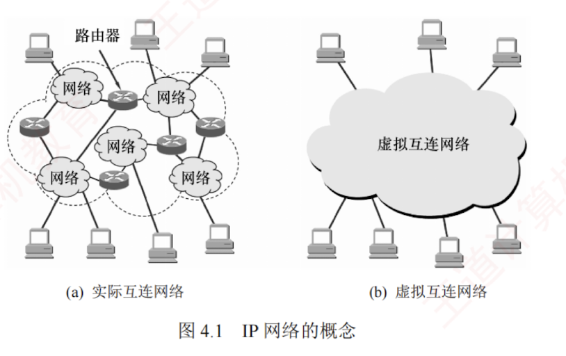

---

### 4.1.1 异构网络互连

互联网是由全球范围内数以百万计的**异构网络**互连起来的。  
这些网络的拓扑结构、寻址方案、差错处理方法、路由选择机制等都不尽相同。  
网络层所要完成的任务之一就是实现这些**异构网络的互连**。  
网络互连是指将两个以上的计算机网络，通过一定的方法，用一些**中继系统**相互连接起来，以构成更大的网络系统。  
根据所在的层次，中继系统分为以下 4 种：

1. **物理层中继系统**：转发器，集线器。
    
2. **数据链路层中继系统**：网桥或交换机。
    
3. **网络层中继系统**：路由器。
    
4. **网络层以上的中继系统**：网关。

当使用**物理层**或**数据链路层**的中继系统时，**只是把一个网络扩大了**，而从**网络层**的角度看，它仍然是同一个网络，一般并**不称为网络互连**。  
因此，**网络互连**通常是指用**路由器**进行**网络连接**和**路由选择**。  
路由器是一台专用计算机，用于在互联网中进行路由选择。

> **注意**
> 
> 由于历史原因，许多有关 TCP/IP 的文献也将网络层的路由器称为**网关**。

TCP/IP 在网络互连方面的做法是在网络层采用**标准化协议**，但相互连接的网络可以是异构的。  
图 4.1(a)表示许多计算机网络通过一些**路由器**进行互连。  
因为参与互连的计算机网络都使用相同的网际协议 IP，通过 IP 协议就可使这些性能各异的网络在网络层上看起来像是**一个统一的网络**，所以可以把互连后的网络视为如图 4.1(b)所示的一个**虚拟互连网络**，简称 **IP 网络**。

使用 IP 网络的**好处**是：当 IP 网络上的主机进行通信时，就好像在单个网络上通信一样，而看不见互连的各个网络的**具体异构细节**（如具体的编址方案、路由选择协议等）。
