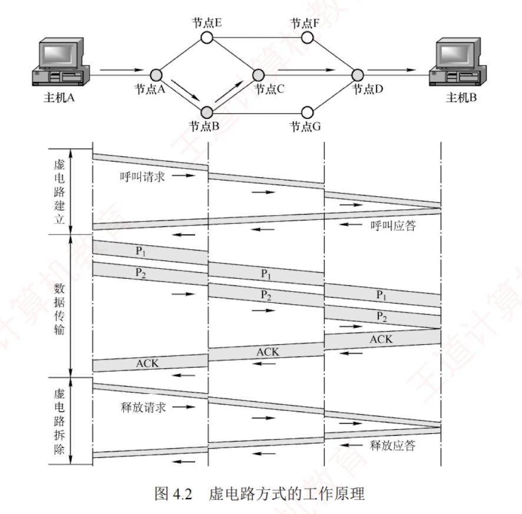
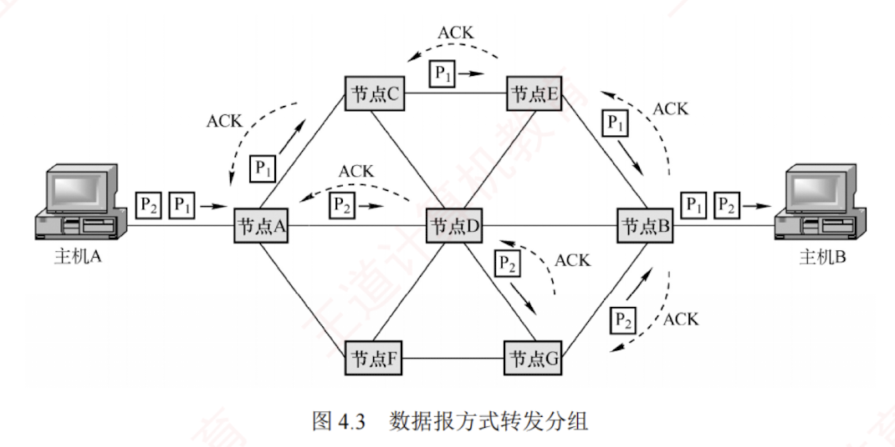
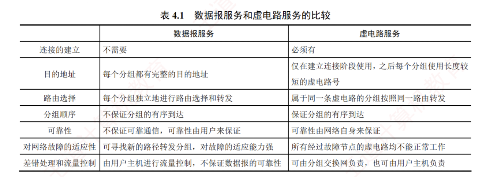

---

### 4.1.3 网络层提供的两种服务

分组交换网根据其通信子网向端系统提供的服务，还可进一步分为**面向连接的虚电路服务和无连接的数据报服务**。  
这两种服务方式都是由**网络层**提供的。

#### 1. 虚电路

在虚电路方式中，两台主机进行通信前，必须首先在网络层建立一条**逻辑连接**，即**虚电路** (Virtual Circuit, **VC**)。  
该连接一旦建立，其对应的**端到端传输路径即被固定**。  
与电路交换类似，整个通信过程可分为三个阶段：**虚电路建立**、**数据传输**与**虚电路释放**。

每次建立虚电路时，系统为其分配一个未使用过的**虚电路号** (**VCID**)，以**区别于同一节点上的其他虚电路**。  
此后，双方就沿着已建立的**虚电路**传送分组。  
值得注意的是，仅在**连接建立阶段**使用完整的源和目的地址，后续分组的首部仅需携带**虚电路号**。  
每个中间节点都需维护一个**虚电路表**，其中记录了每条虚电路的 VCID 及下一跳信息，这些内容在连接建立过程中确定。

##### 虚电路服务的工作原理

下面以图 4.2 为例说明**虚电路服务的工作原理**，假设主机 A 向主机 B 发送分组。

1. 数据传输前，主机 A 与主机 B 需先建立**虚电路连接**：  
   A 发送“呼叫请求”分组，经由中间节点转发至 B；  
   若 B 同意建立连接，则返回“呼叫应答”分组予以确认。
    
2. 虚电路建立后，双方即可相互传输数据分组。
    
3. 传输结束后，主机 A 发送“释放请求”分组，逐段拆除虚电路。
    

注意，图 4.2 所示的数据传输是有**确认**的，接收方收到分组后需返回确认。

##### 虚电路服务的特点

通过上述例子，可总结出虚电路服务具有以下特点：

1. **建立与释放连接开销大**。  
   不适合交互应用或少量数据交换，适合**长时间或大量数据交换**。
    
2. **路由选择在连接建立阶段完成**。建立完成后，就固定了传输路径。
    
3. 提供**可靠**、**有序**的分组交付，并支持**端到端的流量控制**。  
   [[如何判断可靠或者不可靠]]
    
4. **对节点或链路的故障敏感**。任一故障都会导致所有经过该节点或链路的虚电路中断。
    
5. **分组首部开销小**。因为其**无须携带完整的目的地址**，而**只需携带虚电路号**。
    
    虚电路之所以是虚的，是因为这条链路**并非专用**的，而是可被**多条虚电路共享**。
    

#### 2. 数据报

在数据报方式中，发送分组前**无须建立连接**。  
源主机将应用层报文分割为若干数据段，并封装成携带完整**源地址**和**目的地址**的独立分组。  
中间节点对分组**短暂缓存**，独立选路后随即转发。  
网络层不提供服务质量保证，也不确保可靠传输，因此分组可能**丢失、重复、失序或出错**。  
这就使得网络中的**路由器比较简单**，且**造价低廉**（与电话网络相比）。

##### 数据报服务的工作原理

下面以图 4.3 为例说明数据报服务的工作原理，假设主机 A 向主机 B 发送分组。

1. 主机 A 将分组逐个发送至与其直连的节点 A，该节点对分组进行**短暂缓存**。
    
2. 随后，节点 A 查询其**转发表**。网络状态动态变化，导致转发表随之更新，各分组独立进行路由选择，可能经由不同路径转发（例如部分发往节点 C，部分发往节点 D）。
    
3. 后续节点以相同的方式**转发分组**，直至其最终抵达主机 B。
    
    在传输过程中，分组仅占用当前链路的资源。  
    得益于**存储转发**机制和**资源共享**，多个主机可以**同时通信**——例如主机 A 在发送分组的同时，主机 B 也可向其他主机发送数据。

##### 数据报服务的特点

通过上述例子，可总结出数据报服务具有以下**特点**：
    
1. **无须建立连接**。发送方可随时发送分组，交换节点也可随时接收并处理。
    
2. **尽最大努力交付**。网络不保证可靠性，分组可能丢失、出错或失序；  
   由于每个分组独立选路，转发路径可能不同，可能导致失序到达。
    
3. **分组携带完整地址**。每个分组均包含完整的源地址和目的地址，以支持**独立路由**。
    
4. **存在排队时延与丢包风险**。分组在交换节点中需排队处理；  
   网络拥塞时，时延显著增加，还可能被主动丢弃。
    
5. **故障适应能力强**。当某节点或链路失效时，可通过**更新转发表**动态选择绕行路径。
    

6. **资源利用率高**。通信双方**不独占链路**，带宽等资源由**多个会话共享**。
    
采用这种设计思想的好处是：网络的造价大大降低、运行方式灵活、能够适应多种应用。  
互联网能够发展到今天的规模，充分证明了当初采用这种设计思想的正确性。

#### 数据报服务和虚电路服务的对比

数据报服务和虚电路服务的比较见表 4.1。

