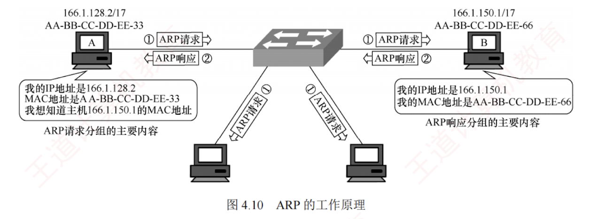

---

### 4.2.5 地址解析协议（ARP）

#### 1. IP 地址与硬件地址

IP 地址是网络层及以上使用的**分层式地址**，而**硬件地址**（MAC 地址）是数据链路层使用的平面式地址。  
IP 地址置于 IP 数据报的首部，而 MAC 地址则置于 MAC 帧的**首部**。  
当 IP 数据报被封装为 MAC 帧后，数据链路层无法感知其中的 IP 地址。

由于路由器隔离了广播域，无法通过广播 MAC 地址实现跨网络通信，因此网络层仅依赖 IP 地址进行寻址。  
每个路由器根据其**路由表**，选择通往目的网络的**下一跳**（通常为**下一跳路由器**的接口 IP 地址）。  
IP 数据报经过多次路由转发抵达目的网络后，在局域网内通过 ARP 获取目的主机的 MAC 地址，将 IP 数据报封装为 MAC 帧并直接交付给目的主机。

以下几点体现了分层抽象的**精髓**，值得特别强调：

1. 在 IP 层抽象的互联网上，只能看到 IP 数据报。

2. 尽管 IP 数据报首部包含源 IP 地址，但路由器仅**依据目的 IP 地址进行转发**。

3. 在局域网的链路层，只能看到 MAC 帧，IP 数据报被封装其中；  
   每当经过路由器转发时，都会被解封装并重新封装，MAC 帧的源地址和目的地址都随之改变，这决定了 **MAC 地址无法用于跨网络通信**。

4. 尽管底层网络的硬件地址体系各异，IP 层的抽象屏蔽了这些差异。  
   只要在网络层讨论问题，就能使用**统一的 IP 地址**研究主机与主机、主机与路由器之间的通信。

**注意**

路由器互连多个网络，每个接口都配置有一个 IP 地址和一个对应的 MAC 地址。

#### 2. 地址解析协议

无论网络层使用何种协议，在实际链路上传送数据帧时，最终都必须使用 MAC 地址。  
因此，需要一种将 IP 地址映射到 MAC 地址的机制，这就是**地址解析协议**（Address Resolution Protocol, **ARP**）。  
每台主机和路由器都维护一个 **ARP 高速缓存**（ARP Cache），用于存放本局域网内各主机和路由器接口的 IP 地址与 MAC 地址的**映射表**，称为 **ARP 表**。ARP 通过动态更新维护该表，并为每个表项设置生存时间（例如 20 分钟），超时的条目将被自动删除。

**考点追踪** $\blacktriangleright$ ARP 的解析过程（2011、2015）

ARP 工作在网络层，其核心功能是解析同一个局域网内 IP 地址对应的 MAC 地址。以主机 A 向本局域网中的主机 B 发送 IP 数据报为例：主机 A 首先在其 ARP 高速缓存中查找主机 B 的 IP 地址。若存在对应表项，则直接获取其 MAC 地址，填入 MAC 帧的目的地址字段，并发送该帧。若未找到，则自动发起 ARP 请求，按以下步骤获取主机 B 的 MAC 地址，如图 4.10 所示。

1）主机 A 构造 ARP 请求分组，封装在目的 MAC 地址为 FF-FF-FF-FF-FF-FF 的帧中并广播发送，本局域网内所有主机均会收到。请求内容为“我的 IP 地址是 166.128.2，MAC 地址是 AA-BB-CC-DD-EE-33，我想知道 IP 地址为 166.1.150.1 的主机的 MAC 地址”。

2）主机 B 收到广播帧后，发现请求解析的 IP 地址正是自己的地址，便向主机 A 单播发送 ARP 响应分组，其中包含自身的 MAC 地址。响应内容为“我的 IP 地址是 166.1.150.1，MAC 地址是 AA-BB-CC-DD-EE-66”。同时，主机 B 将主机 A 的 IP 地址和 MAC 地址的映射写入自己的 ARP 缓存，以便后续通信。

3）主机 A 收到 ARP 响应分组后，将主机 B 的 IP 地址和 MAC 地址的映射写入其 ARP 缓存，随后即可使用该 MAC 地址封装并发送数据帧。

之所以将 ARP 归为网络层协议，是因为它处理的是 IP 地址。一般而言，可根据某协议是否使用或依赖某层的地址或端口信息来判断其所属的协议层次。

**注意**

ARP 仅作用于同一局域网（广播域），无法跨网络工作。

跨网通信时，ARP 解析的是下一跳路由器接口的 MAC 地址，而非最终目的主机。

使用 ARP 的 4 种典型情况总结如下（见图 4.11）。

1）发送方是主机（如 H1），要把 IP 分组发送到本网络上的另一台主机（如 H2）。这时 H1 在网 1 上通过 ARP 解析出目的主机 H2 的 MAC 地址。

2）发送方是主机（如 H1），要把 IP 分组发送到其他网络上的主机（如 H4）。这时 H1 通过 ARP 找到本网络中默认网关（路由器 R1 的接口 L1）的 MAC 地址，并将分组发给 R1，后续工作由 R1 完成。

**考点追踪** $\blacktriangleright$ 跨局域网的 ARP 解析过程（2015）

**注意**

起初，H1 向 R1 发送数据时，MAC 帧首部的源/目地址分别为 H1 和 L1 的 MAC 地址。R1 收到该帧后，在数据链路层将其解封装并重新封装，源/目地址分别更新为 L2 和 L3 的 MAC 地址。随后，R2 收到该帧，同样进行解封装与重新封装，源/目地址再次更新为 L4 和 H4 的 MAC 地址。可见，IP 分组每经过一个路由器，其外层 MAC 帧的源/目地址都会更新为当前链路两端设备的接口 MAC 地址。

3）发送方是路由器（如 R1），要把 IP 分组转发到与其直连的网络（网 2）上的主机（如 H3）。这时 R1 在网 2 上通过 ARP 解析出 H3 的 MAC 地址。

4）发送方是路由器（如 R1），要把 IP 分组转发到非直连网络（网 3）上的主机（如 H4）。这时 R1 在其出接口所在网络（网 2）上，通过 ARP 找到下一跳路由器 R2 的接口 L3 的 MAC 地址，并将分组发给 R2，后续工作由 R2 完成。

整个 ARP 过程对用户完全透明。只要需要与本局域网内的设备通信，系统便会自动完成 IP 地址到 MAC 地址的解析，并封装成帧发送，用户无须也无法干预这一过程。

