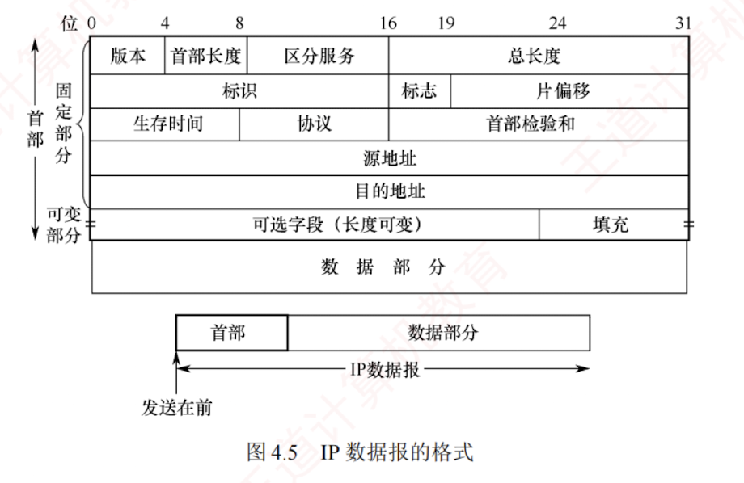
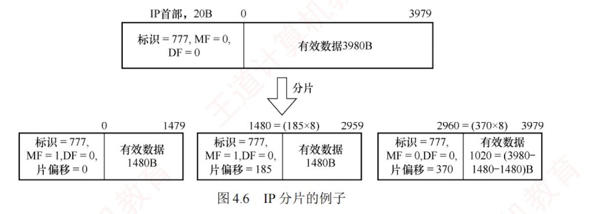

---

### 4.2.1 IPv4 分组

**IPv4**（版本 4）即现在普遍使用的**网际协议**（Internet Protocol, **IP**）。  
IP 定义数据传送的基本单元——**IP 分组**及其确切的数据格式。  
IP 也包括一套规则，指明分组如何处理、错误怎样控制。  
特别是 IP 还包含**非可靠投递**的思想，以及与此关联的**路由选择**的思想。

#### 1. IPv4 分组的格式

一个 IP 分组（或称 IP 数据报）由**首部**和**数据**部分组成。  
首部前一部分的长度固定，共 **20B**，是所有 IP 分组必须具有的。  
在首部固定部分的后面是一些可选字段，用来提供错误检测及安全等机制，其长度可变，从 1B 到 40B 不等。  

**IP 数据报的格式**如图 4.5 所示。

IPv4 首部的部分重要字段含义如下：

1. **版本**。占 4 位。表示 IP 协议的版本，IPv4 中该字段的值为 4。
    
2. **首部长度**。占 4 位。以 **4B** 为单位，可表示的最大首部长度为 60B（15 * 4B）。**最常用的首部长度是 20B**（5 * 4B），该字段的值是 5，表示**不使用可选字段**。  
   IP 首部长度必须是 4B 的整数倍，若可选字段导致长度不足，则通过**填充字段**加以填充。
    

> [!NOTE] 注意
> 
> IP 首部前两个字节往往以 0x45 开头，解题时可用于定位 IP 数据报的开始位置。

3. **总长度**。占 16 位，表示首部和数据之和的长度，以 1B 为单位，因此 IP 数据报的最大长度为 $2^{16}-1=65535\text{B}$。  
   由于以太网 MTU 为 1500B，因此当一个数据报封装成帧时，数据报的总长度（首部加数据）一定不能超过当前链路的 MTU。
    
4. **标识**。占 16 位。源主机用一个**递增计数器**，为每个数据报设置标识字段。  
   它并不是“序号”（因为 IP 是无连接服务）。  
   分片时，所有分片复制原始数据报的标识字段值，以便目的主机据此正确**重组**为原数据报。
    
5. **标志**（Flag）。占 3 位，目前只有低 2 位有意义。  
   MF（More Fragment, 更多分片），MF=1 表示后面还有分片，MF=0 表示这是最后一个分片。  
   DF（Don't Fragment, 不能分片），仅当 DF=0 时允许分片，若 DF=1，则禁止分片。
    
6. **片偏移**。占 13 位，以 **8B** 为单位，指出该分片数据部分起始位置相对于原始数据报数据部分开头 festival 的偏移量。  
   除最后一个分片外，**其他分片的数据长度必须是 8B 的整数倍**。
    

7. **生存时间**（TTL）。占 8 位，表示数据报在网络中允许经过的**路由器数的最大值**，防止其在网络中无限循环。  
   每经过一个路由器，TTL 减 1。  
   若 TTL 被减为 0，则丢弃该数据报。  
   若 TTL 的初值设为 1，则该数据报仅限在本局域网内传输。
    
8. **协议**。占 8 位，指出此数据报携带的数据使用何种协议，即指示数据报应交付给哪个上层协议（如 TCP、UDP）。  
   其中值为 6 表示 TCP，值为 17 表示 UDP。
    
9. **首部校验和**。占 16 位，**只校验首部**（不含数据部分），不检验数据部分可减少计算的工作量。  
   数据报每经过一个路由器，首部中的某些字段（如生存时间、总长度、标志、片偏移、源/目的地址）都可能发生变化，因此**路由器都需要重新计算检验和**。  
   首部检验和的计算方法与 UDP 和 TCP 检验和的计算方法类似，具体见 5.2.2 节。
    
10. **源地址字段**。占 4B，标识发送方的 IP 地址。
    
11. **目的地址字段**。占 4B，标识接收方的 IP 地址。
    

> [!NOTE] 注意
> 
> 1. IP 数据报首部包含 3 个与长度相关的字段：首部长度、总长度、片偏移，它们的基本单位分别为 4B、1B、8B，计算时要注意换算。  
>    读者应理解 IP 首部各字段的意义和功能，但无须死记首部格式，若题目需要，通常会直接给出。  
>    这一原则同样适用于第 5 章对 TCP 和 UDP 首部的学习。
>     
> 2. 在分析 IP 首部的十六进制原始数据时，IP 地址以连续 4B 的十六进制形式呈现。  
>    将其转换为点分十进制形式时要格外小心，极易因字节顺序或进制转换错误而导致结果偏差。
>     

#### 2. IP 数据报分片

一个链路层数据帧能承载的最大数据量称为**最大传送单元**（**MTU**）。  
由于 IP 数据报被封装在链路层帧中，其长度受到 MTU 的严格限制。  
此外，从源主机到目的主机的路径上可能会经过多段链路，各段链路的 MTU 可能不同——例如，以太网的 MTU 通常为 1500B，而很多广域网的 MTU 不超过 576B。  
当 IP 数据报的总长度超过某段链路的 MTU 时，就必须将 IP 数据报中的数据分装在多个较小的 IP 数据报中，这些较小的数据报称为**分片**（或片）。

分片只能发生在**源主机**或**中间路由器**上，而**重组**仅在目的主机上进行。  
目的主机利用 IP 首部中的**标识**、**标志**和**片偏移**三个字段完成分片的重组。  
源主机在创建 IP 数据报时，会为其分配**唯一的标识号**。  
当该数据报被分片时，所有分片均继承原始数据报的标识号。目的主机收到来自同一源主机的多个数据报后，通过比对标识号，即可判断哪些分片属于同一个原始数据报。  
分片行为受**标志字段**控制：  
仅当 DF=0 时，数据报才被允许分片；  
若 DF=1，则禁止分片。  
此外，MF=1 表示还有后续分片；  
MF=0 表示这是最后一个分片。  
在重组过程中，依据片偏移字段确定每个分片在原始数据报中的起始位置，从而正确还原原始数据。

IP 分片涉及一定的计算。  
例如，一个总长 4000B 的 IP 数据报（首部 20B，数据部分 3980B）到达路由器，需转发到 MTU 为 1500B 的链路上。  
每个分片都是一个独立的 IP 数据报，均包含 20B 的 IP 首部，每片最多携带 1480B 数据，因此需划分为 3 个分片，数据部分依次为 1480B、1480B 和 1020B。  
假定原始数据报标识号为 777，则各分片如图 4.6 所示。  
由于片偏移以 8B 为单位，为保证偏移值为整数，除最后一个分片外，其余分片的数据长度必须是 **8B 的整数倍**。

