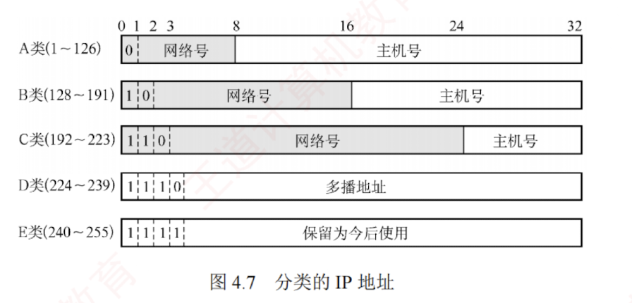
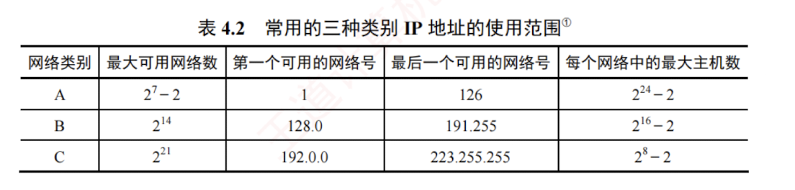

---

### 4.2.2 IPv4 地址

#### 1. IPv4 地址

IP 地址是为连接到互联网上的每台主机（或路由器）的每个接口，分配的一个**全球唯一的 32 位标识符**。  
IP 地址的分配由互联网名字与数字地址分配机构（ICANN）统一管理。  
为方便书写和记忆，通常将 32 位 IP 地址分为 **4 段**，每段 **8 位**，转换为等效的十进制数，并用**小数点**分隔，即一个 IP 地址用 4 段十进制数表示，这种表示方法称为**点分十进制记法**。

#### 2. 分类的 IP 地址

互联网早期采用的是**分类**的 IP 地址，如图 4.7 所示。



无论哪类 IP 地址，都由**网络号**和**主机号**两部分组成。  
即 **IP 地址 ::= {<网络号>, <主机号>}**。  
其中网络号标志主机（或路由器）的接口所连接的网络，一个网络号在整个互联网范围内必须唯一。  
主机号标志该主机（或路由器）的接口，一个主机号在其网络号所指的网络范围内必须唯一。  
由此可见，每个 IP 地址在整个互联网中是唯一的。


A 类、B 类和 C 类地址均为**单播地址**（用于一对一通信），可分配给主机或路由器的接口。  
但以下特殊 IP 地址不能用作普通主机的地址：

- **主机号全为 0**：表示**本网络本身**（网络地址），例如 202.98.174.0。
    
- **主机号全为 1**：表示本网络的**广播地址**，也称**直接广播地址**，例如 202.98.174.255。
    
- **127.x.x.x**：保留用于**本地环回测试**（Loopback Test），仅用于本机进程间的通信，目的地行为环回地址的 IP 数据报不会被发送到任何物理网络。
    
- **32 位全为 0**，即 0.0.0.0：表示本网络上的**本主机**（常用于 **DHCP**，见 4.2.6 节）。
    
- **32 位全为 1**，即 255.255.255.255：表示**受限广播地址**，仅在**本网络内广播**。
    

常用的三种类别 IP 地址的**使用范围**见表 4.2。



在表 4.2 中，A 类地址可用的网络数为 $2^7-2$
**减 2 的原因**如下：  
1. 网络号为 0（0.x.x.x）保留用于**特殊用途**；
2. 网络号为 127（127.x.x.x）保留作为**环回测试地址**。

每个网络中的**最大主机数减 2** 的原因是：  
1. 主机号全为 0 的地址用作**网络地址**（**标识本网络**）；
2. 主机号全为 1 的地址用作**直接广播地址**（向本网络所有主机广播），这两个地址不能分配给主机使用。

IP 地址具有以下**重要特点**：

1. IP 地址由**网络号**和**主机号**两部分组成，是一种**分等级**的地址结构。这种设计带来了**两大优势**：  
	   - IP 地址管理机构只分配网络号，主机号由获得该网络的单位自行分配，**便于地址管理**；  
	   - **路由器转发分组时仅依据目的地址的网络号**，从而显著减小路由表规模。
	
2. IP 地址标识的是**网络接口**，而非主机本身。  
   当一台主机同时连接到多个网络时，必须为每个接口配置一个 IP 地址，且各地址的网络号必须不同。  
   因此，**路由器至少拥有两个或更多的 IP 地址**，每个接口对应一个不同网络号的 IP 地址。
    
3. 通过**集线器**或**交换机**连接的多个网段在**逻辑上仍然属于同一个网络**（同一个**广播域**），因此，其中所有主机的 IP 地址必须具有**相同的网络号**，但主机号必须唯一。
    
4. IP 地址是**逻辑地址**，与底层物理硬件（如 MAC 地址）无关。  
   这使得网络层能够**屏蔽链路层的异构性**，支持跨不同物理网络的**统一通信**。

近年来，随着**无分类编址**的广泛应用，这种**传统分类**的 IP 地址已逐渐退出历史舞台。

#### 3. 划分子网

##### （1）划分子网

传统的两级 IP 地址结构（**仅含网络号和主机号**）存在以下主要**缺点**：

- **地址空间利用率低**：为每个物理网络分配一个完整网络号，导致大量主机号未被使用。
    
- **路由表规模过大**：网络数量增长使路由表膨胀，从而影响转发性能。
    
- **地址分配缺乏灵活性**：无法根据实际需求，对网络进行更**细粒度**的划分。
    

为克服上述问题，从 1985 年起，在 IP 地址中增加“**子网号**”字段，形成三级结构：

**IP 地址 ::= {<网络号>, <子网号>, <主机号>}**

这一机制称为**划分子网**，现已成为互联网的正式标准。

划分子网的**基本思想**如下：

1. **对外透明**：单位对外表现为单一网络，外部路由器无须感知其内部子网结构。
    
2. **内部灵活划分**：从原主机号中借用若干位作为子网号，主机号位数相应减少。
    
3. **分层转发**：外部路由器根据**网络号**转发数据报至该单位边界路由器；  
   边界路由器再结合**子网号**，将数据报交付至**具体子网**，最终送到**目的主机**。
    

例如，将一个 C 类网络 208.115.21.0 划分为 4 个子网，需借用 2 位作为**子网号**（因为 $2^2=4$），主机号剩余 6 位，每个子网中的最大主机数为 $2^6-2=62$（扣除网络地址和广播地址），各子网的**网络地址**为：208.115.21.0、208.115.21.64、208.115.21.128、208.115.21.192。

> [!NOTE] 注意
> 
> ① 划分子网仅对 IP 地址的主机号部分再划分，不改变原网络号，因此无法从 IP 地址本身判断是否划分子网。  
> ② 划分子网提升了地址分配的灵活性，但也使特定网络的可分配主机总数略有减少。

##### （2）子网掩码

**子网掩码**是一个与 IP 地址对应的 32 位二进制串，由一串 1 后面跟一串 0 组成。  
其中，1 对应 IP 地址中的**网络号**和**子网号**，而 0 对应主机号。  
主机或路由器通过将 IP 地址与其**子网掩码**进行逐位“与”（AND）运算，即可得出该地址所在子网的**子网地址**。

现在的互联网标准规定：  
每个网络都需要配置**子网掩码**。  
对于**未划分子网**的传统分类网络，应使用其**默认子网掩码**。  
A、B、C 类地址的默认子网掩码分别为 255.0.0.0、255.255.0.0、255.255.255.0。  
例如，某主机的 IP 地址为 192.168.5.56，子网掩码为 255.255.255.0，通过逐位“与”运算，可得出其所在子网的子网地址为 192.168.5.0。

**子网掩码**是网络的**关键属性**。  
路由器交换路由信息时，必须同时通告**目的网络地址**和**子网掩码**。  
转发分组时，路由器将分组的目的 IP 地址与某条路由的子网掩码进行逐位“与”运算，若结果等于该路由的目的网络地址，则匹配成功，并将分组转发至对应的下一跳。

在使用子网掩码时，需遵循以下**原则**：

1. 主机在配置 IP 地址时，必须同时设置**子网掩码**。
    
2. 同一个子网内的所有主机及路由器接口，必须配置相同的子网掩码。
    
3. 路由器的路由表中通常包含三项核心信息：  
   **目的网络地址**、**子网掩码**、**下一跳地址**。
    

##### （3）默认网关


**默认网关**是指本子网所述路由器接口的 IP 地址，用于将数据转发至外部网络。  
主机发送数据时，会将目的 IP 地址与自身 IP 地址及子网掩码比较，以判断目的主机是否在**同一子网**。

- 若在**同一子网**内，则执行**直接交付**：  
  通过 **ARP**（见 4.2.5 节）获取目的主机的 MAC 地址，并将数据报封装成**数据链路层帧**（如以太网），直接发送至该 MAC 地址。
    
- 若**不在同一子网**内，则执行**间接交付**：  
  将数据报发送至**默认网关**，并通过 **ARP** 获取其 MAC 地址，再将数据报封装成帧并发送至该 MAC 地址，由路由器在网络层进行**转发**。
    

#### 4. 无分类编址 CIDR

**无分类域间路由选择**（Classless Inter-Domain Routing, CIDR）是一种基于**可变长子网掩码**的地址分配与路由聚合机制，旨在消除传统 A、B、C 类地址的限制，并提升 IP 地址空间的利用效率。  
其**核心思想**是：  
不再划分网络类别，而使用“**网络前缀**”来标识网络部分。  
网络前缀的长度（**掩码中连续 1 的数量**）可根据实际需求灵活指定，不再局限于 8 位、16 位或 24 位。

例如，若某单位需要约 2000 个 IP 地址，则为其分配一个包含 2048 个地址的连续块（如 /21），而非浪费一个完整的 B 类网络（65534 个地址），进而大幅提高地址分配的灵活性和利用率。

CIDR 采用如下结构表示 IP 地址：

**IP 地址 ::= {<网络前缀>, <主机号>}**


CIDR 还使用**斜线记法**（也称 CIDR 表示法），格式为“IP 地址/前缀长度”，其中前缀长度表示网络前缀所占的位数，它等效于子网掩码中连续 1 的数量。 

例如，128.14.32.5/20 表示其子网掩码由 20 个连续的 1 和 12 个连续的 0 组成（255.255.240.0）。  
将该 IP 地址与掩码进行逐位“与”运算，即可得到其**网络前缀**（**子网地址**），它等效于直接截取 IP 地址的前 20 位。

```
逐位“与” { IP 地址 = 10000000.00001110.00100000.00000101
          掩码   = 11111111.11111111.11110000.00000000
网络前缀 = 10000000.00001110.00100000.00000000 (128.14.32.0)
```

**斜线记法**不仅标识了具体的 IP 地址，还明确了其所属地址块的**网络前缀长度**。  
在 CIDR 环境下，“/前缀长度”不可省略——若仅给出 IP 地址（如 128.14.32.5），则无法确定其网络地址。


CIDR 将网络前缀相同的连续 IP 地址组成一个 CIDR 地址块。  
只要知道该地址块中的任意一个地址及其前缀长度，即可确定其最小地址、最大地址和地址总数。

以地址 128.14.32.5/20 为例，其所在地址块的地址范围为：

最小地址：`10000000.00001110.00100000.00000000`（128.14.32.0）

最大地址：`10000000.00001110.00101111.11111111`（128.14.47.255）

主机号全 0 或全 1 的地址一般不分配给主机使用，实际可用地址为两者之间的地址。

需要强调的是，“**CIDR 不使用子网**”是指其不在**全局地址结构**中**预设固定的子网字段**。  
但这并不不妨碍获得 CIDR 地址块的单位在其内部继续划分子网。  
例如，某单位获得一个 /20 的地址块后，可从主机号部分借用 3 位划分为 8 个子网，此时每个子网的网络前缀长度变为 /23。


CIDR 地址块的**地址总数**一定是 **2 的整数次幂**。  
若主机号部分占 $N$ 位，则该地址块包含 $2^N$ 个地址，实际可分配给主机的地址数通常为 $2^N-2$（扣除网络地址和广播地址）。 

网络前缀越短，主机号位数越大，地址块包含的总地址就越多；  
反之，前缀越长，地址块越小。

#### 5. 路由聚合

一个大的 CIDR 地址块中包含多个较小的地址块，因此在路由表中可以用这个较大的 CIDR 地址块来代替多个较小的地址块。  
这种方法称为**路由聚合**，它使得路由表中的一个项目能够代表原来基于传统分类地址的多条路由，从而压缩路由表规模，提升网络性能。


例如，在如图 4.8 所示的网络中，若不使用路由聚合，则 R1 的路由表中需要分别为网络 1 和网络 2 配置两条独立的路由项。观察可知，这两个网络的地址前缀在二进制表示下的前 16 位完全相同，第 17 位分别为 0 和 1，且 R1 到这两个网络的下一跳均为 R2。在此情况下，R1 可将这两个网络聚合为一个更大的地址块 206.1.0.0/16，从而用一条聚合路由替代原有的两条路由。

> **考点追踪** -> 最长前缀匹配机制（2013、2015）

最长前缀匹配（也称最佳匹配）：使用 CIDR 时，路由表项由“网络前缀”和“下一跳地址”组成。当查找路由表时，目的地址可能匹配多个路由项。此时，应选择网络前缀最长（前缀位数最多）的那条路由，因为前缀越长，对应的地址块越小，路由信息就越具体、越精确。

CIDR 查找路由表的方法：为高效实现最长前缀匹配，路由器通常将 CIDR 路由表组织成层次式数据结构（如 Trie 树），通过自上而下的方式快速定位最优匹配项。

CIDR 的主要优势在于网络前缀长度的灵活性：在网络外部，可通过较短前缀进行路由聚合，显著减少全局路由表项；在网络内部，可延长前缀以灵活划分子网，满足不同规模的需求。这种“外部聚合、内部细分”的机制，兼顾了路由可扩展性与地址分配的精细化控制。

#### 6. 子网划分的应用举例

通常有两类划分子网的方法：采用固定长子网掩码和变长子网掩码。

##### （1）采用固定长子网掩码划分子网

当采用固定长子网掩码时，所划分的每个子网使用相同的子网掩码，并且每个子网所分配的 IP 地址数量也相同，因此容易造成地址资源的浪费。

> **考点追踪** -> 定长掩码子网划分的应用（2009、2010、2017、2018）

假设某单位拥有一个 CIDR 地址块 208.115.21.0/24，该单位有三个部门，各部门的主机数量分别为 50、20、5 台，采用固定长子网掩码给各部门分配 IP 地址。

各部门（含一个路由器接口）实际所需 IP 地址数分别为 51 个、21 个、6 个。接下来，从 /24 地址块的主机号部分借用 2 位作为子网号，可划分为 $2^2=4$ 个子网，每个子网可用地址数为 $2^{8-2}-2=62$，满足各部门需求。各子网划分如下（为书写方便，仅将 IP 地址的后 8 位用二进制展开）：

- `208.115.21.00000000` ~ `208.115.21.00111111`，地址块 208.115.21.0/26，分配给部门 1。
    
- `208.115.21.01000000` ~ `208.115.21.01111111` { 208.115.21.64/26 }，分配给部门 2。
    
- `208.115.21.10000000` ~ `208.115.21.10111111` { 208.115.21.128/26 }，分配给部门 3。
    
- `208.115.21.11000000` ~ `208.115.21.11111111` { 208.115.21.192/26 }，留作备用。

子网掩码：255.255.255.11000000，即 255.255.255.128。

（2）采用变长子网掩码划分子网

**考点追踪** $\blacktriangleright$ 变长掩码子网划分的应用（2019、2021、2025）

采用变长子网掩码时，所划分的每个子网可使用不同的子网掩码，并且每个子网所分配的 IP 地址数量也可不同，从而更高效地利用地址资源，减少浪费。

假设条件与上一节相同，下面采用变长子网掩码给各部门分配 IP 地址。

部门 1 的主机号需 6 位，剩余 26 位（32 - 6 = 26）作为网络前缀；部门 2 的主机号需 5 位，剩余 27 位（32 - 5 = 27）作为网络前缀；部门 3 的主机号需 3 位，剩余 29 位（32 - 3 = 29）作为网络前缀。接下来，从地址块 208.115.21.0/24 中按需规划出 3 个子网（1 个“/26”，1 个“/27”，1 个“/29”），分配给三个部门。每个子网的网络地址（最小地址）为主机号全 0 的地址。划分方案不唯一，建议从最大的子网开始划分（以避免地址碎片），例如：

$$\begin{cases}
\begin{aligned}
&\text{208.115.21.00}000000 \\
&\cdots\cdots \\
&\text{208.115.21.00}111111
\end{aligned}
\end{cases}
\begin{aligned}
&\text{地址块 208.115.21.0/26，子网掩码 255.255.255.192} \\
&\text{可分配地址 62 个，分配给部门 1。}
\end{aligned}$$

$$\begin{cases}
\begin{aligned}
&\text{208.115.21.010}00000 \\
&\cdots\cdots \\
&\text{208.115.21.010}11111
\end{aligned}
\end{cases}
\begin{aligned}
&\text{地址块 208.115.21.64/27，子网掩码 255.255.255.224} \\
&\text{可分配地址 30 个，分配给部门 2。}
\end{aligned}$$

$\vdots$

$$\begin{cases}
\begin{aligned}
&\text{208.115.21.01100}000 \\
&\cdots\cdots \\
&\text{208.115.21.01100}111
\end{aligned}
\end{cases}
\begin{aligned}
&\text{地址块 208.115.21.96/29，子网掩码 255.255.255.248} \\
&\text{可分配地址 6 个，分配给部门 3。}
\end{aligned}$$

$$\begin{cases}
\begin{aligned}
&\text{208.115.21.01101}000 \\
&\cdots\cdots \\
&\text{208.115.21.11111}111
\end{aligned}
\end{cases}
\text{剩余 256 - 64 - 32 - 8 = 152 个地址，留作备用。}$$

划分方案不唯一，还可借助二叉树模型（参考本节习题 2021 年统考真题解析图）辅助分配，但要确保各子网地址范围互不重叠，且起始地址对齐到其网络前缀对应的地址边界。

对于连接两个路由器接口的点对点链路，传统做法是分配一个“/30”地址块：主机号部分占 2 位，包含 4 个地址，可分配地址有 2 个，恰好可分配给链路两端的接口。

**注意**

根据最新标准，为节省 IP 地址资源，这类链路的两端接口可不分配 IP 地址。若需分配，则该链路被视为仅包含两个节点的特殊“网络”，此时应使用“/31”地址块：主机号部分仅占 1 位，包含 2 个地址，无须保留网络地址和广播地址，2 个地址均可直接分配给链路两端接口，实现 IP 地址的零浪费。


