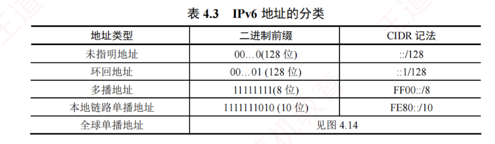

---

### 4.3.3 IPv6 地址

IPv6 数据报的目的地址有以下**三种基本类型**：

1. **单播**。即传统的**点对点通信**，数据报发送给唯一指定的接收方。
    
2. **多播**。**一点对多点的通信**，数据报发送给所有加入该**多播组**的接口。
    
3. **任播**。是 IPv6 **新增的一种地址类型**，其特点可概括为“一址多用、就近交付”。  
   任播地址标识一组接口，但网络会将数据报仅交付给其中**路由距离最近的一个**。
    

IPv4 地址通常采用**点分十进制**表示法。  
若 IPv6 也沿用此方式，其 128 位地址将显得冗长。  
因此，IPv6 标准采用**冒号十六进制**记法：  
将地址划分为 8 组，每组 16 位（4 个十六进制数），各组之间用**冒号**分隔。例如，`4BF5:AA12:0216:FEBC:BA5F:039A:BE9A:2170`。

为了书写简便，还规定了如下**两种缩写规则**。

1. **省略前导零。** 每组中前面连续的十六进制零可以省略，但至少要保留一个数字。例如，可以把地址 `4BF5:0000:0000:0000:BA5F:039A:000A:2176` 缩写为 `4BF5:0:0:0:BA5F:39A:A:2176`。

2. **双冒号替换连续全零组。** 当地址中出现**一个或多个连续的全零组**时，可用双冒号（`::`）替代。  
   但“`::`”在**一个地址中只能使用一次**，否则无法确定省略了多少个全零组（因总组数需恢复为 8）。  
   因此，上述地址可被更紧凑地缩写为 `4BF5::BA5F:39A:A:2176`。

IPv6 **地址的分类**如表 4.3 所示。

对表 4.3 给出的**五类地址**简单解释如下：

1. **未指明地址**：不能用作目的地址，仅用于尚未配置 IPv6 地址的主机作为源地址。
    
2. 环回地址：作用与 IPv4 的环回地址相同，但 IPv6 中仅定义这一个环回地址。
    
3. 多播地址：作用与 IPv4 多播类似。这类地址占 IPv6 地址空间的 1/256。
    
4. 本地链路单播地址：仅用于本地链路内的通信，不能被路由器转发。
    
5. 全球单播地址：使用最多的地址。IPv6 单播地址的划分方法非常灵活，如图 4.14 所示。可以把整个 128 位都作为一个节点的地址。也可用 $n$ 位作为子网前缀，剩下的 $(128-n)$ 位作为接口标识符（相当于 IPv4 的主机号）。还可以划分为三级：用 $n$ 位作为全球路由选择前缀，用 $m$ 位作为子网前缀，而剩下的 $128-n-m$ 位则作为接口标识符。
    
