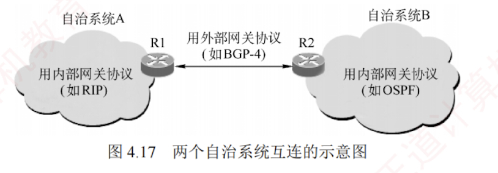

---

### 4.4.2 分层次的路由选择协议

互联网采用的是**自适应**的**分布式路由选择协议**。  
由于互联网规模非常庞大，且许多互联网单位不愿对外暴露其内部网络细节，因此采用了**分层次的路由选择协议**。

为此，整个互联网被划分为多个较小的**自治系统**（Autonomous System, **AS**）。  
每个自治系统在对外通信时，表现为一个**单一且一致**的**路由选择策略**。

自治系统的管理者有权**自主决定**在其内部使用何种路由选择协议（如 RIP 或 OSPF）。

基于此，互联网的路由选择协议被划分为**两大类**。

1. **内部网关协议（Interior Gateway Protocol, IGP）**
    
    内部网关协议用于自治系统内部的路由选择，与其他自治系统所采用的协议无关。  
    目前这类路由选择协议使用最多，如 RIP 和 OSPF。
    
2. **外部网关协议（External Gateway Protocol, EGP）**
    
    当源主机和目的主机位于**不同的自治系统**中（这两个自治系统可能使用不同的 IGP），数据报在到达某一自治系统边界时，就需要借助一种协议将路由信息传递到另一个自治系统。  
    这类协议称为**外部网关协议**。  
    当前广泛使用的外部网关协议是 **BGP-4**。
    

自治系统之间的路由选择也称**域间路由选择**，自治系统内部的路由选择也称**域内路由选择**。

图 4.17 是两个自治系统互连的示意图. 
每个自治系统可以自行选择内部使用的网关协议（如 RIP 或 OSPF）。  
但每个自治系统都至少有一个或多个**边界路由器**（图中的 R1 和 R2），这些路由器除运行本系统的**内部网关协议**外，还需运行**外部网关协议**（如 BGP-4）。

