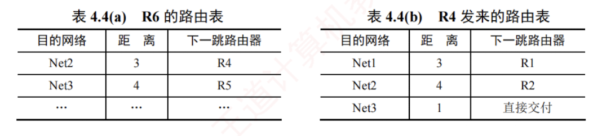
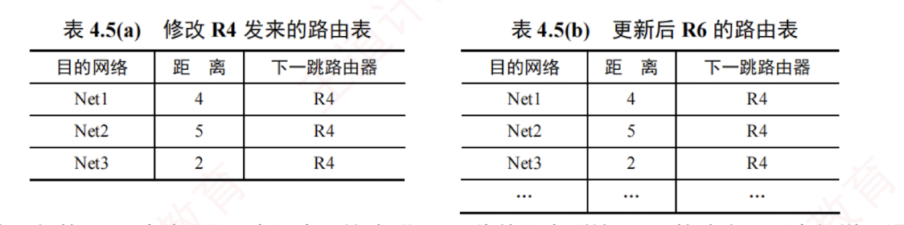
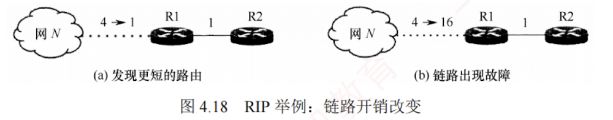

---

### 4.4.3 路由信息协议

**路由信息协议**（Routing Information Protocol, **RIP**）是**内部网关协议**（**IGP**）中最早得到广泛应用的协议之一。  
RIP 是一种分布式的、基于距离向量的路由选择协议。

#### 1. RIP 的规定

1. RIP。**使用跳数**（Hop Count，也称距离）来衡量到达目的网络的远近。规定从一个路由器到其直连网络的距离为 1；  
   每经过一个路由器，跳数加 1。
    
2. RIP 认为“好”的路由就是所经路由器数量最少的路径，即**跳数最少**。  

3. RIP 规定一条路径最多包含 15 个路由器，因此**跳数为 16 表示目的网络不可达**。  
   由此可见，**RIP 仅适用于小型自治系统**。
    
4. 每个路由表项包含三个关键字段：<目的网络 $N$，距离 $d$，下一跳路由器地址 $X$>，其含义是“我通过下一跳路由器 $X$ 到达目的网络 $N$ 的距离为 $d$”。
    
5. 网络中的每个路由器都需要维护一个**距离向量**，即其到所有目的网络的距离记录。
    

#### 2. RIP 的特点

RIP 要求每个路由器持续与其它路由器交换信息，其工作特点主要体现在以下**三个方面**。

1. **和谁交换信息**：仅和直接相邻的路由器交换信息。
    
2. **交换什么信息**：交换的是本路由器当前的**完整路由表**，即**全部路由信息**。
    
3. **何时交换信息**：按**固定的时间间隔**（默认为 30 秒）交换路由信息，路由器据此更新自己的路由表。  
   当网络拓扑发生变化时，路由器也及时向相邻路由器通告最新路由信息。
    

路由器刚开始工作时，它的路由表是空的。  
然后，路由器得得知几个**直连网络**的距离为 1。  
接着，它**周期性**地与邻居交换并更新路由信息。  
经过若干轮的交换和更新后，所有路由器最终都会获知到达本自治系统内任意网络的**最少跳数**和对应的**下一跳地址**，这一过程称为**收敛**。


**RIP 是应用层协议**，它使用 **UDP** 传送数据（端口 **520**）。  
需要注意的是，RIP 选择的路径不一定是时延最短，但一定是跳数最少的路径，因为它仅依据**跳数**进行路径选择。

#### 3. RIP 的基本工作原理

对于每个相邻路由器发来的 RIP 报文，执行以下步骤：

1. 对来自地地址为 $X$ 的相邻路由器的 RIP 报文，首先修改其中所有项目：将所有“下一跳”字段都置为 $X$，并将所有“距离”字段的值加 1。
    
2. 对修改后的每个项目，按如下规则处理：
    


```
IF (若原路由表中没有目的网络 N)
    则将该项目加入路由表 (表示发现新网络)。
ELSE IF (若原路由表中已有目的网络 N, 且原下一跳地址是 X)
    用新收到的项目替换原表项 (要以最新的消息为准)。
ELSE IF (若原路由表中已有目的网络 N, 但原下一跳地址不是 X)
    若新收到的项目中的距离 d 小于当前记录的距离，则替换原表项 (表示找到更优路径)。
ELSE 什么也不做。
```

3. 若**连续 180 秒**（RIP 默认超时时间）未收到某相邻路由器的更新报文，则将其标记为**不可达**，即**将对应路由项的距离置为 16**（表示不可达）。
    
4. 处理完毕，返回。
    


下面举例说明 RIP 路由表项的**更新过程**。  
已知路由器 R6 和 R4 互为**相邻路由器**，表 4.4(a) 所示为 R6 的路由表。  
现在收到相邻路由器 R4 发来的**路由表**，如表 4.4(b) 所示。



现对 R6 的路由表进行更新。  
先把 R4 发来的路由表 [表 4.4(b)] 中各项的距离都加 1，并把下一跳路由器都改为 R4，得到表 4.5(a)。  
这么做的**意义**是：  
R4 是 R6 的相邻路由器，R6 可通过 R4 到达这些网络，但距离比 R4 到达这些网络的距离大 1。  
将该表与 R6 的原路由表逐项比较。



第一行的 Net1 在表 4.4(a) 中没有。  
这表明：R6 此前没有到达 Net1 的路由，现在知道可通过 R4 到达 Net1。  
因此，要把这条 Net1 的路由表项添加到 R6 的路由表中。  

第二行的 Net2 在表 4.4(a) 中已有，且下一跳路由器也是 R4。  
这表明：R6 到达 Net2 的最佳路由仍然是通过 R4，但距离发生了变化（通常由网络拓扑变化引起）。  
因此，要更新目的网络 Net2 的路由表项（无论距离是变大还是变小，都需要更新）。

第三行的 Net3 在表 4.4(a) 中已有，但下一跳路由器不同。  
此时**比较距离**，新路由信息的距离为 2，小于原表中的 4。  
这表明：R6 通过 R4 到达 Net3 的路径比原来经由 R5 的更短，因此应更新 Net3 的路由表项（新路由的距离更大时，不更新）。

更新后的 R6 的路由表如表 4.5(b) 所示。

#### 4. RIP 的优缺点


RIP 的**优点**：

1. 实现简单、开销小、收敛过程较快。
    
2. 若一个路由器发现更短的路由，该更新信息会迅速传播，在较短时间内即可传至所有路由器，俗称“**好消息传播得快**”。
    

RIP 的**缺点**：

1. RIP 限制了网络的规模，其最大有效距离为 15（距离 16 表示不可达）。
    
2. 路由器之间交换的是**完整的路由表**，因此网络规模越大，通信开销也越大。
    
3. 当网络出现故障时，路由器需反复多次交换信息才能完成收敛，故障信息传递缓慢，导致慢收敛现象，俗称“**坏消息传播得慢**”。
    

下面举例说明 **RIP “好消息传播得快，坏消息传播得慢” 的特点**。  

假设图 4.18 中的路由器均采用 RIP 交换路由信息，初始时 R1 到网络 $N$ 的距离为 4，且 R1 和 R2 均已**收敛**。  
为简化讨论，此处仅考虑到达网络 $N$ 的路由条目：R1 中为<网络 $N$, 4, 直接>，R2 中为<网络 $N$, 5, R1>。



在图 4.18(a) 中，某时刻，R1 检测到一条“到 $N$ 更短的链路”（距离由 4 变为 1），于是将到 $N$ 的距离更新为 1，并通知 R2（即便 R1 先收到 R2 发来的更新报文，也不会修改自身到 $N$ 的路由）。  
R2 收到后，将到 $N$ 的距离更新为 2，并通知 R1；  
R1 收到后，不再修改自己的路由，算法进入**静止**状态。  
可见，R2 到 $N$ 的距离减少的好消息通过 RIP 得到了迅速传播。

在图 4.18(b) 中，某时刻，R1 检测到“$N$ 不可达”（距离由 4 变为 16），于是将到 $N$ 的距离置为 16，但可能需等到**下一次周期性更新**（默认 30s）才会通知 R2。  
而在此期间，R2 可能已先将自己的更新报文发给了 R1，其中包含<$N$, 5, R1>。  
R1 收到后，误认为可通过 R2 到达 $N$，于是将路由信息更新为<$N$, 6, R2>。随后 R1 通知 R2，R2 又据此将路由信息更新为<$N$, 7, R1>，误认为可通过 R1 到达 $N$……如此往复，直到两者最终都将距离增至 16，才知道原来 $N$ 是不可达的。  
可见，RIP 对链路故障或距离增加这类“坏消息”的传播非常缓慢。  
若无跳数上限（15）的限制，路由器将无限循环转发无效路由信息，因此“坏消息传播得慢”也称**无穷计数**问题。


