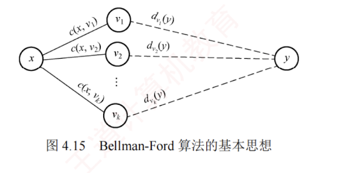
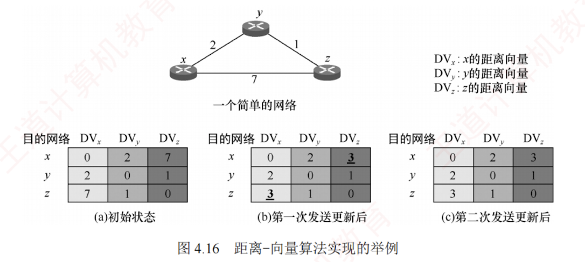

---

### 4.4.1 路由算法

**路由选择协议**的核心是**路由算法**，即用于生成路由表中各项条目的计算方法。  
其目的很明确：给定一组路由器及其互连链路，路由算法要找到一条从**源路由器到目的路由器的最佳路径**。  
通常“最佳”路径是指费用最低的路径，该费用可根据跳数、带宽、延迟等因素定义。

#### 1. 静态路由与动态路由

路由器转发分组是通过**路由表**进行的，而路由表是通过各种算法生成的。  
从能否随网络状态自适应调整的角度，路由算法可分为如下两大类。

1. **静态路由算法**。由网络管理员**手工配置**每一条路由。
    
2. **动态路由算法**。根据网络状态的变化（如链路故障或新增）来**动态调整**自身的路由表。
    

**静态路由算法**的特点是实现简单、开销小，但不能及时适应网络状态的变化，适用于简单的**小型网络**。  
**动态路由算法**能较好地适应网络状态的变化，但实现复杂、开销也大，适用于较复杂的大型网络。  
常用的动态路由算法可分为两类：**距离-向量算法**和**链路状态算法**。

#### 2. 距离-向量算法

**距离-向量**（Distance-Vector, **DV**）算法基于 Bellman-Ford 算法，它不要求每个节点掌握完整的网络拓扑，而只需知道：  
**与相邻节点之间的距离**；  
**各邻居节点到目的节点的最短距离**。  
每个节点以自身为源点，独立运行 Bellman-Ford 算法，通过迭代交换信息，最终可收敛到**全网一致**的**最短路径解**。 

下面讨论 Bellman-Ford 算法的**基本思想**。

假设 $d_x(y)$ 表示从节点 $x$ 到节点 $y$ 的最短路径费用，则有

$$d_x(y) = \min_v \{c(x, v) + d_v(y)\}, \quad v \text{ 是 } x \text{ 的所有邻居}$$

式中，$c(x, v)$ 是从 $x$ 到其邻居 $v$ 的链路费用。  
已知 $x$ 的所有邻居到 $y$ 的最短路径费用后，$x$ 到 $y$ 的最短路径费用即为所有 $c(x, v) + d_v(y)$ 中的最小值，如图 4.15 所示。  

所有最短路径算法都依赖于一个**基本性质**：  
“**两点之间的最短路径，必然包含路径上任意子路径的最短路径**”。

在**距离-向量算法**中，每个节点 $x$ 维护以下**路由信息**：

1. 从 $x$ 到每个**直接相连邻居** $v$ 的**链路费用** $c(x, v)$。
    
2. 节点 $x$ 的距离向量，即 $x$ 到网络中其他节点的费用。  
   这是一组距离，因此称为**距离向量**。
    
3. 从每个邻居接收到的**距离向量副本**，即 $x$ 的各邻居到所有其他节点的费用。
    

算法运行时，每个节点**定期**向所有邻居发送自己的**距离向量**。  
当节点 $x$ 从邻居 $v$ 接收到新的距离向量后，会更新本地保存的 $v$ 的距离向量副本，并利用上述公式重新计算自身的距离向量。  

若计算结果导致自身的距离向量发生变化，则**立即**向所有邻居发送**更新后的距离向量**。

下面以图 4.16 顶部所示的**三节点简单网络**为例，说明距离-向量算法的实现过程。

图 4.16(a) 中的各列依次是三个节点的**初始距离向量**，此时各节点之间尚未交换过任何路由信息，因此每个节点的距离向量仅包含到每个直连邻居的链路费用。

初始化完成后，各节点首次向邻居发送自己的距离向量。  
收到更新后，每个节点重新计算自己的距离向量。例如，节点 $x$ 计算的过程为：$d_x(x) = 0$; $d_x(y) = \min\{c(x, y) + d_y(y), c(x, z) + d_z(y)\} = \min\{2 + 0, 7 + 1\} = 2$; $d_x(z) = \min\{c(x, y) + d_y(z), c(x, z) + d_z(z)\} = \min\{2 + 1, 7 + 0\} = 3$。  
可见，$x$ 到 $z$ 的最低费用由 7 变成了 3，$z$ 到 $x$ 的最低费用也由 7 变成了 3，如图 4.16(b) 所示。  
由于距离向量发生变化，$x$ 和 $z$ 要再次向邻居发送更新报文，而未变化的 $y$ 则无须发送。  
这一轮交换后，各节点又重新计算，发现距离向量不再变化，算法收敛并进入静止状态，如图 4.16(c) 所示。

显然，**更新报文的大小与网络节点数成正比**，大型网络中可能产生较大的通信开销。  
最常见的距离-向量路由协议是 **RIP**，它采用**跳数**作为路径费用的度量标准。

#### 3. 链路状态算法

**链路状态**（Link State, **LS**）指的是：  
本路由器与哪些邻居相连，以及对应链路的代价。  
链路状态算法要求每个节点都掌握完整的**全网拓扑结构图**。  
为此，每个节点执行以下两项任务：

- **主动探测**所有**相邻节点的状态**；
    
- 定期将自身的链路状态信息，通过**洪泛法**传播给全网所有节点。
    

因此，每个节点都知道全网拓扑、连接关系及各链路代价，并可基于此使用 **Dijkstra 最短路径算法**，独立计算到其他所有节点的最短路径；  
每当收到链路状态报文时，节点会更新本地的拓扑视图，并在链路状态发生变化时，立即重新运行 Dijkstra 算法以更新最短路径。

链路状态算法的主要优点是：  
1. 所有节点基于相同的链路状态数据库独立计算最优路径，不依赖邻居的路由决策，避免了距离-向量算法中的无穷计数等问题；
2. 每个节点获得完整拓扑

后，可本地计算全局最优路径，收敛过程通常较快且无环；③ 链路状态报文仅包含本节点的直连链路信息，单个报文大小与网络总规模无关，因此在大型网络中具有更好的可扩展性。

两种路由算法的比较：① 在距离-向量算法中，每个节点仅与直接邻居交换信息，发送的是完整的距离向量（大小与节点数成正比），通信开销较大；② 在链路状态算法中，每个节点通过洪泛方式向全网广播自身直连链路的状态，但每条报文仅包含局部信息，总体可扩展性更好。

典型的链路状态算法是 OSPF 算法。
