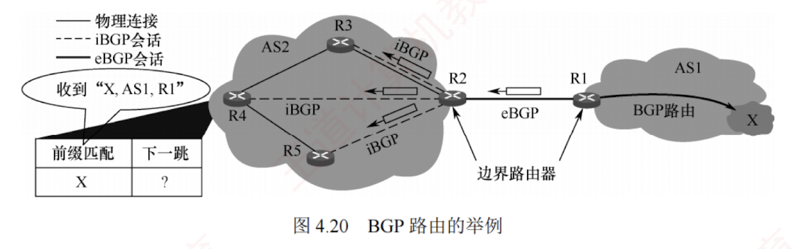
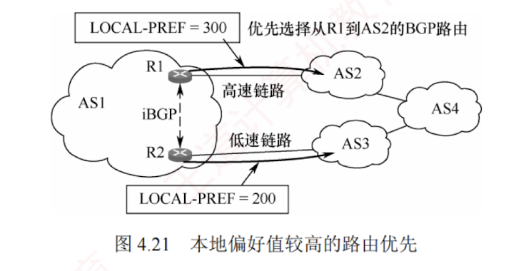
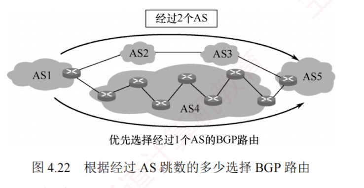
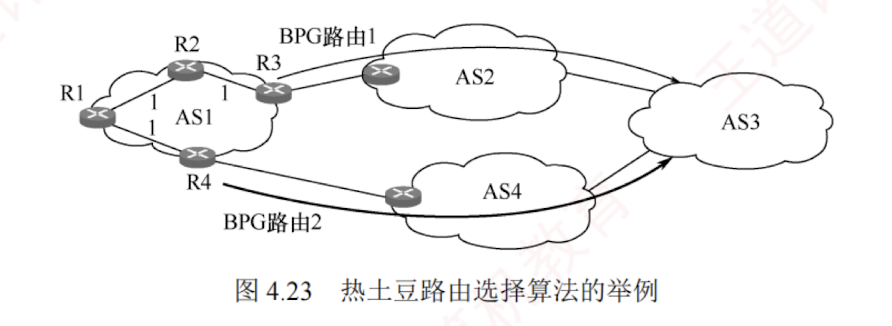
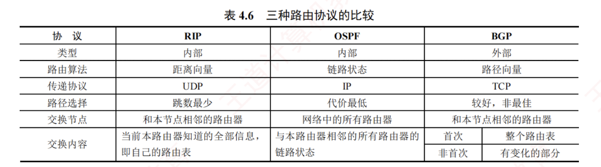

---

### 4.4.5 边界网关协议

#### 1. BGP 的基本特点


**边界网关协议** (Border Gateway Protocol, **BGP**) 是**不同自治系统**的路由器之间交换路由信息的协议，是一种**外部网关协议**。  
BGP 常用用于互联网的 AS 之间。  
而 RIP 和 OSPF 都只能在一个 AS 内工作；  
若没有 BGP，则全世界数以万计的 AS 都将是一个个彼此孤立的“孤岛”。

内部网关协议主要是设法使分组在一个 AS 内尽可能有效地从源站传送到目的站。  
在一个 AS 内部通常不需要考虑其他方面的策略。

然而 BGP 使用的环境却不同，**主要原因**如下：

1. 互联网的规模太大，使得 AS 之间的路由选择非常困难，每个主干网路由器表中的项目数都非常庞大。  
   对于 AS 之间的路由选择，寻找最佳路径是很不现实的。
    
2. AS 之间的路由选择必须考虑政治、安全或经济等有关因素。
    


因此，BGP 只能力求寻找**一条能够到达目的网络且比较好的路由**（不能兜圈子），而非寻找一条最佳路由。  
BGP 采用了**路径向量路由选择协议**，它与距离向量协议（如 RIP）和链路状态协议（如 OSPF）都有很大的区别。  
BGP 是**应用层协议**，基于 **TCP** 实现。

#### 2. BGP 路由

BGP 路由的一般格式如下：


```c
BGP 路由 = <前缀, BGP 属性> = <前缀, AS-PATH, NEXT-HOP>
```

BGP 属性有多种类型。  
当一个路由器通过 BGP 会话向对方通告一条 BGP 路由时，最重要的**两个属性**是 AS-PATH（**自治系统路径**）和 NEXT-HOP（**下一跳**）。

AS-PATH 记录了该 BGP 路由所经过的**自治系统序列**。  
在 BGP 中，每个自治系统由一个全球唯一的**自治系统号** (**ASN**) 标识。  
BGP 路由每经过一个 AS，就向其 ASN 加入 AS-PATH。  
可见，BGP 路由明确指出了所经过的 AS 路径，但不指明具体经过哪些路由器。

NEXT-HOP 表示接收该 BGP 路由的路由器去往目的网络时应使用的下一跳地址。具体而言，

从本 AS 出发时，需将分组发给 NEXT-HOP，其通常是通告此路由的邻居 AS 的边界路由器上与本 AS 直连的接口 IP 地址，即 AS-PATH 中第一个 AS（邻居 AS）对应的入口点。


在一个 AS 中有**两类功能不同的路由器**：  
**边界路由器**和**内部路由器**。  
在这些**边界路由器**之间，以及在 AS 内部的 BGP 路由器之间，均通过端口号为 **179** 的**半永久 TCP 连接**（交换信息后仍保持连接）来交换 BGP 路由信息。  
每对通过 TCP 连接交换 BGP 报文的路由器称为 **BGP 对等方**，该 TCP 连接称为 **BGP 会话**。  
其中，**跨越两个 AS 的 BGP 会话称为外部 BGP** (**eBGP**, external) 会话，而位于**同一 AS 内的 BGP 会话称为内部 BGP** (**iBGP**, internal) 会话。  
可见，BGP 不仅用于 AS 之间的路由交换，还运行于 AS 内部，以确保外部路由信息在整个 AS 中正确传播。

为避免路由信息丢失，BGP 要求在 AS 内的**任意两台路由器之间都要建立 iBGP 会话**，但**不要求物理直连**（如图 4.20 中 R2 与 R4、R2 与 R5 之间的 iBGP 会话）。

下面通过一个简单的例子来说明。

在图 4.20 中，位于 AS2 的 R4 收到一条 BGP 路由“$X$, AS-PATH = AS1, NEXT-HOP = R1”，表示“从 R1 出发，经过 AS1，可到达网络 $X$”，即“R1 $\to$ $X$”。  
R4 为了构造自己的路由表，需要解析该路由的 NEXT-HOP。  
由于 R1 位于 AS1，AS2 的内部路由器无法直接将分组发往 R1，因此 R4 必须通过 AS2 中的某个边界路由器来抵达 NEXT-HOP。  
具体地，R4 知道 R1 是其 eBGP 对等方 R2 的邻居，因此通往 R1 的流量必须先发给 R2，形成的路径为“R2 $\to$ R1 $\to$ $X$”。  
由于 R2 在 AS2 中，AS2 内的所有路由器都能将分组转发到 R2，再经过 R1，最终到达 $X$。

接着，R4 利用**内部网关协议** (**IGP**)，找到从自身到 R2 的最优路径，假设查得下一跳为 R3。  
于是，R4 在路由表中添加表项<$X$, R3>。  
此后，R4 收到目的网络为 $X$ 的分组时，将按路径 R4 $\to$ R3 $\to$ R2 $\to$ R1 $\to$ $X$ 转发。  
类似地，R3 也会在其路由表中添加表项<$X$, R2>。  
每个路由器在收到新的 BGP 路由通告后，都需要执行 NEXT-HOP 解析和 IGP 查找，才能将路由正确写入本地路由表。

#### 3. BGP 路由选择


若从一个 AS 到另一个 AS 中的网络 $X$ 只有一条 BGP 路由，则无须进行 BGP 路由选择，该路由即为**唯一路径**。  
然而，如果存在两条或更多的 BGP 路由可供选择，则应根据以下原则，并按下面给定的优先顺序，选择一条较好的 BGP 路由。

##### (1) 首先选择本地偏好值最高的路由

在 BGP 路由的属性中，有一个称为**本地偏好** (LOCAL-PREF) 的选项，其值可由管理员根据政治或经济上的策略来设置。  
以图 4.21 为例，从 AS1 到 AS4 共有两条 BGP 路由，管理员设置 LOCAL-PREF 值后，根据该原则，所有发往 AS4 的流量都选择从 R1 离开。然而，即使高速链路过载，BGP 也无法自动将部分流量切换到较空闲的低速链路。


若在几条 BGP 路由中找不出本地偏好值最高的路由，则采用**下面的方法**。

##### （2）选择 AS 跳数最少（AS-PATH 最短）的路由

假设到达目的 AS 的多条 BGP 路由的本地偏好都相同，则 BGP 选择 **AS 跳数最少的路由**。  
以图 4.22 为例，从 AS1 到 AS5 共有两条 BGP 路由，根据该原则，应选择仅通过 1 个 AS 的 BGP 路由，即 AS1 $\to$ AS4 $\to$ AS5。  
然而，由于 AS4 是个很大的 AS，分组在 AS4 中反而要经过更多次的转发，可能要花费更长的时间。  
可见，AS 跳数最少的路由**未必是最好**的。

##### （3）使用热土豆路由选择算法

假设按前两种方法都无法确定最好的路由。  
以图 4.23 为例，从 AS1 到 AS3 共有两条 BGP 路由，假设这两条路由的本地偏好都相同，所经过的 AS 个数也相同。  
此时，AS1 中的每个路由器执行**热土豆路由选择算法**（比喻成烫手的热土豆），使分组经过最少的转发次数离开本 AS。这时要使用**内部网关协议**（如 RIP 或 OSPF），对于不同的路由器，得出的选择结果是不同的。  
对于 R1，要使分组尽快离开 AS1，应选择 R4 作为下一跳，因此应选择 BGP 路由 2，最终的转发路径为 R1 $\to$ R4 $\to$ BGP 路由 2。  
同理，对于 R2，要使分组尽快离开 AS1，应选择 R3 作为其下一跳，因此应选择 BGP 路由 1，最终的转发路径为 R2 $\to$ R3 $\to$ BGP 路由 1。


##### （4）选择 BGP 标识符数值最小的路由

在 BGP 报文的首部有一个称为 **BGP 标识符**的字段，该字段是运行 BGP 路由器的唯一标识符。  
当以上三种方法都无法找出最好的 BGP 路由时，可使用 BGP 标识符来选择路由。

#### 4. BGP 的四种报文

当 **BGP 刚启动**时，BGP 会话的两端需要**交换完整的 BGP 路由表**；  
此后，仅在**路由发生变化时发送更新部分**。  
这种方式有助于节省网络带宽并降低路由器的处理开销。


BGP-4 定义了以下**四种报文类型**。

1. **Open**（打开）报文。用来与 BGP 会话的**对等方建立关系**，使通信初始化。
    
2. **Update**（更新）报文。用来**通告某一路由的信息**，以及列出要**撤销的多条路由**。
    
3. **Keepalive**（保活）报文。用来**周期性**地证实与对等方的**连通性**。
    
4. **Notification**（通知）报文。用来发送检测到的**差错**。
    

两个路由器在建立 TCP 连接后，必须**首先交换 Open 报文**，以相互识别对方，并协商一些协议参数。  
收到 Open 报文的路由器若接受 BGP 连接请求，则返回 **Keepalive 报文**。  
BGP 会话建立后，对等方需要**周期性地交换 Keepalive 报文**（**默认间隔为 60 秒**），以维持连接活跃状态。

**Update 报文是 BGP 的核心**，用于**撤销**它之前通告过的路由，或者宣布**增加**一条新的路由。  
撤销路由可以一次撤销多条，但**新增路由时，每个更新报文只能增加一条**。

为检测对等方是否失效，每个 BGP 路由器都维护一个**保持时间计时器**。  
每当收到任意 BGP 报文，计时器就重置为 0 并开始计时，若在约定的保持时间内未收到任何 BGP 报文，则认为对等方已失效，BGP 连接将被关闭。  
**保持时间默认为 180s**，而 Keepalive 报文的发送间隔为其 1/3。

RIP、OSPF 与 BGP 的**比较**如表 4.6 所示。

