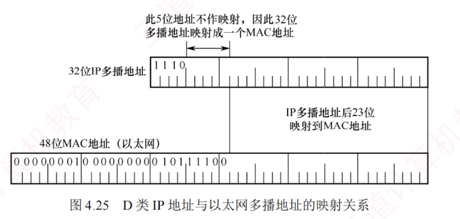

---

#### 4.5.3 在局域网上进行硬件多播

由于**局域网**支持**硬件多播**，只需将 IP 多播地址映射为对应的多播 MAC 地址，并将 IP 多播数据报封装在以太网帧中，其 MAC 帧首部的目的地址字段设为该映射所得的多播 MAC 地址。  
这样，即可借助局域网的硬件多播能力，高效实现 IP 多播在本地网络中的传输。

IANA（互联网地址指派机构）保留的以太网多播地址的范围是 01-00-5E-00-00-00 到 01-00-5E-7F-FF-FF，在这 48 位中，前 25 位保持不变，只有后 23 位可用作多播。  
而 D 类 IP 地址共有 28 位可用于标志多播组，这 28 位中的高 5 位无法映射，导致 32 (即 $2^5$) 个不同的 IP 多播地址会映射到同一个多播 MAC 地址。  
因此两者是多对一的映射关系，如图 4.25 所示。

例如，IP 多播地址 224.128.64.32 (E0-80-40-20) 与 224.0.64.32 (E0-00-40-20) 映射到以太网多播 MAC 地址时，均得到 01-00-5E-00-40-20。因此，主机在收到多播数据帧后，还需在 IP 层利用数据报首部中的目的 IP 地址进行过滤，仅保留本机所属多播组的数据报，其余则予以丢弃。

