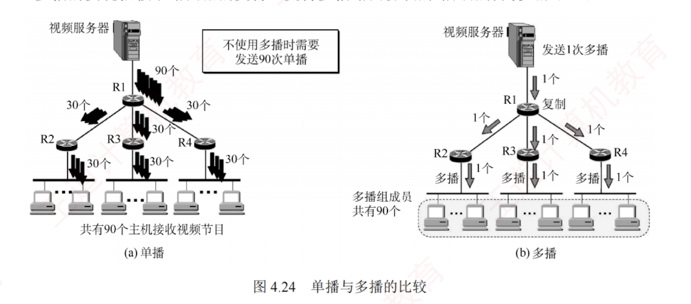

---

#### 4.5.1 多播的概念

**多播**（也称**组播**）是让源主机一次发送的单个分组可以抵达用一个**组地址**标识的若干目的主机，即**一对多的通信**。  
在互联网上进行的多播，称为 **IP 多播**。  
与单播相比，多播在一对多通信中能显著节省网络资源。  
例如，当视频服务器向 90 台主机发送相同的视频分组时（见图 4.24），单播需要为每台主机单独发送一份分组，共 90 份；  
而多播仅发送一份分组。  
该分组在传输路径上仅当遇到分岔节点时才被复制并转发。  
到达目的局域网后，已加入该多播组的主机均可收到该分组。  
因此，多播大幅减轻了服务器的负担和网络负载。

多播的实现依赖于**路由器**的支持，支持**多播路由协议**的路由器称为**多播路由器**。

