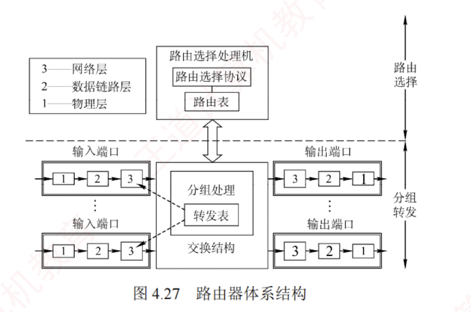

---

#### 4.7.2 路由器的组成和功能

路由器是一种具有**多个输入/输出端口**的专用**计算机**，其任务是互连不同的网络（**异构网络**）并转发分组。  
在多个逻辑网络（多个广播域）互连时必须使用路由器，可用于连接不同的 LAN，不同的 VLAN，不同的 WAN，或实现 LAN 与 WAN 的互连。

从**结构**上看，路由器由**路由选择**（**控制平面**）和**分组转发**（**数据平面**）两部分构成，如图 4.27 所示。  
而从**模型**角度看，路由器是工作在**网络层**的设备，其转发决策基于 **IP 地址**；为完成此功能，其端口还要具备**物理层**和**数据链路层**的处理能力。

路由选择部分的核心是**路由选择处理机**，其任务是根据所选**路由选择协议**（如 RIP、OSPF）构建**路由表**，并周期性地与相邻路由器交换路由信息，以更新和维护路由表。

**分组转发**部分由**三部分**组成：  
**交换结构**、**一组输入端口和一组输出端口**。

**交换结构**是路由器内部连接输入与输出端口的**高速通路**，负责根据转发表将输入端口的分组快速转发至合适的输出端口。  
交换结构本身就是一个“**在路由器中的网络**”。

路由器的**每个端口都包含物理层、数据链路层和网络层的处理模块**。  

输入端口在物理层接收比特流，在数据链路层提取帧并剥离帧头和帧尾后，将分组送入网络层的处理模块。  
若收到的分组为**普通数据分组**，则根据目的 IP 地址查找**转发表**，经交换结构送至相应的输出端口。  
若为**路由协议分组**（如 RIP、OSPF 报文），则交由路由选择处理机处理。

路由器在端口处设有**缓冲区**，用于暂存待处理或待发送的分组，并可进行**差错检测**。  
若分组到达速率超过处理能力，则缓冲区可能**溢出**，导致后续**分组被丢弃**。  

需要说明的是，路由器的**物理端口**通常**兼具输入和输出功能**，图 4.27 中将输入/输出端口分开绘制，仅为方便理解。
