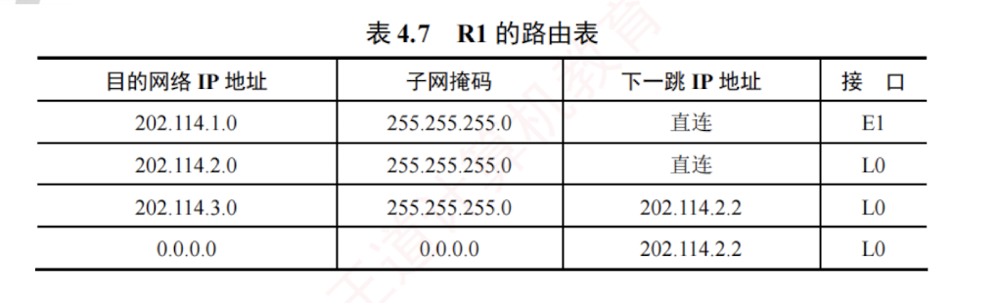

---

#### 4.7.3 路由表与分组转发

路由表是根据**路由选择算法**得出的，主要用于**路由选择**。  
根据历年统考真题可知，标准的路由表通常包含**四个字段**：  
目的网络 IP 地址、子网掩码、下一跳 IP 地址、接口。  
在图 4.28 所示的网络拓扑中，R1 的路由表如表 4.7 所示，其中包含一条**指向互联网**的**默认路由**。

转发表由路由表得出，其表项与路由表项有**直接的对应关系**。  
但两者的设计目标不同：  
路由表应使路由计算优化，便于动态更新和拓扑变化处理；  
转发表应使高速查找优化，用于实际的数据转发过程。  
转发表通常包含目的网络前缀和对应的下一跳信息。  
转发表中可配置一条默认路由，当目的地址无法匹配任何明确表项时，分组将按默认路由转发。  
在实现方式上，路由表通常由软件维护；  
而转发表既可用软件实现，又可通过专用硬件。

注意**转发和路由选择的区别**：  
“**转发**”是单个路由器根据转发表，将收到的 IP 数据报从合适端口送出的过程，属于**数据平面**操作；  
而“**路由选择**”是多个路由器协同工作，通过**路由协议**交换拓扑信息，运行路由算法动态生成**路由表**的过程，属于**控制平面**操作。