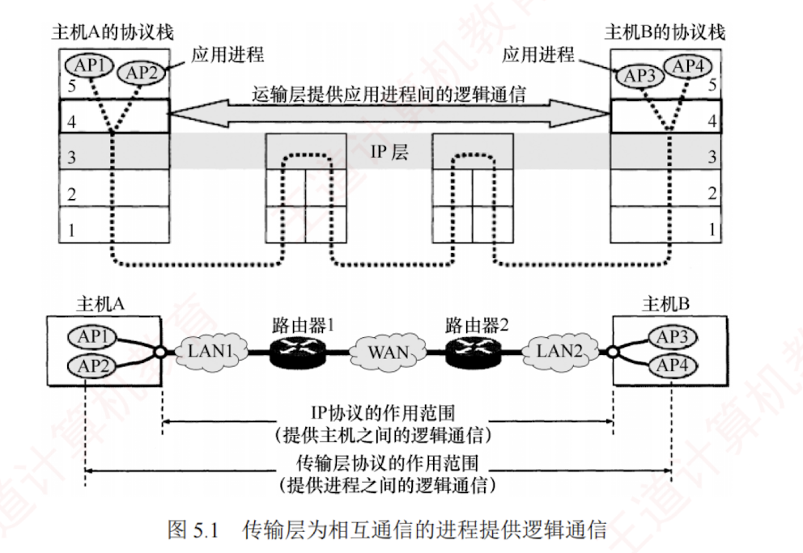

---

### 5.1.1 传输层的功能

数据链路层提供链路上**相邻节点**之间的逻辑通信，**网络层**提供**主机**之间的逻辑通信。  
传输层位于网络层之上、应用层之下，为运行在**不同主机上的进程**之间提供逻辑通信。  
**传输层**是面向通信部分的最高层，同时也是用户功能中的**最低层**。  

即使网络层协议**不可靠**（例如，导致分组丢失、失序或重复），**传输层仍能为应用程序提供可靠的服务**。

以图 5.1 为例说明**传输层**的作用。  
假设局域网 LAN1 上的主机 A 和局域网 LAN2 上的主机 B 通过互连的广域网 WAN 进行通信。  
一台主机中常多个应用进程同时与另一台主机中的多个应用进程通信，其中 $\text{AP}_x$ 表示主机中参与通信的应用进程。  

**传输层的主要功能**如下。  

[[如何理解逻辑通信]]
#### 1. 应用进程之间的逻辑通信

从**网络层**角度看，通信的两端是两台主机，IP 数据报首部指明了这两台主机的 IP 地址。  
但“主机之间的通信”的实质是主机中应用进程之间的通信，也称为**端到端**的逻辑通信。  
IP 虽能将分组送达目的主机，但该分组仅停留在主机的网络层，并未交付给具体的应用进程。  
而从传输层视角看，通信的真正端点并非主机，而是主机中的进程。

#### 2. 复用和分用

复用是指发送方的多个应用进程可使用同一个传输层协议传送数据。分用是指接收方的传输层在剥去报文首部后，能将数据正确交付给对应的目的应用进程。

> **注意**
> 
> 网络层也具备复用和分用的功能，但其复用是指将不同传输层协议的数据封装成 IP 数据报发送；分用则是指接收方网络层根据首部的协议字段，将数据交付给相应的传输层协议。

#### 3. 差错检测

传输层对收到的整个报文（包括首部和数据部分）进行差错检测。对于 TCP，若接收方发现报文段出错，则要求发送方重传。对于 UDP，若发现数据报出错，则直接丢弃。相比之下，网络层的 IP 数据报仅对其首部进行校验，不检查数据部分。

#### 4. 提供面向连接和无连接的传输服务

传输层向上层屏蔽了底层网络的复杂性（如拓扑结构、路由协议等），使应用进程感知到的是一条端到端的逻辑通信信道。该信道的特性取决于所采用的传输层协议：使用 TCP（面向连接）时，尽管底层网络仅提供“尽最大努力”的服务，逻辑信道仍表现为一条全双工的可靠信道；使用 UDP（无连接）时，逻辑信道则仍为不可靠信道。

