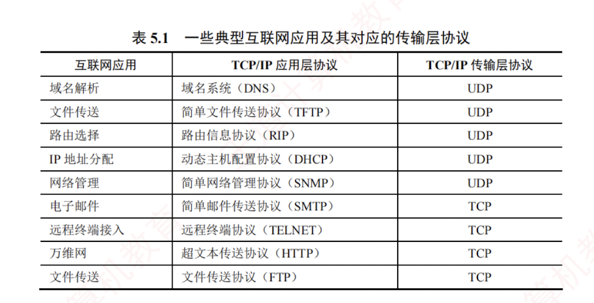

---

### 5.1.3 无连接服务与面向连接服务

TCP/IP 协议族在 IP 层之上定义了两个主要的传输协议：

- **TCP（传输控制协议）**：面向连接，提供可靠的**全双工**逻辑信道。
    
- **UDP（用户数据报协议）**：无连接，提供**不可靠**的逻辑信道。
    

TCP 要求通信双方在数据传输前先建立连接，传输结束后释放连接。  
**TCP 不提供广播或多播服务**。  
TCP 通过**确认**、**流量控制**、**计时器**和**连接管理**等机制保障可靠传输，但代价是首部开销大、处理资源消耗高。  
因此，TCP 适用于对**可靠性要求高**的场景，如 FTP、HTTP、SMTP 等。

UDP **无须建立连接**，接收方收到数据报后，也**不发送确认**。  
它在 IP 层之上仅提供两项服务：**多路复用**与**分用**、**数据差错检测**。  
由于结构简单、开销小，UDP 执行效率高、实时性好，适用于对**时延敏感**、可容忍**少量丢包**的应用，如 TFTP、DNS、DHCP 和 RIP 等。

表 5.1 列出了一些典型互联网应用及其对应的传输层协议。

> **注意**
> 
> IP 数据报和 UDP 数据报的**区别**：  
> IP 数据报在网络层需经路由器存储转发；  
> 而 UDP 数据报作为 IP 数据报的载荷，在网络层传输时，**其内容对路由器不可见**。
