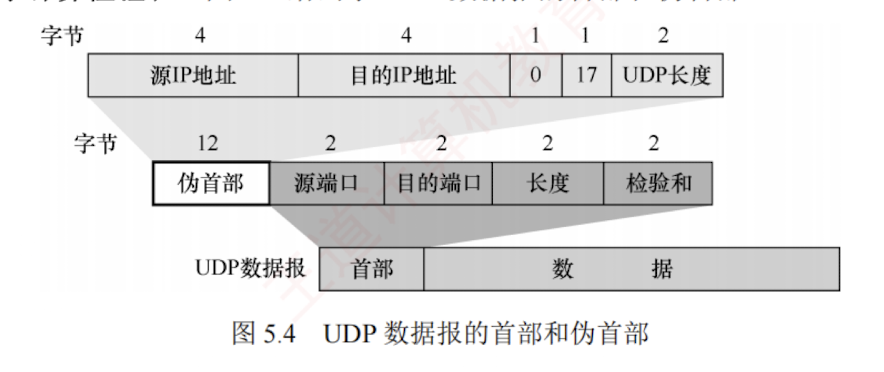

---

### 5.2.2 UDP 检验


在计算检验和时，要在 UDP 数据报之前增加 **12B 的伪首部**，伪首部并不是 UDP 的真正首部。  
只是在计算检验和时，临时添加在 UDP 数据报的前面，得到一个临时的 UDP 数据报。  
检验和就是按照这个临时的 UDP 数据报来计算的。伪首部既不向下传递给网络层，也不向上递交给应用层，而只是为了计算检验和。  

图 5.4 给出了 UDP 数据报的首部和伪首部。



UDP 检验和的计算方法与 IP 首部检验和基本类似。  
**不同之处**在于：  
IP 检验和只检验 IP 数据报的**首部**  
 UDP 检验和把**首部和数据**部分一起检验。

**UDP 计算检验和的过程**：  
在发送方，首先将**检验和字段置为全 0**，然后将伪首部与 UDP 数据报视为一连串 16 位字。  
若 UDP 数据部分长度为**奇数**个字节，则在计算时末尾补一个**全 0B**（该填充字节仅在计算检验和时临时添加，不影响实际发送的数据内容）。  
随后，按二进制**反码**规则对所有 16 位字求和，并将**结果的反码**写入检验和字段后发送。  
在接收方，将收到的 UDP 数据报与伪首部重新组合（同样在必要时补全字节），再按二进制反码求和。若无差错，则结果应为全 1（16 位全为 1）；否则说明有差错，接收方应丢弃该 UDP 数据报。

> **考点追踪** -> UDP 检验和的计算（2024）

**二进制反码求和的运算规则**：① 从低位到高位逐列进行计算，$0+0=0, 0+1=1, 1+1=0$ 并产生进位 1；② 若最高位相加后产生进位，则需将该进位加到结果的最低位，该过程称为回卷。

以下通过一个简单示例说明，假设有以下 3 个 16 位字：

Plaintext

```
01100110 01100000
01010101 01010101
10001111 00001100
```

先将前两个字相加，得

Plaintext

```
  01100110 01100000
+ 01010101 01010101
-------------------
  10111011 10110101
```

再将结果与第三个字相加（最高位产生进位，需加至最低位），得

Plaintext

```
  10111011 10110101
+ 10001111 00001100
-------------------
  01001010 11000001
+                 1   <- 进位加至最低位
-------------------
  01001010 11000010
```

最后对上述相加结果取反码，就得到检验和：

Plaintext

```
10110101 00111101
```

在接收方，将包括检验和在内的 4 个 16 位字相加，若结果为 `11111111 11111111`，则判定无差错；若结果中的某些位是 0，则说明有差错。

> **注意**
> 
> ① 若 UDP 检验和检验出数据报错误，通常应丢弃该报文；尽管 RFC 允许将其交付上层并附带错误指示，但实际实现中极少采用。
> 
> ② 通过伪首部，UDP 不仅能校验源端口、目的端口和数据内容，还能检测 IP 首部中的源地址和目的地址是否在传输过程中因错误而改变。

这种差错检验机制虽然检错能力有限，但其优势在于计算简单、处理速度快。
