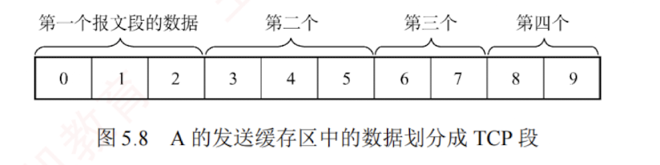

---
### 5.3.4 TCP 可靠传输

TCP 在不可靠的 IP 层之上提供**可靠传输服务**，确保接收方从缓存中读取的字节流与发送方发出的字节流完全一致。  
TCP 通过**检验、序号、确认和重传**等机制实现这一目的。  
其中，TCP 的检验机制与 UDP 类似，这里不再赘述。

#### 1. 序号

TCP 首部的序号字段用于保证数据按序提交给应用层。  
TCP 将数据视为一个**无结构但有序**的字节流，其序号是对**字节流**中的每个字节依次编号，而非对报文段整体编号。

TCP 将每个字节都编上一个序号，序号字段值指明本报文段所发送的第一个数据字节的序号。    
如图 5.8 所示，假设 A 和 B 之间建立了一条 **TCP 连接**，A 的发送缓存区中有 10B 的数据，序号从 0 开始编号。  

第一个报文段包含 $0 \sim 2$ 号数据字节，则该 TCP 报文段的序号是 0；  
第二个报文段的序号是 3；  
第三个报文段的序号是 6；  
第四个报文段的序号是 8。

#### 2. 确认

TCP 首部的**确认序号字段**表示**期望**收到对方下一个报文段的**第一个**数据字节的序号。  
在图 5.8 中，若接收方 B 已收到第一个和第二个报文段，此时 B 希望收到的下一个报文段的数据是从 6 号字节开始的，因此 B 向 A 发送的下一个报文段中的确认序号字段应置为 6。

发送方缓存区会继续存储那些已发送但未收到确认的报文段，以便在需要时重传。  
TCP 默认使用**累积确认**，即确认按序到达的连续字节，**确认序号为第一个未收到字节的序号**。  
接收方可以在**合适时机**发送确认，也可以在有数据要发送时将确认信息顺便携带上（**捎带确认**）。  
例如，在图 5.8 中，接收方 B 收到了 A 发送的第一个和第三个报文段，尚未收到第二个报文段，此时 B 仍在等待从 3 号字节开始的连续数据，因此 B 向 A 发送的下一个报文段将确认序号字段置为 3。

#### 3. 重传

有两种事件会导致 TCP 对报文段进行重传：**超时和冗余 ACK**。

##### (1) 超时

TCP 每发送一个报文段，就会对该报文段设置一个**超时计时器**。  
当计时器到期仍未收到确认时，TCP 将重传该报文段。

由于 TCP 下层是互联网环境，IP 数据报所选的路由变化很大，因此传输层的往返时延波动也较大。  
为了计算超时计时器的重传时间，TCP 采用一种**自适应算法**。  
它记录报文段发出的时间及收到相应确认的时间，两者之差称为报文段的**往返时间**（Round-Trip Time, **RTT**）。  
TCP 维护了一个**加权平均往返时间** $\text{RTT}_S$，并根据新测量的 RTT 样本值动态调整 $\text{RTT}_S$。  
显然，超时计时器设置的**超时重传时间**（Retransmission Time-Out, **RTO**）应**略大于 $\text{RTT}_S$**，但也不能太大，否则当报文段丢失时，TCP 无法迅速重传，导致数据传输延迟增大。

##### (2) 冗余 ACK（冗余确认）

**超时触发重传**的一个问题是**超时周期往往太长**。  
幸运的是，发送方通常可以在超时发生之前，通过注意所谓的冗余 ACK 来较好地检测丢包情况。  
冗余 ACK 是再次确认某个报文段的 ACK，而发送方先前已收到过该报文段的确认。  
例如，发送方 A 发送了编号为 1、2、3、4、5 的 TCP 报文段，其中 2 号报文段在链路中丢失，未能到达接收方 B。  
因此，3、4、5 号报文段对于 B 来说成为失序报文段。  
TCP 规定，每当比期望序号大的失序报文段到达时，立即发送一个**冗余 ACK**，指明下一个期待字节的序号。  
在本例中，3、4、5 号报文段到达 B，但它们不是 B 期望收到的下一个报文段，于是 B 立即发送 **3 个**对 1 号报文段的**冗余 ACK**，表示自己期望接收 2 号报文段。

TCP 规定，当发送方收到对同一个报文段的 **3 个冗余 ACK** 时，可以认为紧跟在这个被确认报文段之后的报文段已丢失。  
就前面的例子而言，当 A 收到对 1 号报文段的 3 个冗余 ACK 时，它可以判断 2 号报文段已经丢失，并立即对 2 号报文段执行重传，这种技术称为**快速重传**。  
当然，**冗余 ACK** 也被用于**拥塞控制**，相关内容将在后续章节讨论。

> **注意**
> 
> 在上述示例中，对 1 号报文段的**正常确认不能称为冗余 ACK**，只有在收到**失序**的 3、4、5 号报文段后，发回的确认才被称为**冗余 ACK**。  
> 也就是说，触发快速重传时，发送方共收到 **4 个**对 1 号报文段的确认。
