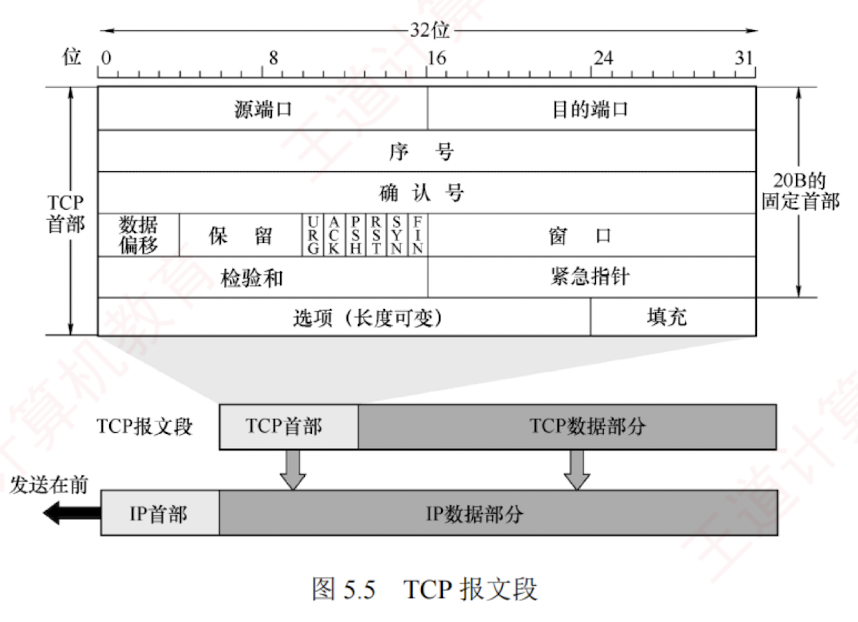

---

### 5.3.2 TCP 报文段

TCP 传送的数据单元称为**报文段**。  
一个 TCP 报文段分为**首部**和**数据**两部分，整个 TCP 报文段作为 IP 数据报的数据部分进行封装，如图 5.5 所示。

TCP 的全部功能都体现在其首部的各个字段中，因此只有弄清各个字段的作用，才能掌握 TCP 的工作原理。  
TCP 首部的**前 20 个字节是固定的**，**后面有 $4N$ 字节**是根据需要而增加的选项。  
因此，**TCP 首部的最小长度为 20B**。

**各个字段的意义如下**：

1. **源端口和目的端口**。各占 **2B**。分别表示发送方和接收方所使用的端口号。
    

2. **序号**。占 **4B**，范围为 $0 \sim 2^{32}-1$，共 $2^{32}$ 个序号。  
   当序号达到 $2^{32}-1$ 后，下一个序号将回到 0，即采用**模 $2^{32}$ 运算**。  
   TCP 连接中传送的字节流中的每个字节都**按顺序编号**，序号字段的值指明了本报文段所发送数据的**第一个字节的序号**。
    

例如，若某报文段的序号为 301，携带的数据长度为 100B，则该报文段的最后一个数据字节的序号为 400，因此下一个报文段的数据应从序号 401 开始。

1. **确认序号**。占 **4B**，表示**期望**收到对方**下一个报文段**中**第一个数据字节的序号**。  
   若确认序号为 $N$，则表明到序号 $N-1$ 为止的所有数据均已正确接收。
    
    例如，B 正确收到了 A 发送的一个报文段，其序号为 501，数据长度为 200B（对应序号 $501 \sim 700$），说明 B 已完整接收到了到序号 700 为止的数据。因此，B 期望接收的下一个数据字节的序号为 701，于是在发给 A 的确认报文段中将确认序号置为 701。
    

2. **数据偏移**（**首部长度**）。占 **4 位**，用于指出 **TCP 首部的长度**。  
   由于首部可能包含长度可变的选项字段，该字段用于指示 TCP 报文段中数据部分的起始位置距离报文段起始处的偏移量。  
   偏移单位为 4B，因此**该字段的值乘以 4 就等于首部长度**。
    
    TCP 首部最小长度为 20B，对应数据偏移字段的最小值为 5；  
    4 位二进制数最大可表示 15，因此 TCP 首部的**最大长度为 60B**（选项长度最多 40B）。
    
3. **保留**。占 **6 位**，保留为今后使用，但目前**必须置为 0**。
    
    下面有 **6 个控制位**，各占 1 位，用来说明本报文段的性质。
    
	1. **紧急位 URG**。当 $\text{URG}=1$ 时，**表明紧急指针字段有效**，通知系统本报文段中包含**紧急数据**，应**优先处理**。  
	   紧急数据被放置在报文段数据的最前面，后续的仍为普通数据，因此需配合紧急指针字段使用。
	    
	2. **确认位 ACK**。仅当 $\text{ACK}=1$ 时，确认序号字段才有效；  
	   当 $\text{ACK}=0$ 时，确认序号无效。  
	   TCP 规定，在**连接建立后**，**所有传送的报文段都必须将 ACK 置为 1**。
	    
	3. **推送位 PSH**（Push）。在**交互式通信**中，应用进程希望**输入命令后能立即收到响应**。  
	   此时发送方将 PSH 置为 1，接收方收到 $\text{PSH}=1$ 的报文段后，会立即将数据交付给应用进程，而不必等到整个缓存填满后再向上交付。
	    
	4. **复位位 RST**（Reset）。当 $\text{RST}=1$ 时，表示 **TCP 连接出现严重差错**（如主机崩溃），必须释放连接并重新建立连接。  
	   此外，RST 也可用于**拒绝非法的报文段或连接请求**。
	    
	5. **同步位 SYN**。当 $\text{SYN}=1$ 时，表示这是一个**连接请求**或**连接接受**报文。
	    
	    当 $\text{SYN}=1, \text{ACK}=0$ 时，表明这是一个连接请求报文，若对方同意建立连接，则在响应报文中设置 $\text{SYN} = 1$ 且 $\text{ACK} = 1$。  
	    关于连接的建立和释放，将在下一节详细讨论。
	
	6. **终止位 FIN** (Finish)。用于**释放连接**。  
	   当 $\text{FIN} = 1$ 时，表示此报文段的发送方已无更多数据要发送，并请求释放连接。
	    
2. **窗口**。占 **2B**，范围为 $0 \sim 2^{16}-1$，以**字节**为单位，该字段由本报文段的**发送方**填写，表示其作为接收方时**当前还能接收的最大数据量**。  
   它告诉对方（作为发送方）“从本报文段的确认号序所指示的字节序号开始，你最多可以连续发送这么多字节的数据”。  
   例如，若确认序号为 701，窗口字段值为 1000，这表示发送方可以从序号 701 开始，连续发送最多 1000B 的数据（字节序号为 $701 \sim 1700$）。
    
3. **检验和**。占。**2B**。检验范围包括**首部**和**数据**部分。  
   计算时需在 TCP 报文段前添加一个 **12B 的伪首部**（与 UDP 类似，只需将**协议字段由 17 改成 6**，**长度字段改成 TCP 长度**）。
    
4. **紧急指针**。占 **2B**。仅在 $\text{URG} = 1$ 时有效，指出本报文段中**紧急数据的字节数**（**紧急数据位于数据部分的开头**）。  
   **即使接收窗口为零，仍可发送紧急数据**。
    
5. **选项**。长度可变，**最长可达 40B**。  
   若不使用选项，TCP 首部长度即为 20B。  
   TCP 最初只定义了一种选项，即**最大报文段长度** (Maximum Segment Size, **MSS**)，它表示 **TCP 报文段中数据字段的最大长度**。  
   后续又增加了窗口扩大、时间戳等选项，具体内容请参见教材。  
   注意，与 **MSS** 类似，数据链路层的 **MTU** 指的是**帧中数据部分的最大长度**。
    
6. **填充**。用于**确保整个首部长度为 4B 的整数倍**，这是由于选项字段的长度是可变的。
    

### 5.3.4 TCP 可靠传输

TCP 在不可靠的 IP 层之上提供可靠传输服务，确保接收方从缓存中读取的字节流与发送方发出的字节流完全一致。TCP 通过**检验、序号、确认和重传**等机制实现这一目的。其中，TCP 的检验机制与 UDP 类似，这里不再赘述。

> **考点追踪** -> TCP 序号与确认机制（2011、2012、2013、2025）

**1. 序号**

TCP 首部的序号字段用于保证数据按序提交给应用层。TCP 将数据视为一个无结构但有序的

字节流，其序号是对字节流中的每个字节依次编号，而非对报文段整体编号。

TCP 将每个字节都编上一个序号，序号字段值指明本报文段所发送的第一个数据字节的序号。如图 5.8 所示，假设 A 和 B 之间建立了一条 TCP 连接，A 的发送缓存区中有 10B 的数据，序号从 0 开始编号。第一个报文段包含 $0 \sim 2$ 号数据字节，则该 TCP 报文段的序号是 0；第二个报文段的序号是 3；第三个报文段的序号是 6；第四个报文段的序号是 8。

**2. 确认**

TCP 首部的确认序号字段表示期望收到对方下一个报文段的第一个数据字节的序号。在图 5.8 中，若接收方 B 已收到第一个和第二个报文段，此时 B 希望收到的下一个报文段的数据是从 6 号字节开始的，因此 B 向 A 发送的下一个报文段中的确认序号字段应置为 6。

发送方缓存区会继续存储那些已发送但未收到确认的报文段，以便在需要时重传。TCP 默认使用**累积确认**，即确认按序到达的连续字节，确认序号为第一个未收到字节的序号。接收方可以在合适时机发送确认，也可以在有数据要发送时将确认信息顺便携带上（捎带确认）。例如，在图 5.8 中，接收方 B 收到了 A 发送的第一个和第三个报文段，尚未收到第二个报文段，此时 B 仍在等待从 3 号字节开始的连续数据，因此 B 向 A 发送的下一个报文段将确认序号字段置为 3。

**3. 重传**

有两种事件会导致 TCP 对报文段进行重传：**超时和冗余 ACK**。

(1) 超时

TCP 每发送一个报文段，就会对该报文段设置一个超时计时器。当计时器到期仍未收到确认时，TCP 将重传该报文段。

由于 TCP 下层是互联网环境，IP 数据报所选的路由变化很大，因此传输层的往返时延波动也较大。为了计算超时计时器的重传时间，TCP 采用一种自适应算法。它记录报文段发出的时间及收到相应确认的时间，两者之差称为报文段的往返时间（Round-Trip Time, RTT）。TCP 维护了一个加权平均往返时间 $\text{RTT}_S$，并根据新测量的 RTT 样本值动态调整 $\text{RTT}_S$。显然，超时计时器设置的超时重传时间（Retransmission Time-Out, RTO）应略大于 $\text{RTT}_S$，但也不能太大，否则当报文段丢失时，TCP 无法迅速重传，导致数据传输延迟增大。

(2) 冗余 ACK（冗余确认）

超时触发重传的一个问题是超时周期往往太长。幸运的是，发送方通常可以在超时发生之前，通过注意所谓的冗余 ACK 来较好地检测丢包情况。冗余 ACK 是再次确认某个报文段的 ACK，而发送方先前已收到过该报文段的确认。例如，发送方 A 发送了编号为 1、2、3、4、5 的 TCP 报文段，其中 2 号报文段在链路中丢失，未能到达接收方 B。因此，3、4、5 号报文段对于 B 来说成为失序报文段。TCP 规定，每当比期望序号大的失序报文段到达时，立即发送一个冗余 ACK，指明下一个期待字节的序号。在本例中，3、4、5 号报文段到达 B，但它们不是 B 期望收到的下一个报文段，于是 B 立即发送 3 个对 1 号报文段的冗余 ACK，表示自己期望接收 2 号报文段。

TCP 规定，当发送方收到对同一个报文段的 **3 个冗余 ACK** 时，可以认为紧跟在这个被确认报文段之后的报文段已丢失。就前面的例子而言，当 A 收到对 1 号报文段的 3 个冗余 ACK 时，它可

以判断 2 号报文段已经丢失，并立即对 2 号报文段执行重传，这种技术称为**快速重传**。当然，冗余 ACK 也被用于拥塞控制，相关内容将在后续章节讨论。

> **注意**
> 
> 在上述示例中，对 1 号报文段的正常确认不能称为冗余 ACK，只有在收到失序的 3、4、5 号报文段后，发回的确认才被称为冗余 ACK。也就是说，触发快速重传时，发送方共收到 4 个对 1 号报文段的确认。

### 5.3.5 TCP 流量控制

流量控制的功能是确保发送方的发送速率不会过快，以便让接收方能够及时处理。因此，可以说流量控制是一种**速度匹配服务**，它匹配发送方的发送速率与接收方的读取速率。

TCP 利用**滑动窗口机制**来实现流量控制。滑动窗口的基本原理已在第 3 章介绍过，这里重点讨论 TCP 如何使用窗口机制进行流量控制。TCP 要求接收方维持一个接收窗口 (rwnd)，该窗口大小根据当前接收缓存的大小动态调整，反映了接收方的容量。接收方将此窗口值写入 TCP 首部的“窗口”字段，以通知发送方。发送方的发送窗口不能超过接收方给出的接收窗口值，从而限制发送方向网络注入报文的速率。

> **考点追踪** -> 基于滑动窗口的流量控制机制（2016、2021）

图 5.9 说明了如何利用滑动窗口进行流量控制。假设数据仅从 A 发往 B，而 B 仅向 A 发送确认报文段，则 B 可通过设置确认报文段首部中的窗口字段来通知 A 当前的 rwnd 值。rwnd 表示接收方允许连续接收的最大字节数。发送方 A 总是根据最新收到的 rwnd 值来限制自己发送窗口的大小，从而将未确认的数据量控制在 rwnd 大小之内，确保 A 不会使 B 的接收缓存溢出。

假设在连接建立时，B 告诉 A：“我的接收窗口 $\text{rwnd} = 400$”。我们注意到，接收方 B 进行了三次流量控制，这三个报文段都设置了 $\text{ACK} = 1$，只有当 $\text{ACK} = 1$ 时，确认序号字段才有意义。第一次将窗口减至 $\text{rwnd} = 300$，第二次减至 $\text{rwnd} = 100$，最后减至 $\text{rwnd} = 0$，即不允许发送方再发送数据。这使得发送方暂停发送的状态将持续到 B 重新发出一个新的窗口值为止。

假设 B 向 A 发送了零窗口通知后不久，B 的接收缓存又了一些存储空间，于是 B 向 A 发送非零窗口通知，然而这个报文段在传输过程中丢失了。若不采取其他措施，则 B 和 A 会陷入相互等待的死锁状态。为此，TCP 为每个连接设有一个**持续计时器**。只要发送方收到对方的零窗口

通知，就启动持续计时器。若计时器超时，则发送方发送一个零窗口探测报文段，而对方会在确认该探测报文段时给出当前的窗口值。若窗口仍然是零，则发送方收到确认报文段后重新设置持续计时器；若窗口不是零，则死锁状态就可以打破了。

传输层和数据链路层的流量控制的区别是：**传输层实现的是端到端**，即两个进程之间的流量控制；数据链路层实现的是相邻节点之间的流量控制。此外，数据链路层的滑动窗口协议的窗口大小一般为固定值，而传输层的窗口大小可以根据接收方的缓存情况**动态变化**。

### 5.3.6 TCP 拥塞控制

拥塞控制是指防止过多的数据注入网络，以保证网络中的路由器或链路不致过载。出现拥塞时，通信端点通常无法直接获知拥塞的具体细节，只能通过表现（如时延增加）间接感知。

拥塞控制与流量控制的区别：**拥塞控制**的目标是使网络能够承受当前的负载，是一个**全局性**过程，涉及所有主机、路由器及影响网络性能的各种因素。而**流量控制**则关注点对点通信中接收方的处理能力，是一个**端到端**的问题，由接收方通过窗口机制抑制发送方的发送速率，以确保自身能及时接收数据。尽管二者目标不同，但都是通过调节发送方的发送速率来实现控制效果的。

例如，某链路的传输速率为 10Gb/s，当一台大型机以 1Gb/s 的速率向一台 PC 传送文件时，显然网络带宽充足，不存在拥塞问题；但由于 PC 的处理能力有限，可能来不及接收如此高速的数据流，因此必须进行流量控制。反之，若有 100 万台 PC 同时以 1Mb/s 的速率通过该链路传输文件，则问题就转变伪网络总负载是否超出了其承载能力，这时需要依赖拥塞控制。

TCP 采用四种算法进行拥塞控制：**慢开始、拥塞避免、快重传和快恢复**。

发送方在确定数据的发送速率时，既要考虑接收方的接收能力，也要从全局角度避免引发网络拥塞。因此，除了上节介绍的接收窗口，TCP 还要求发送方维护一个**拥塞窗口 (cwnd)**，其大小取决于当前网络的拥塞状况，并动态调整。其控制原则是：

- 若网络未出现拥塞，则适当增大 cwnd，以便把更多分组发送出去，提高网络利用率。
    
- 若检测到网络拥塞，则适当减少 cwnd，以减少注入网络的分组数量，缓解网络拥塞。
    

通常，只要发送方未按时收到确认（发生了超时），即可认为网络出现了拥塞。

> **考点追踪** -> TCP 的滑动窗口机制（2010、2014-2016、2025）

发送窗口的上限值应取接收窗口 (rwnd) 和拥塞窗口 (cwnd) 中较小的一个，即

$$\text{发送窗口的上限值} = \min[\text{rwnd}, \text{cwnd}]$$

接收窗口的大小可通过 TCP 首部中的“窗口”字段由接收方通知发送方。那么，发送方如何维护拥塞窗口呢？这正是下面要介绍的慢开始和拥塞避免算法所解决的问题。为了便于分析，这里假设：数据仅单向传输，接收方只发送确认报文；接收方拥有足够大的缓存空间，因此发送窗口的大小仅受拥塞窗口的限制；并且以最大报文段长度 MSS 作为拥塞窗口大小的单位。

**1. 慢开始和拥塞避免**

(1) 慢开始算法

慢开始的基本思想：在连接刚建立时，发送方并不了解网络的负载情况，若立即向网络注入大量数据，可能会引发拥塞。因此，应先发送少量数据进行试探；若未发生拥塞，则逐步增大发送量，即从小到大逐渐增大拥塞窗口。

> **考点追踪** -> 慢开始算法的原理（2014、2015、2025）

初始拥塞窗口 cwnd 通常设置为 **1MSS**（最新的 RFC 允许设置更多 MSS），**慢开始算法规定：每收到一个对新报文段的确认，就把 cwnd 加 1**。这样，每经过一个传输轮次（一个往返时延 RTT），

cwnd 就会加倍，从而随传输轮次呈**指数增长**。请注意：慢开始的“慢”并非指增长速度慢，而是指从较小的 cwnd（如 1）开始，谨慎试探网络状态，从而有效预防拥塞。例如，A 向 B 发送数据，初始 $\text{cwnd} = 1$，A 发送第 1 个报文段；收到确认后，cwnd 增至 2，接着发送 2 个报文段；收到这 2 个确认后，cwnd 增至 4，下一轮便可发送 4 个报文段，依此类推。

为防止 cwnd 无限制增长，还需设置一个慢开始门限 ssthresh（阈值）。当 cwnd 增长至 ssthresh 时，停止慢开始算法，转而采用拥塞避免算法。

(2) 拥塞避免算法

> **考点追踪** -> 拥塞避免算法的原理（2009、2017、2020、2022、2023）

拥塞避免的目标是让 cwnd 缓慢增长，以降低拥塞风险。其策略是：**每经过一个传输轮次（收到本轮所有报文段的确认），就把 cwnd 加 1**，而不是加倍，从而使 cwnd 按线性规律缓慢增长（加法增大），防止网络过早出现拥塞。这种增长速率比慢开始阶段要慢得多。

两种算法的切换规则如下：

- 当 $\text{cwnd} < \text{ssthresh}$ 时，使用慢开始算法。
    
- 当 $\text{cwnd} > \text{ssthresh}$ 时，使用拥塞避免算法。
    
- 当 $\text{cwnd} = \text{ssthresh}$ 时，既可使用慢开始算法，又可使用拥塞避免算法（常规做法）。
    

(3) 网络拥塞的处理

无论处于慢开始阶段还是拥塞避免阶段，只要发送方判断网络出现拥塞（如发生超时），就执行以下操作：① **将慢开始门限 ssthresh 调整为当前 cwnd 的一半**（但不得小于 2）；② **将 cwnd 重置为 1**；③ **重新执行慢开始算法**。这样做的目的是迅速减少注入网络的分组数量，使得发生拥塞的路由器有足够时间把队列中积压的分组处理完。

> **考点追踪** -> TCP 拥塞控制与传输效率分析（2016、2023）

慢开始和拥塞避免算法的实现过程如图 5.10 所示。

- 初始时，拥塞窗口设为 1，即 $\text{cwnd} = 1$；慢开始门限设为 16，即 $\text{ssthresh} = 16$。
    

> **考点追踪** -> TCP 拥塞窗口演化分析（2016、2023）

- 在慢开始阶段，发送方每收到一个对新报文段的确认，就将 cwnd 加 1。当 cwnd 增长到 ssthresh ($\text{cwnd} = 16$) 时，停止慢开始算法，转而采用拥塞避免算法。
    
- 当 $\text{cwnd} = 24$ 时，若网络出现拥塞，则将 ssthresh 调整为当前 cwnd 的一半 (12)，同时将 cwnd 重置为 1，并重新执行慢开始算法；此后，当 cwnd 再次增长到 12 时，改为执行拥塞避免算法。