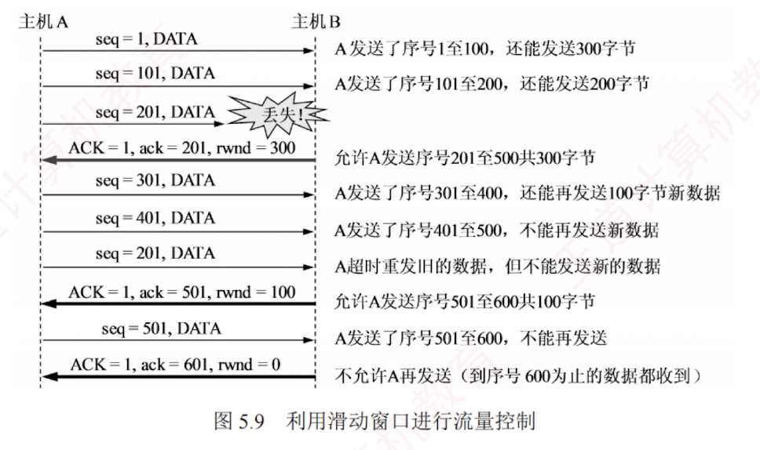

---

### 5.3.5 TCP 流量控制

流量控制的功能是确保发送方的发送速率不会过快，以便让接收方能够及时处理。因此，可以说流量控制是一种**速度匹配服务**，它匹配**发送方的发送速率与接收方的读取速率**。

TCP 利用**滑动窗口机制**来实现**流量控制**。  
滑动窗口的基本原理已在第 3 章介绍过，这里重点讨论 TCP 如何使用窗口机制进行流量控制。  
TCP 要求接收方维持一个**接收窗口** (**rwnd**)，该窗口大小根据当前**接收缓存**的大小动态调整，反映了接收方的容量。  
接收方将此窗口值写入 TCP 首部的“**窗口**”字段，以通知发送方。  
发送方的**发送窗口不能超过接收方给出的接收窗口值**，从而限制发送方向网络注入报文的速率。

图 5.9 说明了如何利用**滑动窗口**进行流量控制。  
假设数据仅从 A 发往 B，而 B 仅向 A 发送确认报文段，则 B 可通过设置确认报文段首部中的**窗口字段**来通知 A 当前的 rwnd 值。  
rwnd 表示接收方允许**连续接收的最大字节数**。  
发送方 A 总是根据最新收到的 rwnd 值来限制自己发送窗口的大小，从而将未确认的数据量控制在 rwnd 大小之内，确保 A 不会使 B 的接收缓存溢出。

假设在连接建立时，B 告诉 A：“我的接收窗口 $\text{rwnd} = 400$”。  
我们注意到，接收方 B 进行了三次流量控制，这三个报文段都设置了 $\text{ACK} = 1$，只有当 $\text{ACK} = 1$ 时，确认序号字段才有意义。  
第一次将窗口减至 $\text{rwnd} = 300$，第二次减至 $\text{rwnd} = 100$，最后减至 $\text{rwnd} = 0$，即不允许发送方再发送数据。  
这使得发送方暂停发送的状态将持续到 B 重新发出一个新的窗口值为止。

假设 B 向 A 发送了零窗口通知后不久，B 的接收缓存又了一些存储空间，于是 B 向 A 发送非零窗口通知，然而这个报文段在传输过程中丢失了。  
若不采取其他措施，则 B 和 A 会陷入相互等待的死锁状态。为此，TCP 为每个连接设有一个**持续计时器**。  
只要发送方收到对方的零窗口通知，就启动**持续计时器**。  
若**计时器超时**，则发送方发送一个**零窗口探测报文段**，而对方会在确认该探测报文段时给出当前的窗口值。  
**若窗口仍然是零**，则发送方收到确认报文段后**重新设置持续计时器**；  
**若窗口不是零**，则**死锁状态**就可以**打破**了。

**传输层和数据链路层的流量控制的区别**是：  

**传输层实现的是端到端**，即**两个进程**之间的流量控制；  
数据链路层实现的是**相邻节点**之间的流量控制。  
此外，**数据链路层**的**滑动窗口协议**的窗口大小一般为**固定值**，  
而**传输层**的窗口大小可以根据接收方的缓存情况**动态变化**。
