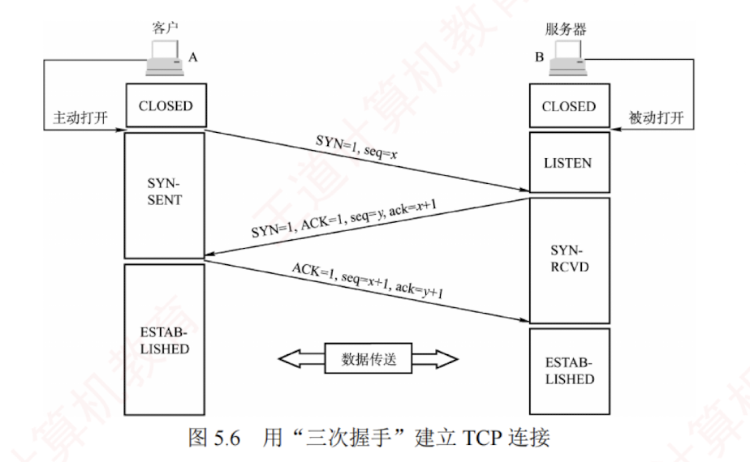
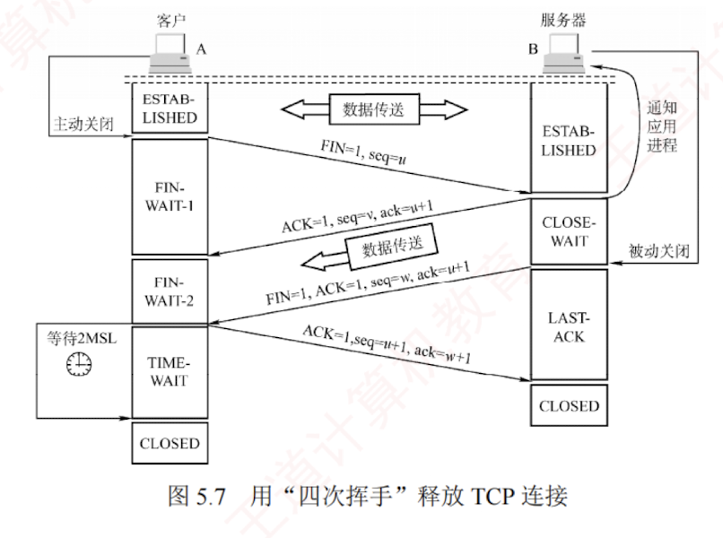

---

### 5.3.3 TCP 连接管理

TCP 是面向连接的协议，因此每条 TCP 连接都包含三个阶段：**连接建立、数据传送和连接释放**。  
TCP 连接管理的目标是确保连接的建立与释放能够正常、可靠地进行。

在 TCP 连接建立过程中，需解决以下**三个问题**：

1. 使通信双方确知对方的存在。
    
2. 允许双方**协商相关参数**（如最大窗口值、是否使用窗口扩大选项、时间戳选项等）。
    
3. 为传输实体**分配必要的资源**（如缓存空间、连接表项等）。
    

**TCP 将连接作为最基本的抽象**。  
每条 TCP 连接有两个端点，这些端点既不是主机、IP 地址，也不是应用进程或传输层端口，而是**套接字** (Socket)。  
一条 TCP 连接由通信双方的两个套接字唯一确定。  
需要注意的是：  
同一个 IP 地址可以参与多个不同的 TCP 连接，同一个端口号也可以出现在多个不同的 TCP 连接中。

TCP 连接的建立采用**客户/服务器**模式。  
主动发起连接建立的应用进程称为**客户** (Client)，  
被动等待连接请求的应用进程称为**服务器** (Server)。

#### 1. TCP 连接的建立

连接建立需经历**三个步骤**，通常称为**三次握手**，如图 5.6 所示。  

假设主机 A 和 B 分别运行 TCP 客户和服务器程序，最初两端的 TCP 进程均处于 CLOSED（关闭）状态。  
在连接建立前，服务器完成一些准备工作后进入 LISTEN（收听）状态，等待客户的连接请求。

**第一步**：客户向服务器发送**连接请求报文段**。  
该报文段的 $\text{SYN} = 1$，同时选择一个初始序号 $\text{seq} = x$。  
TCP 规定，SYN 报文段（$\text{SYN} = 1$ 的报文段）不能携带数据，但仍**消耗一个序号**，因此客户下一次发送的报文段序号 $\text{seq} = x + 1$。  
此时，客户进入 SYN-SENT（同步已发送）状态。

**第二步**：服务器收到连接请求后，若同意建立连接，则向客户返回确认报文段。  
该报文段的 $\text{SYN} = 1$、$\text{ACK} = 1$，确认序号 $\text{ack} = x + 1$，同时选择自己的初始序号 $\text{seq} = y$。  
确认报文段同样不能携带数据，但也消耗一个序号。  
此时，服务器进入 SYN-RCVD（同步已收到）状态。

**第三步**：客户收到确认后，再向服务器发送**最终确认**。  
该确认报文段的 $\text{ACK} = 1$，确认序号 $\text{ack} = y + 1$，序号 $\text{seq} = x + 1$。  
此报文段**可以携带数据**。  
**若不携带数据，则不消耗序号**，下一个数据报文段的序号仍伪 $x + 1$。  
此时，客户进入 ESTABLISHED（**已建立连接**）状态。

当**服务器收到该最终确认**后，也进入 **ESTABLISHED 状态**，连接正式建立。

> **注意**
> 
> ① 仅在**前两次握手**的报文段中，$\text{SYN} = 1$。  
> TCP 规定：SYN 报文段不能携带数据，但仍消耗一个序号，因此下次发送的报文段序号为其 SYN 报文段序号加 1。
> 
> ② 仅在**第一次握手**的报文段中，$\text{ACK} = 0$，因为此时尚未收到任何报文段。
> 
> ③ **第三次握手**的报文段可**携带数据**；  
> **若不携带，则不消耗序号**。

从客户发出 SYN 报文段（第一次握手的连接请求报文段）时刻起算，客户最早可在 1RTT 后开始发送数据，而服务器最早在 1.5RTT 后才能发送数据。

#### 2. TCP 连接的释放

“天下没有不散的筵席”，TCP 连接亦如此。  
通信双方中的任意一方均可主动终止连接。  
TCP 连接的释放过程通常称为**四次挥手**，如图 5.7 所示。

**第一步**：**客户**决定**关闭连接**时，向服务器发送**连接释放报文段**，并停止发送数据（主动关闭）。  
该报文段的 $\text{FIN} = 1$，序号 $\text{seq} = u$，其值等于此前已发送数据的最后一个字节序号加 1。  
TCP 规定，FIN 报文段（$\text{FIN} = 1$ 的报文段）即使不携带数据，也消耗一个序号。  
此时，客户进入 FIN-WAIT-1（终止等待 1）  
状态。  
由于 TCP 是全双工的，可视为连接包含两条独立的数据通路；  
发送 FIN 的一端关闭了其发送方向，但对方仍可继续发送数据。

**第二步**：**服务器**收到**连接释放报文段**后，立即发送**确认报文段**。  
该报文段的 $\text{ACK} = 1$，确认序号 $\text{ack} = u + 1$，序号 $\text{seq} = v$（$v$ 为服务器此前已发送数据的最后一个字节序号加 1）。  
随后，服务器进入 CLOSE-WAIT（关闭等待）状态。  
此时，从客户到服务器方向的连接已释放，但从服务器到客户方向的连接并未释放，TCP 连接处于**半关闭状态**。  
客户收到确认后，进入 FIN-WAIT-2（终止等待 2）状态，等待服务器发出的**连接释放报文段**。

**第三步**：若服务器已经没有要向客户发送的数据，就向其发送**连接释放报文段**。  
该报文段的 $\text{FIN} = 1$、$\text{ACK} = 1$，序号 $\text{seq} = w$（$w$ 可能大于 $v$，因服务器在半关闭期间可能又发送了数据），还需重复此前已发送的确认序号 $\text{ack} = u + 1$。  
此时，服务器进入 LAST-ACK（最后确认）状态。

**第四步**：客户收到连接释放报文段后，必须发送**最终确认**，并进入 TIME-WAIT（时间等待）状态。  
该确认报文段的 $\text{ACK} = 1$，确认序号 $\text{ack} = w + 1$，序号 $\text{seq} = u + 1$。  
服务器收到此确认后，即进入 CLOSED（连接关闭）状态。  
客户在 TIME-WAIT 状态下，还需等待时间等待计时器设置的时间 2MSL (Maximum Segment Lifetime, **最长报文段寿命**) 后，才进入 CLOSED 状态。

设置 **2MSL** 的主要目的是：  
1. 确保客户发送的最后一个 ACK 报文段能够到达服务器；
2. 使本连接中所有可能滞留的旧报文段从网络中自然消失，避免影响新连接。

若服务器在收到客户的连接释放请求后不再发送数据，则从客户发出 FIN 报文段时刻起算，客户释放连接的最短时间为 $\text{1RTT} + \text{2MSL}$，服务器释放连接的最短时间为 1.5RTT。

> **注意**
> 
> ① 仅在第一次和第三次握手的报文段中（请求主动关闭），$\text{FIN} = 1$。
> 
> ② 后三次挥手的报文段中，$\text{ACK} = 1$，因为每次都需要对之前收到的报文段进行确认。
> 
> ③ 尽管协议并未禁止 FIN 段携带数据，但主流的操作系统一般不允许其携带数据。

除时间等待计时器外，TCP 还使用一个**保活计时器**，以防止客户突然故障导致服务器长期无谓等待。服务器每收到一次数据，就会重置该计时器；若计时器超时仍未收到数据，则每隔 75 秒发送一个探测报文段。若连续 10 次探测均无响应，则判定客户已故障，并关闭该连接。
