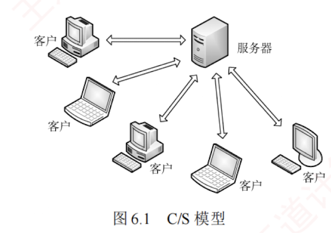

---

网络应用模型是计算机网络中用于描述应用程序之间通信方式和结构的框架，主要包括**客户/服务器模型**（C/S）和**对等模型**（P2P）两种。

### 6.1.1 客户/服务器模型

在**客户/服务器**（Client/Server，C/S）模型中，存在一个始终处于**开启状态**的主机，称为**服务器**，它负责响应来自多个称为客户的主机的服务请求，如图 6.1 所示。  

其**工作流程**如下：

1. 服务器持续处于**接收请求**的状态。
    
2. 客户主动发起**服务请求**，并等待接收处理结果。
    
3. 服务器收到请求后，解析并处理该请求，将结果返回给客户。
    

服务器上运行着专门提供某种服务的程序，能够同时处理多个来自**远程**或**本地**客户程序的请求。  
客户程序必须事先知道服务器程序的地址；  
而服务器程序启动后便一直不断运行着，被动等待并接收来自各地客户程序的请求。  
因此，**服务器程序无须知道客户程序的地址**。

客户/服务器模型的主要特征：  
**客户是服务请求方，服务器是服务提供方**。  
例如，在 Web 应用中，始终运行的 Web 服务器响应运行在客户上的浏览器所发出的请求。  
当 Web 服务器收到来自客户对某一对象的请求时，会将该对象发送回客户作为响应。  
采用 C/S 模型的常见应用包括 **Web**、**文件传输协议**（**FTP**）和**电子邮件**（**SMTP/POP3/IMAP**）等。

客户/服务器模型的**主要特点**还包括：

1. 网络中各计算机的**地位不平等**。  
   服务器可通过**用户权限控制**来管理客户，整个网络的管理工作由**少数服务器**集中承担，因此管理更加集中和便捷。
    
2. **客户之间通常不直接通信**。  
   例如，在 Web 应用中，两个浏览器不会直接交换数据。
    
3. **可扩展性不佳**。受服务器性能和网络带宽的制约，单个服务器支持的客户数量有限。
    

