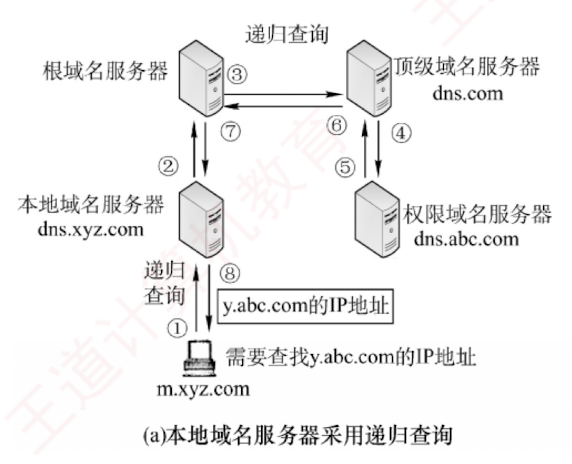
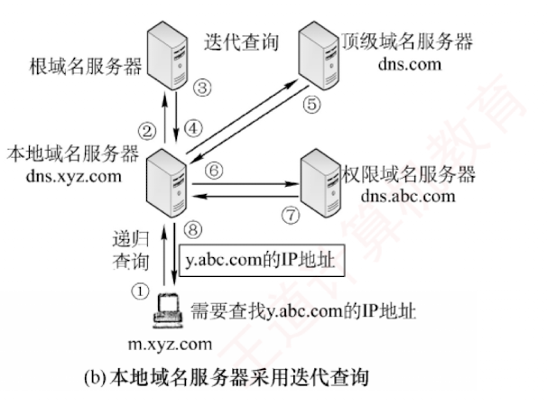

---

### 6.2.3 域名解析过程

**域名解析是指将域名转换为 IP 地址的过程**。  
当客户端需要进行域名解析时，会通过本机的 DNS 客户端构造一个 DNS 请求报文，并以 UDP 数据报的形式发送给本地域名服务器。

域名解析有两种方式：**递归查询**和**迭代查询**。

#### （1）主机向本地域名服务器的查询都采用递归查询

在**递归查询**中，若本地域名服务器不知道被查询域名的 IP 地址，则它会以 DNS 客户的身份**代替主机**向其他根域名服务器继续**发出查询请求**，而不是让主机自行进行后续查询。  
无论后续采用何种查询方式，**主机向本地域名服务器的查询都采用递归查询**。

#### （2）本地域名服务器向其他域名服务器采用递归查询或迭代查询

**递归查询**的过程如图 6.6(a)所示，本地域名服务器只需向根域名服务器发起一次查询，后续的查询过程由**各级域名服务器**之间**递归**完成 [步骤③~⑥]。  
最终，根域名服务器**将请求的 IP 地址返回给本地域名服务器**（步骤⑦），再由本地域名服务器将结果返回给原始主机（步骤⑧）。  
由于这种方式会给根域名服务器带来过**重负载**，实际中几乎不被采用。

**本地域名服务器向根域名服务器的查询通常采用迭代查询**。  
当根域名服务器收到本地域名服务器的迭代查询请求时，要么直接给出所查询的 IP 地址，要么告诉本地域名服务器：“你下一步应向哪个顶级域名服务器查询”。  
随后，由本地域名服务器向该顶级域名服务器发起新的查询请求。  
同样，顶级域名服务器收到请求后，要么直接给出所查询的 IP 地址，要么告诉本地域名服务器下一步应当向哪个权限域名服务器查询。  
如此逐级查询，直到获得目标 IP 地址，最后由本地域名服务器将结果返回给发起查询的主机，如图 6.6(b)所示。

下面举例说明**域名解析的过程**。  
假设某客户希望获取主机 `y.abc.com` 的 IP 地址，整个域名解析过程（最多涉及 8 个 UDP 报文：4 个查询报文和 4 个回答报文）如下：

1. 客户向其本地域名服务器发送。**DNS 请求报文**（**递归查询**）。
    
2. 本地域名服务器收到请求后，先查询**本地缓存**；  
   若未命中，则以 DNS 客户身份向根域名服务器发送**解析请求报文**（**迭代查询**）。
    
3. 根域名服务器收到请求后，识别该域名属于 .com **顶级域**，返回 .com 顶级域名服务器 `dns.com` 的 IP 地址。
    
4. 本地域名服务器向顶级域名服务器 `dns.com` 发送**解析请求报文**（**迭代查询**）。
    
5. 顶级域名服务器 `dns.com` 收到请求后，识别该域名属于 `abc.com` 区，返回其权限域名服务器 `dns.abc.com` 的 IP 地址。
    
6. 本地域名服务器向权限域名服务器 `dns.abc.com` 发送**解析请求报文**（**迭代查询**）。
    
7. 权限域名服务器 `dns.abc.com` 收到请求后，返回 `y.abc.com` 对应的 IP 地址。
    
8. 本地域名服务器将结果保存到**本地缓存**，并返回给客户。
    

为提高 DNS 查询效率并减少互联网上的查询流量，域名服务器广泛使用 **DNS 高速缓存**，用于存储近期查询过的域名与 IP 地址的映射。  
当后续收到相同域名的查询时，服务器可直接从**缓存**返回结果，无须再次发起完整的解析流程。  
由于主机名与 IP 地址的映射关系并非永久有效，DNS 缓存中的记录会设置**生存时间（TTL）**，到期后自动失效并被清除。  
此外，主机端也常维护本地 DNS 缓存，在运行过程中**缓存最近访问过的域名**。  
只有当本地缓存未命中时，才会向 DNS 服务器发起查询，从而进一步提升解析速度并减轻网络负载。