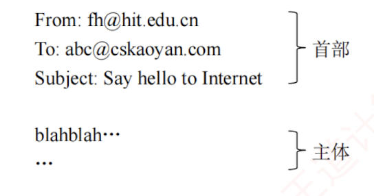
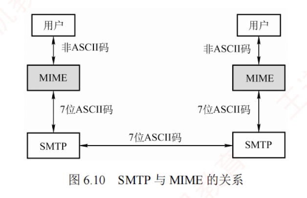

---

### 6.4.2 电子邮件格式与 MIME

#### 1. 电子邮件格式

一封电子邮件由**信封**和**内容**两大部分组成，  
其中邮件内容又分为**首部**和**主体**两部分。  
RFC 822 规定了邮件首部的格式，而主体部分则由用户自由撰写。  
用户只需填写首部信息，邮件系统便会自动从中提取所需信息并生成信封，无须用户手动填写信封内容。

邮件内容的首部由若干首部行构成，每行由一个关键字、冒号及对应的值组成。其中有些关键字是必需的，有些则是可选的。  
**最重要的关键字**包括 `To` 和 `Subject`。

`To` 是**必填关键字**，用于指定一个或多个收件人的电子邮件地址。  
电子邮件地址的格式为：  
收件人邮箱名@邮箱所在主机的域名，例如 `abc@cskaoyan.com`。  
其中，邮箱名 `abc` 在 `cskaoyan.com` 所对应的邮件服务器上必须是唯一的，从而确保该地址在整个互联网范围内是唯一的。

`Subject` 是**可选关键字**，用于标明邮件的主题，简要反映邮件的主要内容。

此外，还有一个**必填的关键字**是 `From`，但通常由邮件系统**自动填充**，用户一般无须手动输入。首部与主体之间以一个空行分隔。典型的邮件内容示例如下：

#### 2. 多用途互联网邮件扩展（MIME）

由于 SMTP 协议仅支持传输 **7 位 ASCII 码**文本邮件，因此**无法直接传送非英语字符**（如中文、俄文，甚至带重音符号的法文或德文），也**无法传输可执行文件或其他二进制对象**。  
为解决这一限制，提出了**多用途互联网邮件扩展**（Multipurpose Internet Mail Extensions, MIME）。

MIME 并未修改或取代 SMTP，而是在其基础上进行扩展。  
当发送端需要传输包含非 ASCII 数据的邮件时，不能直接通过 SMTP 发送，而要先用 MIME 将非 ASCII 数据编码为 ASCII 格式，再交由 SMTP 传输。  
接收端收到邮件后，再通过 MIME 对 ASCII 数据进行**解码还原**，进而恢复原始的非 ASCII 内容。  
MIME 与 SMTP 的关系如图 6.10 所示。

MIME 主要包括以下**三部分内容**：

1. 定义了 5 个新的首部字段：MIME 版本、内容描述、内容标识、传送编码和内容类型。
    
2. 标准化了多种邮件内容的格式，为多媒体电子邮件的表示方法提供了统一规范。
    
3. 定义了**传送编码机制**，能够对**任意类型的内容**进行编码转换，而不会被邮件系统改变。
    
