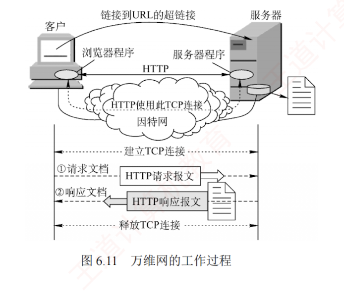
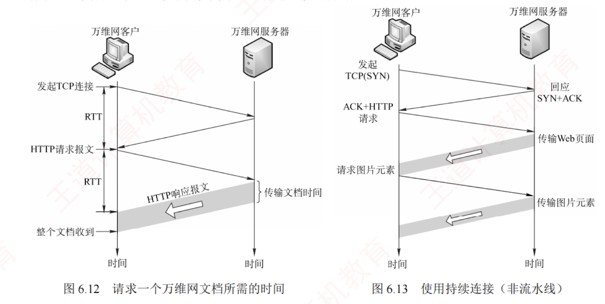
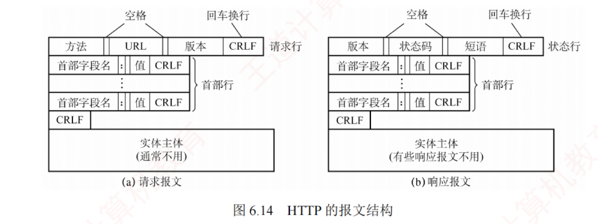
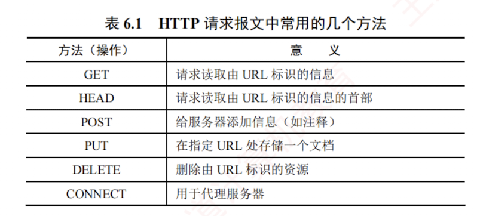
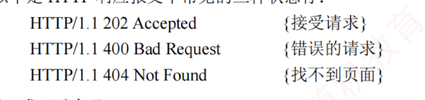
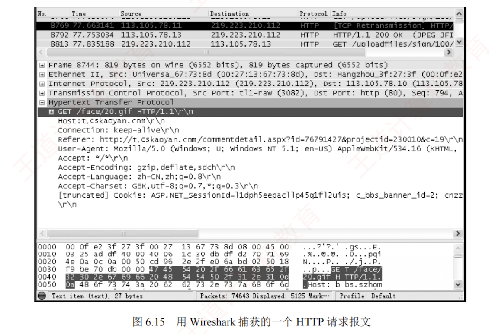
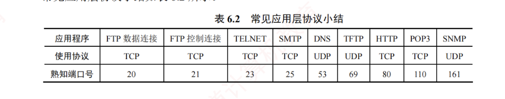

---

### 6.5.2 超文本传输协议

**超文本传输协议**（HTTP）定义了**浏览器**（万维网客户进程）如何向万维网服务器请求文档，以及服务器如何将文档传送给浏览器。  
从**协议**层次来看，HTTP 是一种**面向事务**（transaction-oriented）的应用层协议，规定了浏览器与服务器之间请求与响应的格式和交互规则，是万维网上可靠交换各类文件（包括文本、声音、图像等多媒体内容）的重要基础。

#### 1. HTTP 的操作过程

从协议执行流程来看，当浏览器要访问某个 WWW 服务器时，首先需完成对该服务器**域名的解析**。  
一旦获得其 **IP 地址**，浏览器便通过 TCP 向该服务器**发起连接建立请求**。

万维网的大致工作过程如图 6.11 所示。

每个万维网站点都运行一个服务器进程，持续监听 TCP 端口 80（默认）。  
当监听到连接请求时，服务器便与浏览器建立 **TCP 连接**。  
随后，浏览器向服务器发送 HTTP 请求，以获取指定的 Web 页面。  
服务器收到请求后，组装所请求页面所需的资源，并通过 HTTP 响应返回给浏览器。  
浏览器对收到的内容进行解析，并将最终的 Web 页面呈现给用户。最后，TCP 连接被释放。

用户单击鼠标后所发生的**事件顺序**如下（以访问清华大学网站为例）：

1. 用户在浏览器地址栏中输入 URL：`http://www.tsinghua.edu.cn/index.htm`。
    
2. 浏览器向 DNS 服务器请求解析 `www.tsinghua.edu.cn` 的 IP 地址。
    
3. DNS 系统返回清华大学服务器的 IP 地址。
    
4. 浏览器与该服务器建立 TCP 连接（默认端口号为 80）。
    
5. 浏览器发出 HTTP 请求：`GET /index.htm`。
    
6. 服务器通过 HTTP 响应把文件 `index.htm` 发送给浏览器。
    
7. 释放 TCP 连接。
    
8. 浏览器解析 `index.htm` 文件，并将 Web 页面显示给用户。
    

上述过程仅为简化描述。  
实际上，整个通信可能涉及 TCP/IP 体系结构中的多种协议：  
应用层的 DHCP、DNS 和 HTTP，传输层的 UDP 与 TCP，网际层的 IP 和 ARP，以及数据链路层的 CSMA/CD 协议或 PPP（涉及 ISP 接入或广域网传输时）等。  
本节主要聚焦于 HTTP。

#### 2. HTTP 的特点

HTTP 使用 TCP 作为**传输层**协议，从而保证了数据的可靠传输。  
因此，HTTP 无须关心数据在传输过程中是否丢失或如何重传。  
但需特别注意：HTTP 本身是无连接的。  
也就是说，尽管底层使用了 TCP 连接，但在交换 HTTP 报文之前，并不需要建立专门的“HTTP 连接”。

此外，HTTP 是**无状态**的。  
这意味着，当同一个客户第二次访问服务器上的某个页面时，服务器的响应与第一次完全相同，因为它并不记录此前与该客户的交互历史。

HTTP 的无状态特性简化了服务器设计，使其更容易支持大量并发请求。  
在实际应用中，通常结合 **Cookie** 与**数据库**来实现**用户行为跟踪**（如记录用户最近浏览的商品等）。

**Cookie 的工作原理**：  
当用户首次访问某个启用 Cookie 的网站时，服务器会为其生成唯一的 Cookie 识别码，如“12345”，并以此为索引**在后端数据库中创建一个记录**，用于**存储该用户的访问信息**。  
随后，服务器在 HTTP 响应报文中添加一个 `Set-cookie` 首部行：“`Set-cookie: 12345`”。  
用户代理（浏览器）收到响应后，会将 **Cookie 识别码**连同**服务器域名**一起保存在其**本地的 Cookie 文件**中。  
当用户再次访问该网站时，浏览器会在 **HTTP 请求报文**中自动附加一个 **Cookie 首部行**：“`Cookie: 12345`”。  
服务器根据 **Cookie 识别码**即可从数据库中检索出该用户的活动记录，从而提供一些个性化服务，例如基于历史浏览记录向用户推荐新商品等。

**HTTP/1.0** 仅支持**非持续连接**，而其升级版本 **HTTP/1.1** 支持**持续连接**（默认启用）。

在**非持续连接**模式下，每个网页元素（如 JPEG 图像、Flash 动画等）的传输都需要**单独建立一个 TCP 连接**，如图 6.12 所示（客户端通常在 TCP 第三次握手的 ACK 报文中捎带 HTTP 请求；  
若未捎带，则会紧随其后立即发送，其间的时间间隔可以忽略不计）。  
请求一个 Web 文档所需的时间 = **文档传输时间**（与文档大小成正比）$+$ 2 $\times$ RTT（一个 RTT 用于完成建立 TCP 连接的前两次握手，另一个 RTT 用于发送请求并接收响应）。  
每个对象的获取都需要承担 **2RTT** 的开销，为减小时延，现代浏览器通常创建**多个并行 TCP 连接**，以同时请求多个对象。

所谓**持续连接**，是指服务器在**发送响应后仍保持该 TCP 连接**，使得同一客户可继续通过该连接发送后续的 HTTP 请求并接收响应，如图 6.13 所示。  
在实际应用中，浏览器先通过该连接请求并接收 Web 页面（通常是 HTML 文档），解析后发现其中引用的图像等资源，即可**复用**该连接请求这些资源，从而避免为每个资源重新建立连接的开销。

HTTP/1.1 的持续连接又分为**非流水线**和**流水线**两种工作方式。

在**非流水线**方式中，客户端必须等待**前一个响应到达后才能发送下一个请求**，导致服务器发送完一个对象后，TCP 连接处于空闲状态，造成资源浪费。  
而在**流水线**方式中，客户可连续发送多个对象的请求，服务器也能连续发送响应。  
若所有请求与响应均能连续传输，则获取全部引用对象仅需 **1RTT**，而不像非流水线方式下那样，每个对象均需 1RTT。  
这种方式显著减少了连接空闲时间，提升了效率。  
需要注意的是，由于 HTTP 基于 TCP，实际传输时间还受 TCP **发送窗口**和**拥塞控制机制**的影响。

#### 3. HTTP 的报文结构

HTTP 是**面向文本**的（Text-Oriented），其报文中的每个字段均为 ASCII 字符串，且字段长度不固定。HTTP 报文分为两类：

- **请求报文**：从客户向服务器发送的请求报文，如图 6.14(a)所示。
    
- **响应报文**：从服务器到客户的回答，如图 6.14(b)所示。
    

如图 6.14 所示，两类报文均由三部分组成，区别仅在于开始行的不同。

- **开始行**：请求报文中的开始行称为**请求行**，响应报文中的开始行称为**状态行**。  
  开始行的三个字段之间以**空格**分隔，行末以**回车换行符**（CRLF）结束。
    
- **首部行**：用于传递关于浏览器、服务器或报文主体的附加信息。  
  首部可包含多行，也可为空。  
  每行由“字段名: 值”构成，行末同样以 CRLF 结束。  
  所有首部行结束后，还需用一个**空行**（仅含 CRLF）分隔首部行与后面的实体主体。
    
- **实体主体**：请求报文中通常没有这个字段；  
  响应报文中也可能没有这个字段。
    
[

请求行包含**三个字段**：**方法**、**请求资源的 URL** 和 **HTTP 版本**。  
其中，“方法”指明**对目标资源的操作类型**，本质上是一条**命令**。  
表 6.1 列出了常用的**几种方法**。

第 1 行是请求行，其中使用的是**相对 URL**，因为下面的 Host 首部行已指明服务器域名。  
第 3 行 “Connection: Keep-Alive” 告诉服务器使用**持续连接**，即要求其在发送完文档后保持该 TCP 连接；  
若需使用**非持续连接**，则应将该首部行设为 “Connection: close”。

HTTP 响应报文的第 1 行是**状态行**，包含**三个内容**：  
**HTTP 版本**、**状态码**和**解释状态码**的短语。  

以下是 HTTP 响应报文中常见的三种状态行：

### 4. 代理服务器

**代理服务器**（proxy server）将近期的一些请求与响应暂存在本地磁盘上，也称为**万维网高速缓存**（Web cache）。  
新请求到达时，若代理服务器发现该请求与暂存的请求相同，便直接返回缓存的响应，而无须再次通过互联网访问**原始服务器**。  
代理服务器可部署在客户端、服务器端或网络中间节点上。  
在内网中设置**代理服务器**后，就能将相当大一部分的**通信流量**限制在内网内部，从而显著减少内网通往互联网的链路负载，降低访问互联网的延迟。

### 5. HTTP 请求报文举例

图 6.15 展示了使用 Wireshark 软件捕获的一个 HTTP 请求报文。

根据帧的结构定义，在图 6.15 的以太网数据帧中，第 1~6 字节为目的 MAC 地址（默认网关地址），值为 00-0f-e2-3f-27-3f；  
第 7~12 字节为源 MAC 地址（本机地址），值为 00-27-13-67-73-8d；  
第 13~14 字节为类型字段，值为 08 00，表示上层协议为 IP。  
第 15~34 字节（共 20B）为 IP 数据报首部，其中第 27~30 字节为源 IP 地址，十六进制数为 db df d2 70，转换成十进制数为 219.223.210.112；第 31~34 字节为目的 IP 地址，十六进制数为 71 69 4e 0a，转换成十进制数为 113.105.78.10。第 35~54 字节（共 20B）为 TCP 报文段首部。

从第 55 字节开始为 TCP 数据部分（图中阴影区域），即应用层传递下来的数据（本例中为 HTTP 请求报文）。其中，GET 对应请求行的方法，/face/20.gif 为请求的 URL，HTTP/1.1 为协议版本。左侧数字为对应字符的 ASCII 码值，例如：'G'=0x47、'E'=0x45、'T'=0x54 等。建议读者自行了解图 6.15 中的请求报文各首部字段的含义，或动手抓包实践分析。

常见**应用层协议**小结如表 6.2 所示。

