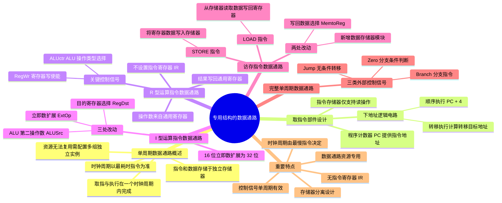

**user**: 整理一下这篇笔记，优化一下排版布局，段落格式，段与段之间不要太拥挤，重点的地方要有标红，文字的内容可以稍微优化一下，按照书中的说法来，我会直接复制粘贴替换
[Context: Notes: 408/计组/Chapter 5 ：中央处理器/5.3 数据通路的功能和基本结构/专用结构的数据通路.md]
[Timestamp: 2026/04/26 22:39:02]

**ai**: ---
title: 专用结构的数据通路
tags:
  - "#数据通路"
  - "#专用结构"
date: 2026-04-26
---

---

### 5.3.4 专用结构的数据通路

本节以**单周期数据通路**为例，介绍专用数据通路的设计原理。在单周期数据通路中，每条指令的取指与执行均在一个时钟周期内完成，CPU 的时钟周期必须以**最耗时的指令**为准。此外，由于资源无法复用，系统需要为频繁使用的功能单元（如加法器）配置**多组独立的实例**。同时，为避免指令获取与数据访问冲突，指令和数据被分别存储在**独立的存储器**中，确保两者可在同一时钟周期内并行处理。

鉴于完整单周期数据通路结构较复杂，以下将结合具体指令执行过程，逐步拆解其关键设计要点。尽管基于单周期模型，但其中的控制逻辑与数据通路设计思想同样适用于多周期、流水线等更复杂的结构。考生应在夯实基础的前提下，灵活运用所学知识。

---

## 1. 取指令部件的设计

每条指令的第一步都是完成取指令并计算下一条指令地址的过程。图 5.7 展示了取指令部件的结构示意图。指令存储在**指令存储器**中，仅支持读操作。读取指令时，只需提供指令地址，经过固定的延迟后即可输出对应的 32 位指令字。指令地址由**程序计数器（PC）**提供。

取指令部件包含专用的下地址逻辑电路，用于计算并更新 PC 值，以确定下一条指令的地址。下地址逻辑根据当前指令类型区分不同的执行路径：

- **顺序执行：** 当指令为普通顺序指令时，直接计算 $PC + 4$ 得到下一条指令的地址。
- **转移执行：** 对于分支或转移指令，需要根据指令类型计算转移目标地址。例如，beq 指令（相等转移）通过比较两个寄存器的内容决定是否转移，并根据偏移量计算新的 PC 值。

---

## 2. R 型运算类指令数据通路

R 型指令指的是操作数全部来自通用寄存器、运算结果也写回通用寄存器的算术/逻辑运算指令。以加法指令为例：

```c
add rd, rs, rt    # R[rs] + R[rt] → R[rd]
```

图 5.8 展示了 R 型指令相关的数据通路示意图。该数据通路能够对两个寄存器 Rs 和 Rt 的内容进行运算，并将结果写回 Rd 寄存器。例如，add 和 sub 等指令还需判断运算结果是否溢出，**仅当不溢出时才将结果写回 Rd 寄存器**；发生溢出时，会触发异常处理。

指令中的 Rs 和 Rt 是两个源操作数寄存器的编号，Rd 是目的寄存器的编号。因此：

- 寄存器堆的两个读地址端 Ra 和 Rb 应分别与 Rs 和 Rt 相连。
- 写地址端 Rw 应与 Rd 相连。
- ALU 的运算结果通过总线 busW 连至寄存器堆的写数据端。

控制信号 **RegWr** 作为寄存器堆的写使能信号，在 RegWr 为 1 且无溢出的情况下，运算结果才被写入寄存器堆。具体来说，RegWr 信号和溢出标志位 Overflow 通过"与"门组合后，决定是否允许写入寄存器堆。显然，在 R 型指令执行期间，RegWr 信号始终为 1。

此外，ALU 的操作类型由控制信号 **ALUctr** 决定。假设 ALU 支持 $N$ 种不同的运算，则 ALUctr 至少需要 $\lceil \log_2 N \rceil$ 位来选择具体的运算类型。

> ⚠️ **注意：** 由于单周期处理器必须在一个时钟周期内完成指令，其数据通路中**不设置指令寄存器（IR）**，而直接从指令存储器中取指令并解析执行，否则仅取指令到 IR 就需一个时钟周期。

---

## 3. I 型运算指令的数据通路

I 型运算指令（立即数运算类指令）的核心执行逻辑是，先将指令中的 16 位立即数扩展为 32 位，再将寄存器 Rs 的内容送入 ALU 运算，结果写回目的寄存器 Rt。以有符号加法指令为例：

```c
addi rt, rs, imm16    # R[rs] + SignExt[imm16] → R[rt]
```

其中，$SignExt[imm16]$ 表示对 16 位立即数进行符号扩展。

图 5.9 是在 R 型指令数据通路（见图 5.8）基础上，增加支持 I 型指令的功能模块（如立即数扩展器和多路选择器）后形成的通用数据通路。该通路可同时执行 R 型和 I 型运算指令。

与图 5.8 相比，数据通路主要有以下三处改动，以同时兼容 R 型和 I 型运算指令的执行：

| 改动位置 | 控制信号 | RegDst = 1（R 型） | RegDst = 0（I 型） |
| --- | --- | --- | --- |
| **目的寄存器选择** | RegDst | 选择 Rd 为目的寄存器 | 选择 Rt 为目的寄存器 |
| **立即数扩展** | ExtOp | 算术类指令：符号扩展 | 按位逻辑指令：零扩展 |
| **ALU 第二操作数** | ALUSrc | 选择寄存器 Rt 的数据 | 选择扩展后的立即数 |

---

## 4. 访存指令的数据通路

MIPS 访存指令属于 I 型指令（需要进行立即数运算），包括以下两类：

```c
lw rt, imm16(rs)    # M[ R[rs] + SignExt(imm16) ] → R[rt]
sw rt, imm16(rs)    # R[rt] → M[ R[rs] + SignExt(imm16) ]
```

LOAD 和 STORE 指令的访存地址计算逻辑完全一致：首先对指令中的 16 位立即数 imm16 进行符号扩展，然后将其与寄存器 Rs 的内容相加，得到访存地址。二者区别在于数据传输方向：

- **LOAD 指令：** 从该地址读取 32 位数据，并将数据写入寄存器 Rt。
- **STORE 指令：** 将寄存器 Rt 中的 32 位数据写入该地址对应的存储单元。

图 5.10 是在图 5.9 的基础上增加支持 LOAD/STORE 指令功能模块后的数据通路示意图。该数据通路不仅能够执行 LOAD/STORE 指令，还能兼容 R 型和 I 型运算指令。

与图 5.9 相比，数据通路主要有以下两处改动，以支持 LOAD/STORE 指令的执行：

| 改动位置 | 控制信号 | MemtoReg = 0（运算类） | MemtoReg = 1（LOAD） |
| --- | --- | --- | --- |
| **写回寄存器数据选择** | MemtoReg | 选择 ALU 的运算结果 | 选择数据存储器读出的数据 |
| **新增数据存储器模块** | MemWr | 数据存储器的地址端 Adr 连接 ALU 输出 | 数据存储器的写使能信号 |

---

## 5. 完整的单周期数据通路结构图

综合前述各功能模块，可构建如图 5.11 所示的完整单周期数据通路。图中所有加下划线的信号均为控制信号，以虚线表示。

其中，取指令部件在图 5.7 的基础上，还需接收三类关键外部控制信号：

- **Branch：** 在执行分支指令时置 1。
- **Jump：** 在执行无条件转移指令时置 1。
- **Zero：** 用于判断分支条件是否成立，该信号由 ALU 输出。例如，执行 beq 指令（相等转移）时，ALU 执行减法操作，若结果为 0，则 Zero 置 1，表示满足转移条件。

---

## 单周期处理器的重要特点

基于以上分析，单周期处理器具有以下重要特点：

| 特点 | 说明 |
| --- | --- |
| **存储器分离设计** | 指令存储器与数据存储器相互独立，使得取指令与数据访存操作可并行进行，避免冲突，确保在一个时钟周期内同时完成指令读取与数据读/写 |
| **无指令寄存器（IR）** | 指令从存储器取出后，其各字段（如 rs、rt、rd、imm）直接用于生成控制信号或地址输入，指令解析与执行在同一个时钟周期内同步完成 |
| **时钟周期由最慢指令决定** | 时钟周期必须满足执行时间最长的指令（如访存指令），导致简单指令（如 R 型加法）的执行效率受限 |
| **数据通路资源专用** | 由于所有操作需要在一个周期内并发完成，关键功能单元（如用于 PC 更新和地址计算的加法器）需要配置多个独立的实例，硬件无法复用，开销较大 |
| **控制信号单周期有效** | 所有控制信号（如 RegWr、MemWr 等）在一个时钟周期内保持有效，指令"取指、执行、写回"的完整流程在单个时钟脉冲内完成，无流水线分段 |

---

> 💡 **记忆要点：** 单周期数据通路的核心思想是**"专用资源、并行执行、最慢决定"**。理解各控制信号的作用及多路选择器的选择逻辑，是掌握数据通路设计的关键。

---
[Timestamp: 2026/04/26 22:39:20]

**user**: 根据这一章的内容建立思维导图
[Timestamp: 2026/04/27 12:30:52]

**ai**: ---



---

## 📌 使用说明

1. **复制粘贴**：将上述 Mermaid 代码复制到 Obsidian 笔记中
2. **渲染查看**：Obsidian 会自动渲染为思维导图（需安装 Mermaid 插件）
3. **导出图片**：可通过插件导出为 PNG/SVG 格式用于复习

## 🎯 思维导图结构说明

| 层级 | 内容 |
| --- | --- |
| **根节点** | 专用结构的数据通路 |
| **一级分支** | 6 个核心模块（概述、取指、R 型、I 型、访存、完整结构、特点） |
| **二级分支** | 各模块的关键设计要点和控制信号 |
| **三级分支** | 具体实现细节和参数说明 |

---

> 💡 **建议**：可将此思维导图与 [[专用结构的数据通路]] 笔记配合使用，先通过思维导图建立整体框架，再深入阅读笔记细节。

如需调整思维导图结构或添加更多细节，请告诉我！
[Timestamp: 2026/04/27 12:30:57]