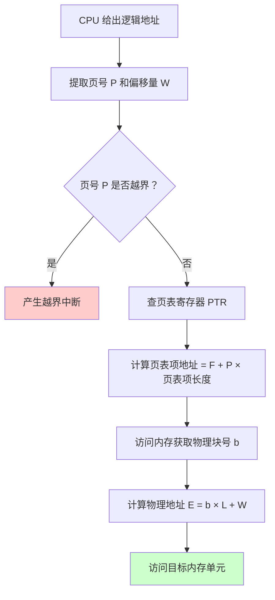
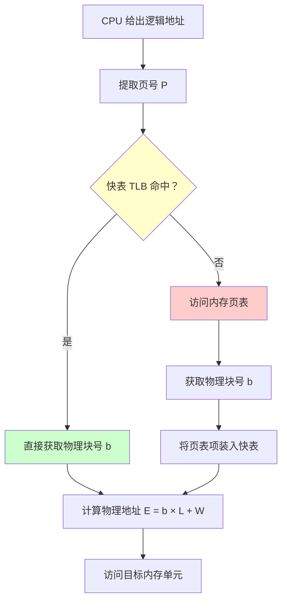
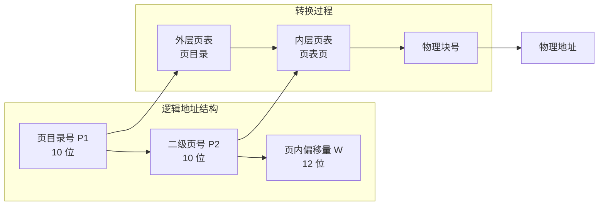

**user**: 根据分页存储讲一下它的地址转换，最好使用图解的方式
[Context: Notes: 408/操作系统/Chapter 3 ：内存管理/3.1 内存管理概念/基本分页存储管理.md]
[Timestamp: 2026/04/23 23:23:57]

**ai**: 

# 分页存储地址转换详解

根据笔记内容，我为您整理了分页存储的地址转换机制，并用图解方式展示核心流程。

## 一、逻辑地址结构

分页存储中，逻辑地址被划分为**页号**和**页内偏移量**两部分：

```
┌─────────────────────────────────────────────────────────┐
│                    逻辑地址 (32 位)                       │
├─────────────────────────────────────────────────────────┤
│  页号 P (高 20 位)  │  页内偏移量 W (低 12 位)  │
│  20 位            │  12 位 (4KB 页面)          │
└─────────────────────────────────────────────────────────┘
```

**计算公式：**
- 页号 $P = \lfloor A/L \rfloor$
- 页内偏移量 $W = A \% L$

其中 $A$ 为逻辑地址，$L$ 为页面大小。

---

## 二、基本地址变换机构（无快表）

### 转换流程图



### 转换过程说明

| 步骤 | 操作 | 访存次数 |
|---|---|---|
| 1 | 计算页号 $P$ 和偏移量 $W$ | 0 |
| 2 | 查页表获取物理块号 $b$ | 1 |
| 3 | 拼接物理地址并访问 | 1 |
| **合计** | | **2 次访存** |

---

## 三、带快表（TLB）的地址变换机构

### 转换流程图



### 性能对比

| 场景 | 访存次数 | 说明 |
|---|---|---|
| TLB 命中 | 1 次 | 直接从快表获取物理块号 |
| TLB 未命中 | 2 次 | 需访问内存页表 |
| 平均性能 | 约 1.1 次 | 命中率通常 >90% |

---

## 四、两级页表地址转换

### 逻辑地址结构



### 转换步骤

| 步骤 | 操作 | 访存次数 |
|---|---|---|
| 1 | 用页目录号查外层页表 | 1 |
| 2 | 用二级页号查内层页表 | 1 |
| 3 | 访问目标内存单元 | 1 |
| **合计** | | **3 次访存** |

---

## 五、关键概念总结

| 概念 | 说明 |
|---|---|
| **页表寄存器 (PTR)** | 存放页表始址 $F$ 和长度 $M$ |
| **MMU** | 内存管理单元，硬件自动完成地址转换 |
| **快表 (TLB)** | 高速缓存，存储活跃页表项 |
| **页表项大小** | 通常 4B（含有效位、访问位等） |

---

## 六、实际计算示例

假设：页面大小 $L = 1\text{KB} = 1024\text{B}$，页号 2 对应物理块号 $b = 8$，逻辑地址 $A = 2500$

```
1. 计算页号：P = ⌊2500 / 1024⌋ = 2
2. 计算偏移量：W = 2500 % 1024 = 452
3. 查页表：页号 2 → 物理块号 8
4. 计算物理地址：E = 8 × 1024 + 452 = 8644
```

---

## 七、核心优势

| 特性 | 说明 |
|---|---|
| **消除外部碎片** | 内存以页框为单位分配 |
| **页内碎片平均半页** | 每个进程平均浪费约 $L/2$ |
| **支持虚拟内存** | 页表可部分驻留磁盘 |
| **保护机制** | 页表项含有效位、访问位等 |

---

> 💡 **提示**：实际系统中，由于局部性原理，快表命中率通常可达 90% 以上，因此分页机制带来的性能开销可控制在 10% 以内。

如需进一步了解快表替换算法或多级页表的具体实现细节，可以参考 [[3.2 内存管理概念]] 中的相关内容。
[Timestamp: 2026/04/23 23:24:09]