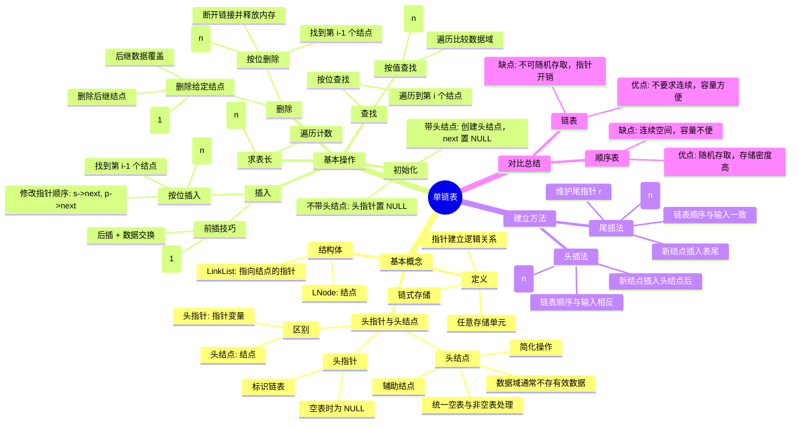

**user**: 根据这篇笔记的内容，制作思维导图的md文件
[Context: Notes: 408/数据结构/Chapter 2 ：线性表/2.3 线性表的链式表示/单链表.md]
[Timestamp: 2026/06/03 10:15:45]

**ai**: 



你可以将上述代码复制到你的 Obsidian 笔记中，它会自动渲染为思维导图。如果需要调整样式或布局，可以在 `mindmap` 标签后添加 `style` 参数。

```markdown
---
title: 单链表思维导图
tags:
  - "#思维导图"
  - "#数据结构"
---

```mermaid
mindmap
  root((单链表))
    基本概念
      定义
        链式存储
        任意存储单元
        指针建立逻辑关系
      结构体
        LNode: 结点
        LinkList: 指向结点的指针
      头指针与头结点
        头指针
          标识链表
          空表时为 NULL
        头结点
          辅助结点
          数据域通常不存有效数据
          简化操作
          统一空表与非空表处理
        区别
          头指针: 指针变量
          头结点: 结点
    基本操作
      初始化
        带头结点: 创建头结点，next 置 NULL
        不带头结点: 头指针置 NULL
      求表长
        遍历计数
        时间复杂度: $O(n)$
      插入
        按位插入
          找到第 i-1 个结点
          修改指针顺序: s->next, p->next
          时间复杂度: $O(n)$
        前插技巧
          后插 + 数据交换
          时间复杂度: $O(1)$
      删除
        按位删除
          找到第 i-1 个结点
          断开链接并释放内存
          时间复杂度: $O(n)$
        删除给定结点
          后继数据覆盖
          删除后继结点
          时间复杂度: $O(1)$
      查找
        按位查找
          遍历到第 i 个结点
        按值查找
          遍历比较数据域
          时间复杂度: $O(n)$
    建立方法
      头插法
        新结点插入头结点后
        链表顺序与输入相反
        时间复杂度: $O(n)$
      尾插法
        维护尾指针 r
        新结点插入表尾
        链表顺序与输入一致
        时间复杂度: $O(n)$
    对比总结
      顺序表
        优点: 随机存取，存储密度高
        缺点: 连续空间，容量不便
      链表
        优点: 不要求连续，容量方便
        缺点: 不可随机存取，指针开销
```
```

这样你就可以直接保存为 `.md` 文件，Obsidian 会自动渲染思维导图。如果需要导出为图片，可以使用 Obsidian 的插件如 `Mermaid Export`。
[Timestamp: 2026/06/03 10:15:58]

**user**: 没有自动渲染
[Context: Notes: 408/数据结构/Chapter 2 ：线性表/思维导图.md]
[Timestamp: 2026/06/03 10:17:36]

**ai**: 

我来帮你检查并修复这个问题。Obsidian 中 Mermaid 思维导图不渲染通常有以下几个原因：

## 可能的问题及解决方案

### 1. 检查 Mermaid 插件是否启用

确保你在 Obsidian 设置中启用了 **Core Plugins → Mermaid** 插件：
- 打开 Obsidian 设置
- 进入 **核心插件**
- 确认 **Mermaid** 已启用

### 2. 修复代码块格式

你的代码块格式基本正确，但为了确保兼容性，我帮你优化一下：

```markdown
---
title: 单链表思维导图
tags:
  - "#思维导图"
  - "#数据结构"
---


```

### 3. 其他排查步骤

| 步骤 | 操作 |
| --- | --- |
| 1 | 保存文件后，按 `Ctrl+Shift+P` 或 `Cmd+Shift+P` 刷新预览 |
| 2 | 检查代码块前后是否有空行 |
| 3 | 尝试将 `mindmap` 改为 `graph TD` 测试渲染 |
| 4 | 查看 Obsidian 控制台是否有错误信息 |

### 4. 如果仍不渲染

你可以尝试使用 **Obsidian 思维导图插件**：
- 安装社区插件 **Mindmap** 或 **Excalidraw**
- 这些插件提供更强大的思维导图功能

---

**请先确认 Mermaid 插件已启用**，然后刷新页面。如果还是不行，告诉我你的 Obsidian 版本，我可以提供更具体的解决方案。
[Timestamp: 2026/06/03 10:17:44]

**user**: 我不是很喜欢这种风格的思维导图
[Context: Notes: 408/数据结构/Chapter 2 ：线性表/思维导图.md]
[Timestamp: 2026/06/03 10:19:13]