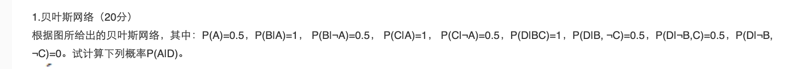
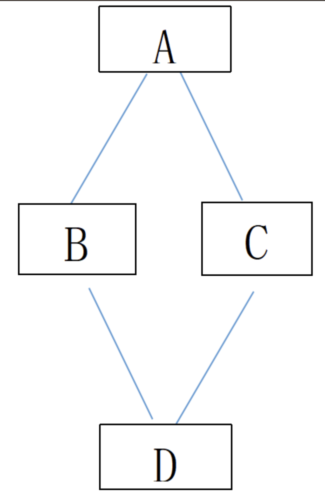

## 001

> [!question] 问题
> 
> 

## 🎯 题目深度解析

> 本题的核心考点是**贝叶斯网络（Bayesian Network）的联合概率分解与条件概率推理**。需要利用贝叶斯网络的拓扑结构将联合概率转化为条件概率乘积，并通过全概率公式和贝叶斯定理计算后验概率 $P(A|D)$。

## 📝 详细解题步骤

### 1. 明确已知条件与贝叶斯网络结构

由图可知，该贝叶斯网络的拓扑结构决定了联合概率分解公式为：

$$P(A, B, C, D) = P(A)P(B|A)P(C|A)P(D|B,C)$$

题目给出的条件概率如下：

- **根节点：** $P(A) = 0.5 \implies P(\neg A) = 1 - 0.5 = 0.5$
    
- **中间节点 B：** $P(B|A) = 1$，$P(B|\neg A) = 0.5$
    
    - 进而可得：$P(\neg B|A) = 0$，$P(\neg B|\neg A) = 0.5$
        
- **中间节点 C：** $P(C|A) = 1$，$P(C|\neg A) = 0.5$
    
    - 进而可得：$P(\neg C|A) = 0$，$P(\neg C|\neg A) = 0.5$
        
- **叶子节点 D：** * $P(D|B,C) = 1$
    
    - $P(D|B,\neg C) = 0.5$
        
    - $P(D|\neg B,C) = 0.5$
        
    - $P(D|\neg B,\neg C) = 0$
        

我们要计算的目标后验概率为：

$$P(A|D) = \frac{P(A, D)}{P(D)}$$

### 2. 计算分子 $P(A, D)$

由于变量 $B$ 和 $C$ 处于 $A$ 和 $D$ 之间，通过对 $B, C$ 进行全概率展开（边缘化消元）：

$$P(A, D) = \sum_{B, C} P(A, B, C, D) = P(A) \sum_{B, C} P(B|A)P(C|A)P(D|B,C)$$

展开 $B, C$ 的四种组合状态：

$$P(A, D) = P(A) \Big[ P(B|A)P(C|A)P(D|B,C) + P(B|A)P(\neg C|A)P(D|B,\neg C) + P(\neg B|A)P(C|A)P(D|\neg B,C) + P(\neg B|A)P(\neg C|A)P(D|\neg B,\neg C) \Big]$$

将已知数据代入（注意 $P(\neg B|A) = 0$ 且 $P(\neg C|A) = 0$）：

$$P(A, D) = 0.5 \times \Big[ 1 \times 1 \times 1 + 1 \times 0 \times 0.5 + 0 \times 1 \times 0.5 + 0 \times 0 \times 0 \Big]$$

$$P(A, D) = 0.5 \times 1 = \mathbf{0.5}$$

### 3. 计算 $P(\neg A, D)$

同理，对 $A$ 取反的情况进行展开：

$$P(\neg A, D) = P(\neg A) \Big[ P(B|\neg A)P(C|\neg A)P(D|B,C) + P(B|\neg A)P(\neg C|\neg A)P(D|B,\neg C) + P(\neg B|\neg A)P(C|\neg A)P(D|\neg B,C) + P(\neg B|\neg A)P(\neg C|\neg A)P(D|\neg B,\neg C) \Big]$$

代入对应的条件概率值（此时 $P(B|\neg A)=0.5, P(\neg B|\neg A)=0.5, P(C|\neg A)=0.5, P(\neg C|\neg A)=0.5$）：

$$P(\neg A, D) = 0.5 \times \Big[ 0.5 \times 0.5 \times 1 + 0.5 \times 0.5 \times 0.5 + 0.5 \times 0.5 \times 0.5 + 0.5 \times 0.5 \times 0 \Big]$$

$$P(\neg A, D) = 0.5 \times \Big[ 0.25 + 0.125 + 0.125 + 0 \Big]$$

$$P(\neg A, D) = 0.5 \times 0.5 = \mathbf{0.25}$$

### 4. 计算分母 $P(D)$

利用全概率公式，将关于 $A$ 的全概率求和：

$$P(D) = P(A, D) + P(\neg A, D)$$

$$P(D) = 0.5 + 0.25 = \mathbf{0.75}$$

### 5. 计算最终后验概率 $P(A|D)$

根据贝叶斯定理：

$$P(A|D) = \frac{P(A, D)}{P(D)} = \frac{0.5}{0.75} = \frac{2}{3}$$

**最终答案：**

$$P(A|D) = \mathbf{\frac{2}{3}} \approx \mathbf{0.667}$$

## 💡 核心考点归纳

- **核心概念/定义**：
    
    - **贝叶斯网络（DAG）**：一种有向无环图模型，节点表示随机变量，有向边表示变量间的条件依赖关系。每个节点都关联一个条件概率表（CPT）。
        
    - **条件独立性**：在已知父节点的情况下，该节点与其所有非后代节点独立。本题中在给定 $A$ 时，$B$ 和 $C$ 条件独立，即 $P(B,C|A) = P(B|A)P(C|A)$。
        
- **核心公式/定理**：
    
    - **联合概率网络分解**：$P(X_1, ..., X_n) = \prod_{i=1}^n P(X_i | \text{Parents}(X_i))$
        
    - **贝叶斯定理（Bayes' Theorem）**：$P(A|D) = \frac{P(D|A)P(A)}{P(D)}$
        
- **常见易错点/避坑指南**：
    
    - **遗漏补全概率**：题目中往往只给出正向概率（如 $P(B|A)=1$），在展开公式时遇到反向概率（如 $P(\neg B|A)$）需要习惯性地用 $1 - P(B|A)$ 自行补全。
        
    - **消元展开漏项**：在对隐藏变量 $B, C$ 进行边缘化（求和）时，必须穷举 $(B,C), (B,\neg C), (\neg B,C), (\neg B,\neg C)$ 全部 4 种组合，切勿漏项导致结果偏差。
##### **知识关联**
- 
<!-- COUNTER: 1 -->
