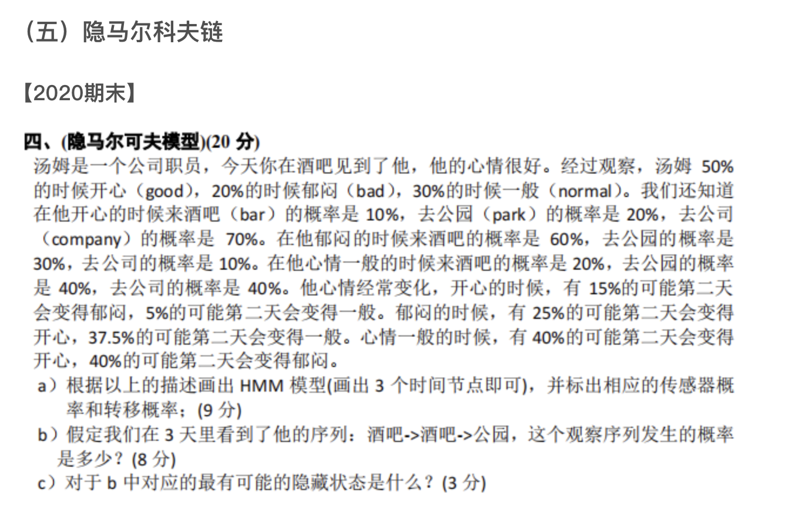
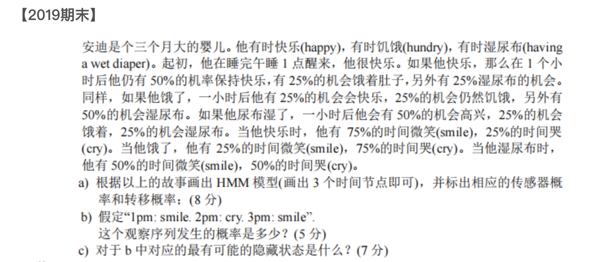

## 001


> [!question] 问题
> 
## 🎯 题目深度解析

> 本题的核心考点是**隐马尔可夫模型（Hidden Markov Model, HMM）**。题目考查了 HMM 的三大基本要素（初始状态、转移概率、发射概率）、**前向算法（计算观察序列概率，b问）**以及**维特比算法（寻找最可能的隐藏状态序列，c问）**。

## 📝 详细解题步骤

### 1. 整理已知条件（HMM 模型参数提炼）

为了方便后续计算，我们先将文本中的百分比数据转化为概率矩阵。

- **隐藏状态（Hidden States）：** 汤姆的心情 $S = \{\text{good}(g), \text{bad}(b), \text{normal}(n)\}$
    
- **观察状态（Observations）：** 汤姆去的地方 $O = \{\text{bar}, \text{park}, \text{company}\}$
    

#### ① 初始状态概率 $\pi$（汤姆第一天心情的概率）：

$$\pi = [P(g), P(b), P(n)] = [0.5, 0.2, 0.3]$$

#### ② 状态转移概率矩阵 $A$（心情到心情的转化，注意每一行之和为 1）：

- $g \rightarrow \text{bad}: 15\%$， $g \rightarrow \text{normal}: 5\%$ $\implies g \rightarrow g: 1 - 0.15 - 0.05 = 80\%$
    
- $b \rightarrow \text{good}: 25\%$， $b \rightarrow \text{normal}: 37.5\%$ $\implies b \rightarrow b: 1 - 0.25 - 0.375 = 37.5\%$
    
- $n \rightarrow \text{good}: 40\%$， $n \rightarrow \text{bad}: 40\%$ $\implies n \rightarrow n: 1 - 0.4 - 0.4 = 20\%$
    

$$A = \begin{matrix}

& \text{good} & \text{bad} & \text{normal} \

\text{good} \ \text{bad} \ \text{normal}

\end{matrix} \begin{bmatrix}

0.8 & 0.15 & 0.05 \

0.25 & 0.375 & 0.375 \

0.4 & 0.4 & 0.2

\end{bmatrix}$$

#### ③ 发射概率（传感器概率）矩阵 $B$（心情决定去哪里的概率）：

$$B = \begin{matrix}

& \text{bar} & \text{park} & \text{company} \

\text{good} \ \text{bad} \ \text{normal}

\end{matrix} \begin{bmatrix}

0.1 & 0.2 & 0.7 \

0.6 & 0.3 & 0.1 \

0.2 & 0.4 & 0.4

\end{bmatrix}$$

### a) 画出 HMM 模型（3个时间节点）

HMM 在时间轴上展开为一个双层拓扑结构。上层为隐藏状态 $X_t$，下层为观察状态 $Y_t$。

```
(隐藏层)   X1 -----------> X2 -----------> X3     (状态转移概率 A)
           |               |               |
           |               |               |      (发射/传感器概率 B)
           V               V               V
(观察层)   Y1(bar)         Y2(bar)         Y3(park)
```

- **图中标注说明**：
    
    - $X_1$ 的初始输入为 $\pi = [0.5, 0.2, 0.3]$。
        
    - 节点间的横向箭头标注矩阵 $A$ 的元素（如 $X_1(g) \rightarrow X_2(b)$ 为 $0.15$）。
        
    - 纵向箭头标注矩阵 $B$ 的元素（如 $X_1(g) \rightarrow Y_1(\text{bar})$ 为 $0.1$）。
        

### b) 计算观察序列“酒吧 $\rightarrow$ 酒吧 $\rightarrow$ 公园”发生的概率

我们要计算的是 $P(Y_1=\text{bar}, Y_2=\text{bar}, Y_3=\text{park})$。采用前向算法（Forward Algorithm）分步计算。

定义前向变量 $\alpha_t(i) = P(Y_1, \dots, Y_t, X_t = i)$。

#### 1. 时间 $t=1$（观察到 $Y_1 = \text{bar}$）：

$$\alpha_1(i) = \pi_i \times B_i(Y_1)$$

- $\alpha_1(g) = 0.5 \times 0.1 = \mathbf{0.05}$
    
- $\alpha_1(b) = 0.2 \times 0.6 = \mathbf{0.12}$
    
- $\alpha_1(n) = 0.3 \times 0.2 = \mathbf{0.06}$
    

#### 2. 时间 $t=2$（观察到 $Y_2 = \text{bar}$）：

$$\alpha_2(j) = \left[ \sum_{i} \alpha_1(i) A_{ij} \right] \times B_j(Y_2)$$

- $\alpha_2(g) = [0.05 \times 0.8 + 0.12 \times 0.25 + 0.06 \times 0.4] \times 0.1 = [0.04 + 0.03 + 0.024] \times 0.1 = 0.094 \times 0.1 = \mathbf{0.0094}$
    
- $\alpha_2(b) = [0.05 \times 0.15 + 0.12 \times 0.375 + 0.06 \times 0.4] \times 0.6 = [0.0075 + 0.045 + 0.024] \times 0.6 = 0.0765 \times 0.6 = \mathbf{0.0459}$
    
- $\alpha_2(n) = [0.05 \times 0.05 + 0.12 \times 0.375 + 0.06 \times 0.2] \times 0.2 = [0.0025 + 0.045 + 0.012] \times 0.2 = 0.0595 \times 0.2 = \mathbf{0.0119}$
    

#### 3. 时间 $t=3$（观察到 $Y_3 = \text{park}$）：

$$\alpha_3(j) = \left[ \sum_{j} \alpha_2(j) A_{jk} \right] \times B_k(Y_3)$$

- $\alpha_3(g) = [0.0094 \times 0.8 + 0.0459 \times 0.25 + 0.0119 \times 0.4] \times 0.2 = [0.00752 + 0.011475 + 0.00476] \times 0.2 = 0.023755 \times 0.2 = \mathbf{0.004751}$
    
- $\alpha_3(b) = [0.0094 \times 0.15 + 0.0459 \times 0.375 + 0.0119 \times 0.4] \times 0.3 = [0.00141 + 0.0172125 + 0.00476] \times 0.3 = 0.0233825 \times 0.3 = \mathbf{0.00701475}$
    
- $\alpha_3(n) = [0.0094 \times 0.05 + 0.0459 \times 0.375 + 0.0119 \times 0.2] \times 0.4 = [0.00047 + 0.0172125 + 0.00238] \times 0.4 = 0.0200625 \times 0.4 = \mathbf{0.008025}$
    

#### 4. 汇总总概率：

$$P(\text{bar} \rightarrow \text{bar} \rightarrow \text{park}) = \alpha_3(g) + \alpha_3(b) + \alpha_3(n) = 0.004751 + 0.00701475 + 0.008025 = \mathbf{0.01979075}$$

### c) 对于 b 中对应的最可能的隐藏状态序列是什么？

利用**维特比算法（Viterbi Algorithm）**，通过动态规划寻找概率最大的路径。定义 $\delta_t(i)$ 为 $t$ 时刻到达状态 $i$ 的最大概率。

#### 1. $t=1$（与前向初始化相同）：

- $\delta_1(g) = \mathbf{0.05}$ （来自初始）
    
- $\delta_1(b) = \mathbf{0.12}$ （来自初始）
    
- $\delta_1(n) = \mathbf{0.06}$ （来自初始）
    

#### 2. $t=2$（找出到各个状态的最大单条路径）：

$$\delta_2(j) = \max_{i} [\delta_1(i) A_{ij}] \times B_j(Y_2)$$

- 对 $\delta_2(g)$：
    
    - 来自 $g$: $0.05 \times 0.8 = 0.04$
        
    - 来自 $b$: $0.12 \times 0.25 = \mathbf{0.03}$
        
    - 来自 $n$: $0.06 \times 0.4 = 0.024$
        
    - 极大值来自 $g$， $\delta_2(g) = 0.04 \times 0.1 = \mathbf{0.004}$ （前驱为 **g**）
        
- 对 $\delta_2(b)$：
    
    - 来自 $g$: $0.05 \times 0.15 = 0.0075$
        
    - 来自 $b$: $0.12 \times 0.375 = \mathbf{0.045}$
        
    - 来自 $n$: $0.06 \times 0.4 = 0.024$
        
    - 极大值来自 $b$， $\delta_2(b) = 0.045 \times 0.6 = \mathbf{0.027}$ （前驱为 **b**）
        
- 对 $\delta_2(n)$：
    
    - 来自 $g$: $0.05 \times 0.05 = 0.0025$
        
    - 来自 $b$: $0.12 \times 0.375 = \mathbf{0.045}$
        
    - 来自 $n$: $0.06 \times 0.2 = 0.012$
        
    - 极大值来自 $b$， $\delta_2(n) = 0.045 \times 0.2 = \mathbf{0.009}$ （前驱为 **b**）
        

#### 3. $t=3$（计算最终终点的最大路径）：

$$\delta_3(k) = \max_{j} [\delta_2(j) A_{jk}] \times B_k(Y_3)$$

- 对 $\delta_3(g)$：
    
    - 来自 $g$: $0.004 \times 0.8 = 0.0032$
        
    - 来自 $b$: $0.027 \times 0.25 = \mathbf{0.00675}$
        
    - 来自 $n$: $0.009 \times 0.4 = 0.0036$
        
    - 最大为 $0.00675$（来自 $b$）， $\delta_3(g) = 0.00675 \times 0.2 = \mathbf{0.00135}$
        
- 对 $\delta_3(b)$：
    
    - 来自 $g$: $0.004 \times 0.15 = 0.0006$
        
    - 来自 $b$: $0.027 \times 0.375 = \mathbf{0.010125}$
        
    - 来自 $n$: $0.009 \times 0.4 = 0.0036$
        
    - 最大为 $0.010125$（来自 $b$）， $\delta_3(b) = 0.010125 \times 0.3 = \mathbf{0.0030375}$
        
- 对 $\delta_3(n)$：
    
    - 来自 $g$: $0.004 \times 0.05 = 0.0002$
        
    - 来自 $b$: $0.027 \times 0.375 = \mathbf{0.010125}$
        
    - 来自 $n$: $0.009 \times 0.2 = 0.0018$
        
    - 最大为 $0.010125$（来自 $b$）， $\delta_3(n) = 0.010125 \times 0.4 = \mathbf{0.00405}$
        

#### 4. 回溯最优序列：

1. 在 $t=3$ 时，最大概率为 $\delta_3(n) = 0.00405$，故第三天最可能的状态是 **normal (n)**。
    
2. 回溯到 $t=2$：让 $\delta_3(n)$ 取得最大值的那个前驱状态是 **bad (b)**。
    
3. 回溯到 $t=1$：让 $\delta_2(b)$ 取得最大值的那个前驱状态是 **bad (b)**。
    

**最终最可能的隐藏状态序列为：**

$$\mathbf{\text{bad} \rightarrow \text{bad} \rightarrow \text{normal}}$$

## 💡 核心考点归纳

|**核心算法**|**解决的根本问题**|**底层数学核心**|**易错点/考试避坑指南**|
|---|---|---|---|
|**前向算法**|评估（Evaluation）：计算某一特定观察序列的总出现概率。|每一步做**求和 ($\sum$)** 运算。|累加时不要漏掉任何一个状态分支。|
|**维特比算法**|解码（Decoding）：已知观察序列，反推最可能的隐状态序列。|每一步做**求最大值 ($\max$)** 运算。|算完后**必须回溯**！绝对不能图省事直接选每一步里 $\delta$ 最大的那个状态，必须顺着最优路径的指针往回找。|
##### **知识关联**
- 
<!-- COUNTER: 1 -->

## 🎯 题目深度解析

> 本题的核心考点是**隐马尔可夫模型（Hidden Markov Model, HMM）**。涉及的具体知识点包括：HMM 的三个时间步拓扑结构图、观测序列的边际概率计算（前向算法思想）以及基于特定观测序列求最可能隐藏状态序列的**维特比算法（Viterbi Algorithm）**。

## 📝 详细解题步骤

### 符号与状态定义

为了计算方便，我们首先对隐藏状态（States）和观测状态（Observations）进行符号化定义：

- **隐藏状态集合 $S = \{H, U, D\}$**：
    
    - $H$: 快乐 (happy)
        
    - $U$: 饥饿 (hungry)
        
    - $D$: 湿尿布 (having a wet diaper)
        
- **观测状态集合 $V = \{s, c\}$**：
    
    - $s$: 微笑 (smile)
        
    - $c$: 哭闹 (cry)
        
- **时间节点**：$t_1 = \text{1pm}$, $t_2 = \text{2pm}$, $t_3 = \text{3pm}$
    

根据题意，初始状态（1pm 醒来时）安迪很快乐，因此初始状态概率分布为：

$$\pi = [P(X_1=H), P(X_1=U), P(X_1=D)] = [1, 0, 0]$$

**状态转移概率矩阵 $A$**（行表示当前状态，列表示下一小时状态）：

$$A = \begin{pmatrix}

P(H|H) & P(U|H) & P(D|H) \

P(H|U) & P(U|U) & P(D|U) \

P(H|D) & P(U|D) & P(D|D)

\end{pmatrix} = \begin{pmatrix}

0.5 & 0.25 & 0.25 \

0.25 & 0.25 & 0.5 \

0.5 & 0.25 & 0.25

\end{pmatrix}$$

**观测发射概率矩阵 $B$**（行表示隐藏状态，列表示观测状态）：

$$B = \begin{pmatrix}

P(s|H) & P(c|H) \

P(s|U) & P(c|U) \

P(s|D) & P(c|D)

\end{pmatrix} = \begin{pmatrix}

0.75 & 0.25 \

0.25 & 0.75 \

0.5 & 0.5

\end{pmatrix}$$

### a) 画出 HMM 模型（3个时间节点）并标出参数

题目要求画出 3 个时间节点的拓扑结构。隐马尔可夫模型由隐藏状态链和观测发射组成。其拓扑图结构如下：

```
( 隐藏状态 )    X_1 (1pm) ------> X_2 (2pm) ------> X_3 (3pm)
                  |                 |                 |
                  | 发射            | 发射            | 发射
                  v                 v                 v
( 观测状态 )    Y_1 (1pm)         Y_2 (2pm)         Y_3 (3pm)
```

在线性图中标注具体的转移与发射概率（由于完全图的边较多，考试时通常也可以通过展开特定的节点状态或单独列出参数矩阵来清晰表达）：

- **初始概率**：$P(X_1 = H) = 1.0$
    
- **时间步间转移边 $X_t \to X_{t+1}$** 对应的条件概率查阅矩阵 $A$。
    
- **时间步内发射边 $X_t \to Y_t$** 对应的条件概率查阅矩阵 $B$。
    

### b) 计算观察序列 “1pm: smile. 2pm: cry. 3pm: smile” 发生的概率

已知观测序列 $O = (Y_1=s, Y_2=c, Y_3=s)$。由于初始状态 $X_1 = H$ 的概率为 1，我们可以利用前向递推（或直接对状态路径求和）来计算该观测序列的边际概率 $P(O)$。

#### **Step 1: 1pm ($t=1$) 的前向概率 $\alpha_1(j) = P(X_1=j, Y_1=s)$**

由于初始状态确定为 $H$：

- $\alpha_1(H) = P(X_1=H) \cdot P(Y_1=s | X_1=H) = 1 \times 0.75 = \mathbf{0.75}$
    
- $\alpha_1(U) = 0 \times 0.25 = \mathbf{0}$
    
- $\alpha_1(D) = 0 \times 0.5 = \mathbf{0}$
    

#### **Step 2: 2pm ($t=2$) 的前向概率 $\alpha_2(j) = \left[ \sum_{i} \alpha_1(i) A_{ij} \right] \cdot B_{j}(Y_2=c)$**

由于只有 $\alpha_1(H) > 0$，计算可以简化：

- $\alpha_2(H) = [\alpha_1(H) \cdot P(H|H)] \cdot P(c|H) = [0.75 \times 0.5] \times 0.25 = 0.375 \times 0.25 = \mathbf{0.09375}$
    
- $\alpha_2(U) = [\alpha_1(H) \cdot P(U|H)] \cdot P(c|U) = [0.75 \times 0.25] \times 0.75 = 0.1875 \times 0.75 = \mathbf{0.140625}$
    
- $\alpha_2(D) = [\alpha_1(H) \cdot P(D|H)] \cdot P(c|D) = [0.75 \times 0.25] \times 0.5 = 0.1875 \times 0.5 = \mathbf{0.09375}$
    

#### **Step 3: 3pm ($t=3$) 的前向概率 $\alpha_3(j) = \left[ \sum_{i} \alpha_2(i) A_{ij} \right] \cdot B_{j}(Y_3=s)$**

- **计算状态 $H$ 的前向概率：**
    
    $$\sum_{i} \alpha_2(i) A_{iH} = (0.09375 \times 0.5) + (0.140625 \times 0.25) + (0.09375 \times 0.5) = 0.046875 + 0.03515625 + 0.046875 = 0.12890625$$
    
    $$\alpha_3(H) = 0.12890625 \times P(s|H) = 0.12890625 \times 0.75 = \mathbf{0.0966796875}$$
    
- **计算状态 $U$ 的前向概率：**
    
    $$\sum_{i} \alpha_2(i) A_{iU} = (0.09375 \times 0.25) + (0.140625 \times 0.25) + (0.09375 \times 0.25) = 0.0234375 + 0.03515625 + 0.0234375 = 0.08203125$$
    
    $$\alpha_3(U) = 0.08203125 \times P(s|U) = 0.08203125 \times 0.25 = \mathbf{0.0205078125}$$
    
- **计算状态 $D$ 的前向概率：**
    
    $$\sum_{i} \alpha_2(i) A_{iD} = (0.09375 \times 0.25) + (0.140625 \times 0.5) + (0.09375 \times 0.25) = 0.0234375 + 0.0703125 + 0.0234375 = 0.1171875$$
    
    $$\alpha_3(D) = 0.1171875 \times P(s|D) = 0.1171875 \times 0.5 = \mathbf{0.05859375}$$
    

#### **Step 4: 总观测序列概率**

$$P(O) = \alpha_3(H) + \alpha_3(U) + \alpha_3(D) = 0.0966796875 + 0.0205078125 + 0.05859375 = \mathbf{0.17578125} \quad \left(\text{即 } \frac{45}{256}\right)$$

### c) 寻找对应的最可能的隐藏状态序列（维特比算法）

维特比算法定义 $\delta_t(j)$ 为在时刻 $t$ 到达状态 $j$ 的所有路径中的最大概率。

#### **时刻 $t=1$ (1pm)**

已知初始时刻必定为 $H$，对应的观测为 $s$:

- $\delta_1(H) = \mathbf{0.75}$
    
- $\delta_1(U) = \mathbf{0}$
    
- $\delta_1(D) = \mathbf{0}$
    

#### **时刻 $t=2$ (2pm)**

由于只有 $\delta_1(H) > 0$，此时各状态的最大概率路径只能从 $H$ 转移而来（回溯指针 $\psi_2(j) = H$）：

- $\delta_2(H) = \delta_1(H) \cdot P(H|H) \cdot P(c|H) = 0.75 \times 0.5 \times 0.25 = \mathbf{0.09375}$
    
- $\delta_2(U) = \delta_1(H) \cdot P(U|H) \cdot P(c|U) = 0.75 \times 0.25 \times 0.75 = \mathbf{0.140625}$
    
- $\delta_2(D) = \delta_1(H) \cdot P(D|H) \cdot P(c|D) = 0.75 \times 0.25 \times 0.5 = \mathbf{0.09375}$
    

#### **时刻 $t=3$ (3pm)**

我们需要分别找出转移到 $t=3$ 各个状态的最大可能概率：

$$\delta_3(j) = \max_{i} \left[ \delta_2(i) \cdot A_{ij} \right] \cdot B_j(s)$$

- **对于状态 $H$ ($Y_3=s$):**
    
    - 从 $H$ 转移: $0.09375 \times 0.5 = 0.046875$
        
    - 从 $U$ 转移: $0.140625 \times 0.25 = 0.03515625$
        
    - 从 $D$ 转移: $0.09375 \times 0.5 = 0.046875$
        
    - 最大来源为 $H$ 或 $D$，最大值 $\max = 0.046875$。
        
    - $\delta_3(H) = 0.046875 \times P(s|H) = 0.046875 \times 0.75 = \mathbf{0.03515625}$ （回溯：$H$ 或 $D$）
        
- **对于状态 $U$ ($Y_3=s$):**
    
    - 从 $H$ 转移: $0.09375 \times 0.25 = 0.0234375$
        
    - 从 $U$ 转移: $0.140625 \times 0.25 = 0.03515625$
        
    - 从 $D$ 转移: $0.09375 \times 0.25 = 0.0234375$
        
    - 最大来源为 $U$，最大值 $\max = 0.03515625$。
        
    - $\delta_3(U) = 0.03515625 \times P(s|U) = 0.03515625 \times 0.25 = \mathbf{0.0087890625}$ （回溯：$U$）
        
- **对于状态 $D$ ($Y_3=s$):**
    
    - 从 $H$ 转移: $0.09375 \times 0.25 = 0.0234375$
        
    - 从 $U$ 转移: $0.140625 \times 0.5 = \mathbf{0.0703125}$
        
    - 从 $D$ 转移: $0.09375 \times 0.25 = 0.0234375$
        
    - 最大来源为 $U$，最大值 $\max = 0.0703125$。
        
    - $\delta_3(D) = 0.0703125 \times P(s|D) = 0.0703125 \times 0.5 = \mathbf{0.03515625}$ （回溯：$U$）
        

#### **路径回溯（Backtracking）**

在 $t=3$ 时，比较 $\delta_3(H)$, $\delta_3(U)$, $\delta_3(D)$ 的值：

- $\delta_3(H) = 0.03515625$
    
- $\delta_3(U) = 0.0087890625$
    
- $\delta_3(D) = 0.03515625$
    

最大概率值存在两个并列的隐藏状态：**$H$** 和 **$D$**。

1. 如果终点选 **$H$**：其在 $t=2$ 的最佳前驱节点可以回溯到 **$H$**（或 $D$，但由于 $t=2$ 时 $H$ 和 $D$ 的前驱均只能是 $1\text{pm}$ 的 $H$）。
    
2. 如果终点选 **$D$**：其在 $t=2$ 的最佳前驱节点是 **$U$**。
    

计算对应完整路径的联合概率验证：

- 路径 $H \to U \to D$：$1.0 \times 0.75 \times 0.25 \times 0.75 \times 0.5 \times 0.5 = 0.03515625$
    
- 路径 $H \to H \to H$：$1.0 \times 0.75 \times 0.5 \times 0.25 \times 0.5 \times 0.75 = 0.03515625$
    

因此，最可能的隐藏状态序列为以下两条（写出任意一条或全部写出均可）：

- **快乐 $\to$ 饥饿 $\to$ 湿尿布 (Happy $\to$ Hungry $\to$ Wet Diaper)**
    
- **快乐 $\to$ 快乐 $\to$ 快乐 (Happy $\to$ Happy $\to$ Happy)**
    

## 💡 核心考点归纳

|**核心概念/定义**|**核心公式/定理**|**常见易错点/避坑指南**|
|---|---|---|
|**状态转移概率**|$A_{ij} = P(X_{t+1}=j \\| X_t=i$|容易分不清矩阵的行和列。**牢记：行代表当前时刻的状态，列代表下一时刻的状态**，每行概率之和必须为 1。|
|**观测发射概率**|$B_{j}(k) = P(Y_t=k \\| X_t=j$|发射概率是**给定隐藏状态**下产生某种观测的概率，不要将自变量和条件颠倒。|
|**前向概率（求观测序列）**|$\alpha_t(j) = \left[ \sum_{i} \alpha_{t-1}(i) A_{ij} \right] B_j(O_t)$|容易在计算每一项时忘记乘最后的发射概率 $B_j(O_t)$。计算 b 问时，需将最后一步所有状态的前向概率进行**相加**。|
|**维特比变量（求最可能状态）**|$\delta_t(j) = \max_{i} \left[ \delta_{t-1}(i) A_{ij} \right] B_j(O_t)$|与前向算法不同，维特比在求和步使用的是 **$\max$ 算子**。考试时切记记录回溯指针（即最大值来自上一步的哪个状态），否则最后无法还原路径。|
