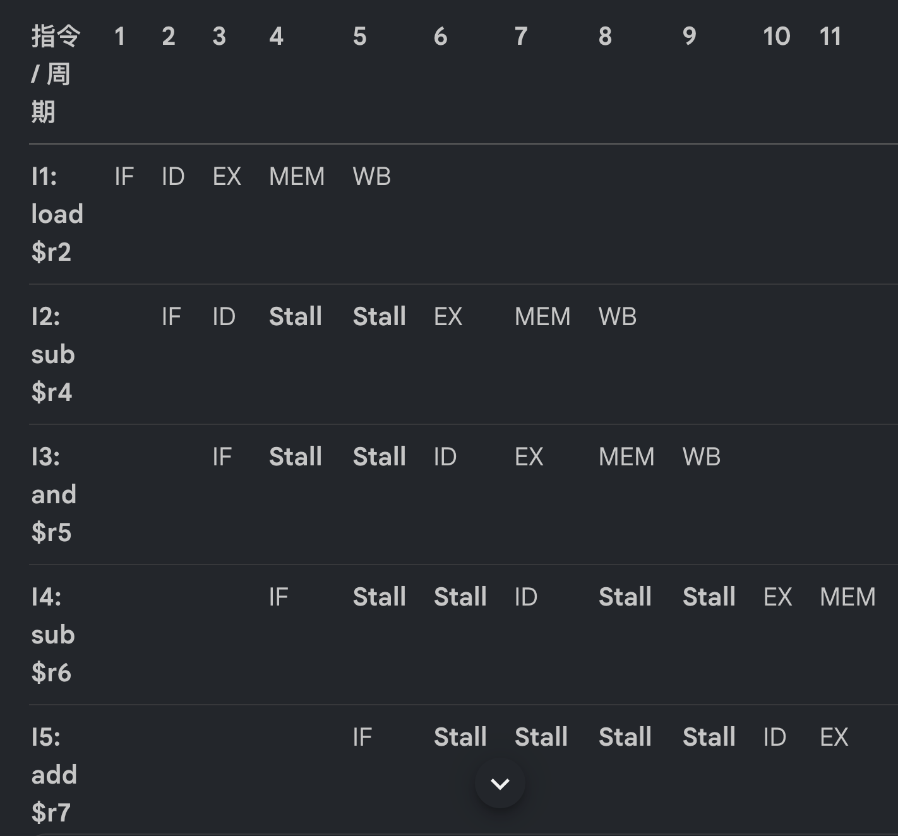
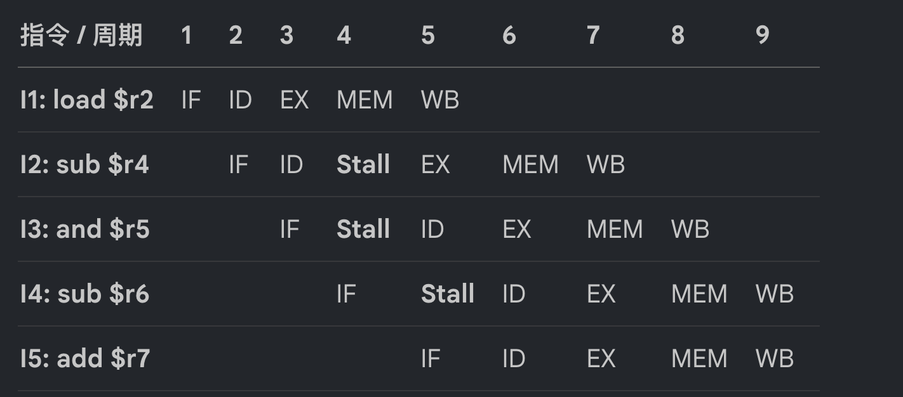

**第三章《基本流水线》**在期末考试中是绝对的核心重灾区，主要以**画图分析题、计算题、简答与辨析题**的形式出现。根据 2025 年春季 A 卷与 2024 年真题回忆，本章的考题主要集中在以下四大类型：

### 1. 数据冒险分析与流水线时空图绘制（压轴大题，10分）

这是第三章分值最高、每年必考的题型，主要考察在经典 RISC 五级流水线中，数据相关如何导致流水线停顿，以及旁路转发（Forwarding）机制的运作细节。

- **真题实例（2025年 A 卷 第 7 题）**：给定一段汇编代码（如 `load $r2, 8($r1)`，`sub $r4, $r2, $r1`，`and $r5, $r1, $r2`，`sub $r6, $r2, $r4`，`add $r7, $r2, $r3`）。
- **考查三连问**：
    1. **找出所有的写后读（RAW）数据冒险**：要求按具体格式写出，例如“I2 指令和 I1 指令在 $r2 上存在 RAW”。
    2. **画出没有转发（No Forwarding）的流水线时空图**：需要展示出后续指令为了等待前面指令在 WB 阶段写回结果，而在 ID 阶段被迫插入多次停顿（Stall/Bubble）的过程。
    3. **画出有转发（Forwarding）的流水线时空图**：需要精准体现出 ALU 到 ALU 的无缝转发，以及**最核心的采分点——Load-Use 冒险**（即 load 后的指令即使有转发，也必须被强制停顿 1 个周期，因为内存数据在 MEM 段末尾才可用）。

### 2. 控制冒险与分支跳转流水线填图题（约 5 分）

主要考察条件跳转（Branch）指令对流水线吞吐率的破坏，以及静态分支预测失败时的惩罚机制。

- **真题实例（2025年 A 卷 第 6 题第 2 小问）**：给出一个包含 `beq` 的 7 条指令序列和一个空的流水线周期表。
- **限定条件与考点**：题目规定“条件跳转指令在 EX 阶段才知道最终目标位置”，且“硬件预测条件跳转不选中（Untaken）”。当实际执行时发现条件成立（即实际发生了跳转），考生需要在表格中准确画出：流水线是如何冲刷（Kill）掉沿着错误路径取入的指令，并在产生 3 个周期的分支延迟（Branch Penalty）后，从正确的目标地址重新取指的。

### 3. 结构冒险对性能影响的计算题（约 5 分）

考察资源冲突带来的额外停顿开销，通常结合 CPU 性能公式进行定量对比。

- **经典考题模型**：对比机器 A（采用双端口存储器/哈佛架构，无结构冒险）与机器 B（采用单端口存储器，访存时存在结构冒险）。题目通常会给出机器 B 为了单端口付出了时钟频率的提升（如频率是 A 的 1.05 倍），且 Load 指令占总指令的 40%。
- **考点**：要求计算并评估，这 1.05 倍的时钟频率提升，能否抵消由于 40% 的 Load 指令引发结构冒险而带来的停顿周期损失。

### 4. 概念辨析与简答题（综合题，每题约 2 分）

主要考察对流水线底层微架构机理的理解。

- **真题判断与解释（2024 年考点）**：“分支预测可以完美解决控制冒险”。**答案是错误的**，分支预测只能降低控制冒险的开销，一旦预测失败，仍然需要付出冲刷流水线状态的巨大停顿代价。
- **实际 CPI 简答**：“为什么经典五段流水线中指令不能在每个周期都被分发（即 CPI > 1）？”核心原因正是结构冒险、数据冒险和控制冒险导致了不可避免的流水线气泡。
- **3.2 节扩展考点（异常与多周期浮点）**：
    - **精确异常（Precise Exception）**：如何处理流水线中并发的异常？答案是在提交阶段（Commit Stage/WB段）才统一响应并处理异常，以保证按指令的逻辑顺序恢复机器状态。
    - **多周期浮点冒险**：引入长延迟的浮点乘除部件后，指令会发生**乱序完成（Out-of-order Completion）**，这不仅会增加同一周期多指令争抢写回端口的新结构冒险，还会引发经典 5 级流水线中不存在的写后写（WAW）冒险。

没问题，我为你将这两份试卷中关于第三章“基本流水线与冒险消减”的考题，严格按照顺序进行极其详实的保姆级解答。

### 📝 第一题：数据冒险分析与流水线时空图（2025年A卷 第7题，10分）

**题目再现**： 给定指令序列： `I1: load $r2, 8($r1)` `I2: sub $r4, $r2, $r1` `I3: and $r5, $r1, $r2` `I4: sub $r6, $r2, $r4` `I5: add $r7, $r2, $r3`

#### 1) 找出代码中所有的数据冒险（RAW）

在经典的 5 级流水线中，真实数据依赖（RAW，写后读）会导致后一条指令必须等待前一条指令写入结果。根据指令中寄存器的读写关系，所有的 RAW 冒险如下：

1. **I2 指令和 I1 指令在 `$r2` 上存在 RAW**（I1 写 `$r2`，I2 读 `$r2`）。
2. **I3 指令和 I1 指令在 `$r2` 上存在 RAW**（I1 写 `$r2`，I3 读 `$r2`）。
3. **I4 指令和 I1 指令在 `$r2` 上存在 RAW**（I1 写 `$r2`，I4 读 `$r2`）。
4. **I4 指令和 I2 指令在 `$r4` 上存在 RAW**（I2 写 `$r4`，I4 读 `$r4`）。
5. **I5 指令和 I1 指令在 `$r2` 上存在 RAW**（I1 写 `$r2`，I5 读 `$r2`）。

#### 2) 画出没有转发（No Forwarding）的流水线时空图

在没有硬件旁路转发的情况下，必须依靠硬件互锁（Interlock）让后续指令在 ID（译码）阶段停顿，**直到前一条指令在 WB 阶段的前半周期将数据写回寄存器，后续指令才能在 ID 阶段的后半周期读出**。

_解析：I2 在周期 3 的 ID 段发现需要 `$r2`，被迫停顿 2 个周期，直到 I1 在周期 5 写回后，I2 才在周期 6 进入 EX 段。同理，I4 需要 I2 产生的 `$r4`，又产生了新的 2 周期停顿。_

#### 3) 画出有转发（Forwarding）的流水线时空图

增加旁路数据通路后，ALU 的结果可以直接短接到下一条指令的输入端。但**当第一条指令是 Load 时，数据必须等到 MEM 段结束才能从内存读出，因此紧接着需要该数据的算术指令必须被强制停顿 1 个周期（Load-Use 冒险）**。

_解析：I2 因为 Load-Use 冒险在周期 4 被强制 Stall；到了周期 5，I1 直接将 MEM 读出的数据旁路给 I2 的 EX 段。随后的 I4 对 I2 的依赖，通过 EX/MEM 段到 EX 段的旁路无缝衔接，消除了所有额外的停顿。_

---

### 📝 第二题：控制冒险与分支预测填图题（2025年A卷 第6题第2小问，5分）

**题目条件分析**： 给定 7 条连续的汇编指令序列，包含条件分支 `beq $1, $2, X`。题目设定了极其关键的三条规则：

1. 条件跳转指令在 **EX 阶段**才知道最终的跳转位置。
2. 硬件分支预测机制**预测跳转不会选中（Untaken）**。
3. 实际执行时，**`$1` 的值不等于 `$2` 的值**。（即条件不成立，实际确实**没有发生跳转**）。

**破题核心**：因为预测是不跳转（Untaken），且实际由于 `$1 != $2` 确实没有跳转，所以**分支预测是完全正确的！流水线不需要发生冲刷（Flush/Kill），程序将完美地顺序执行下去**。我们只需要找出顺序执行路径中的数据冒险即可。

**顺序路径中的数据冒险排查**：

- `lw $10, 0($11)` 与 `sub $14, $10, $10`：存在针对 `$10` 的 **Load-Use 冒险**，必须产生 **1 周期停顿**。
- `X: add $4, $1, $2` 与 `lw $1, 0($4)`：存在针对 `$4` 的 RAW，有旁路转发，**0 停顿**。
- `lw $1, 0($4)` 与 `sub $1, $1, $1`：存在针对 `$1` 的 **Load-Use 冒险**，必须产生 **1 周期停顿**。
- `sub $1, $1, $1` 与 `add $1, $1, $1`：存在针对 `$1` 的 RAW，有旁路转发，**0 停顿**。

**完整流水线时空填图**：

| 指令 / 周期 | 1 | 2 | 3 | 4 | 5 | 6 | 7 | 8 | 9 | 10 | 11 | 12 | 13 | | :--- | :-: | :-: | :-: | :-: | :-: | :-: | :-: | :-: | :-: | :-: | :-: | :-: | :-: | | `beq $1, $2, X` | IF | ID | EX | MEM | WB | | | | | | | | | | `lw $10, 0($11)` | | IF | ID | EX | MEM | WB | | | | | | | | | `sub $14, $10, $10` | | | IF | ID | **Stall** | EX | MEM | WB | | | | | | | `X: add $4, $1, $2` | | | | IF | **Stall** | ID | EX | MEM | WB | | | | | | `lw $1, 0($4)` | | | | | IF | **Stall** | ID | EX | MEM | WB | | | | | `sub $1, $1, $1` | | | | | | IF | **Stall** | ID | **Stall** | EX | MEM | WB | | | `add $1, $1, $1` | | | | | | | IF | **Stall** | **Stall** | ID | EX | MEM | WB |

_(注：由于流水线的严格级联特性，当 `sub $14` 在 ID 阶段因为等待 Load 数据而停顿（Stall）时，其后方的所有指令在相应的取指（IF）或译码阶段也必须同步暂停前进。上表展示了指令因两次 Load-Use 冒险导致整体向后平移的真实执行时序。)_

---

### 📝 第三题：概念辨析与判断题（2024年真题回忆版）

根据 2024 年考试中针对流水线与冒险机制的判断题，这里为你作极其清晰的学术辨析：

**1）“Tomasulo 不需要考虑真数据依赖（RAW）”**

- **判断**：**错误（False）**。
- **解释**：Tomasulo 算法虽然通过强大的**保留站（Reservation Stations）机制进行了寄存器重命名**，从而彻底消除了 WAR（读后写）和 WAW（写后写）这两种假数据依赖（名称依赖）；但对于 **RAW（写后读）这种真实数据依赖**，指令依然无法立刻执行。它们必须在保留站中保持 Busy 状态并持续监听，直到前序指令计算完毕并通过 **CDB（公共数据总线）广播**出结果后，才能获取源操作数并进入执行段（EX）。

**2）“分支预测可以完美解决控制冒险”**

- **判断**：**错误（False）**。
- **解释**：分支预测（如 BHT、BTB 技术）只能通过“提前猜测”来尽量隐藏控制冒险带来的流水线断流。但它绝对不是“完美”的。一旦**预测失败（Misprediction）**，处理器依然必须付出惨痛的代价：清空（Flush）流水线中沿着错误预测路径已经取入的所有指令，并回滚状态从正确的地址重新取指。这种预测失败带来的**分支惩罚（Branch Penalty）**在极深的现代流水线中依然是极其巨大的性能损耗。