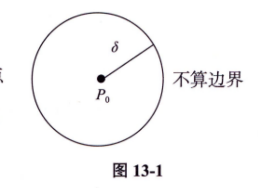
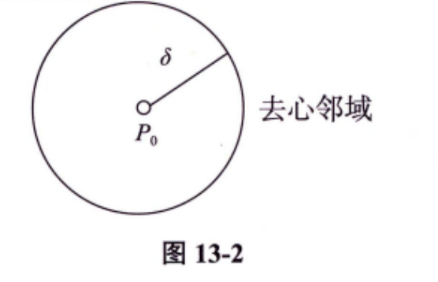
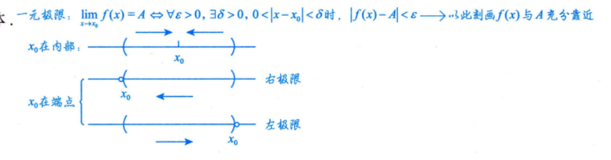
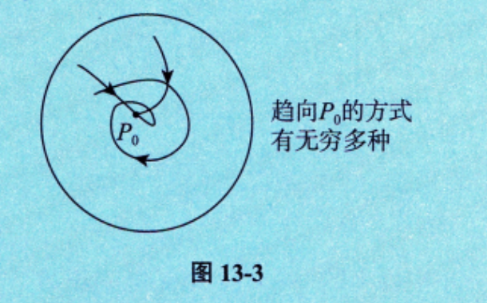
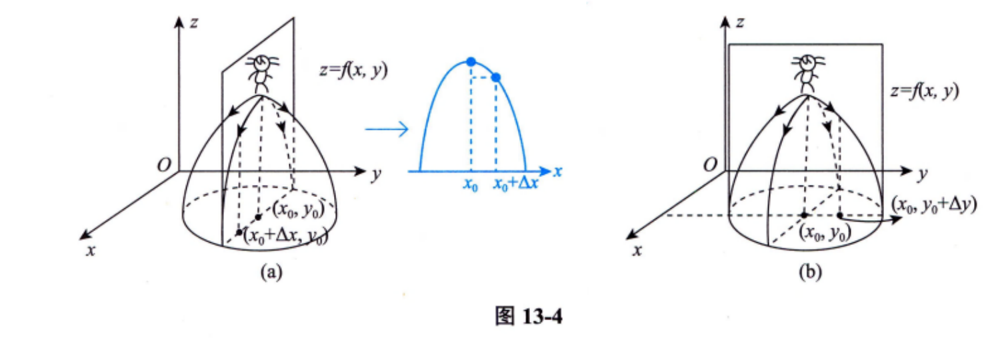

---
## 邻域
### $\delta$ 邻域

设 $P_0(x_0, y_0)$ 是 $xOy$ 平面上的一个点，$\delta$ 是某一正数. 与点 $P_0(x_0, y_0)$ 的距离小于 $\delta$ 的点 $P(x, y)$ 的全体，称为点 $P_0$ 的 $\delta$ 邻域（见图 13-1），记为 $U(P_0, \delta)$，即

$$U(P_0, \delta) = \{P \mid |PP_0| < \delta\} \text{ 或 } U(P_0, \delta) = \left\{ (x, y) \mid \sqrt{(x-x_0)^2 + (y-y_0)^2} < \delta \right\}$$
>这里表示为两点间的距离

### 去心 $\delta$ 邻域

点 $P_0$ 的去心 $\delta$ 邻域（见图 13-2），记作 $\mathring{U}(P_0, \delta)$，即

$$\mathring{U}(P_0, \delta) = \{P \mid 0 < |PP_0| < \delta\}$$

特别指出，如果不需要强调邻域的半径 $\delta$，则用 $U(P_0)$ 表示点 $P_0$ 的某个邻域，点 $P_0$ 的去心邻域记作 $\mathring{U}(P_0)$.

### $\delta$ 邻域的几何意义

$U(P_0, \delta)$ 表示 $xOy$ 平面上以点 $P_0(x_0, y_0)$ 为中心，$\delta > 0$ 为半径的圆内部的点 $P(x, y)$ 的全体.

## 极限

设函数 $f(x, y)$ 在区域 $D$ 上有定义，$P_0(x_0, y_0) \in D$ 或为区域 $D$ 边界上的一点. 如果对于任意给定的 $\varepsilon > 0$，总存在 $\delta > 0$，当点 $P(x, y) \in D$，且满足 $0 < |PP_0| = \sqrt{(x-x_0)^2 + (y-y_0)^2} < \delta$ 时，恒有

$$|f(x, y) - A| < \varepsilon,$$

则称常数 $A$ 为 $(x, y) \to (x_0, y_0)$ 时 $f(x, y)$ 的极限，记作

$$\lim_{(x, y) \to (x_0, y_0)} f(x, y) = A \text{ 或 } \lim_{\substack{x \to x_0 \\ y \to y_0}} f(x, y) = A,$$
>称为二重极限

也常记作

$$\lim_{P \to P_0} f(P) = A.$$
**注**

1. 一元极限中 $x \to x_0$ 有且仅有两种方式（$x \to x_0^-$ 和 $x \to x_0^+$），二元极限中 $(x, y) \to (x_0, y_0)$ 一般有无穷多种方式，如图 13-3 所示.
   
    
2. 若有两条不同路径使极限 $\lim_{(x, y) \to (x_0, y_0)} f(x, y)$ 的值不相等或某一路径使极限 $\lim_{(x, y) \to (x_0, y_0)} f(x, y)$ 的值不存在，则说明 $\lim_{(x, y) \to (x_0, y_0)} f(x, y)$ 不存在.（根据极限若存在，则必具有唯一性这一准则去判断.）
    
3. 除洛必达法则和单调有界准则外，可照搬一元函数求极限的方法来求**二重极限**，二重极限保持了一元极限的各种性质，如唯一性、局部有界性、局部保号性、运算规则及**脱帽法**：
    $$\lim_{(x, y) \to (x_0, y_0)} f(x, y) = A \iff f(x, y) = A + \alpha, \text{ 其中当 } (x, y) \to (x_0, y_0) \text{ 时，} \alpha \text{ 是无穷小量.}$$
    

## 连续

如果 $\lim_{\substack{x \to x_0 \\ y \to y_0}} f(x, y) = f(x_0, y_0)$，则称函数 $f(x, y)$ 在点 $(x_0, y_0)$ 处连续，如果 $f(x, y)$ 在区域 $D$ 上每一点处都连续，则称 $f(x, y)$ 在区域 $D$ 上连续.
>这里不需要强行掌握间断点的概念

## 偏导数

### 定义

设函数 $z = f(x, y)$ 在点 $(x_0, y_0)$ 的某邻域内有定义，如果极限

$$\lim_{\Delta x \to 0} \frac{f(x_0 + \Delta x, y_0) - f(x_0, y_0)}{\Delta x}$$

存在，则称此极限为函数 $z = f(x, y)$ 在点 $(x_0, y_0)$ 处对 $x$ 的偏导数 [见图 13-4(a)]，记作

$$\left. \frac{\partial z}{\partial x} \right|_{\substack{x=x_0 \\ y=y_0}}, \left. \frac{\partial f}{\partial x} \right|_{\substack{x=x_0 \\ y=y_0}}, z'_x \Big|_{\substack{x=x_0 \\ y=y_0}} \text{ 或 } f'_x(x_0, y_0),$$

即

$$f'_x(x_0, y_0) = \lim_{\Delta x \to 0} \frac{f(x_0 + \Delta x, y_0) - f(x_0, y_0)}{\Delta x}.$$

类似地，函数 $z = f(x, y)$ 在点 $(x_0, y_0)$ 处对 $y$ 的偏导数 [见图 13-4(b)] 定义为

$$f'_y(x_0, y_0) = \lim_{\Delta y \to 0} \frac{f(x_0, y_0 + \Delta y) - f(x_0, y_0)}{\Delta y}.$$

### 如果 $z = f(x, y)$ 在区域 $D$ 上的每一点 $(x, y)$ 处都有偏导数，一般来说，它们仍是 $x, y$ 的函数，则称为 $f(x, y)$ 的**偏导函数**，简称**偏导数**，记作

$$\frac{\partial z}{\partial x}, \frac{\partial f}{\partial x}, f'_x(x, y), \frac{\partial z}{\partial y}, \frac{\partial f}{\partial y}, f'_y(x, y).$$

### 几何意义

设有二元函数 $z = f(x, y)$，且 $z_0 = f(x_0, y_0)$，则 $f'_x(x_0, y_0)$ 在几何上表示曲线 $\begin{cases} z = f(x, y), \\ y = y_0 \end{cases}$ 在点 $(x_0, y_0, z_0)$ 处的切线对 $x$ 轴的斜率. 同理，$f'_y(x_0, y_0)$ 在几何上表示曲线 $\begin{cases} z = f(x, y), \\ x = x_0 \end{cases}$ 在点 $(x_0, y_0, z_0)$ 处的切线对 $y$ 轴的斜率.

### 高阶偏导数

如果二元函数 $z = f(x, y)$ 的偏导数 $f'_x(x, y)$ 和 $f'_y(x, y)$ 仍然具有偏导数，则它们的偏导数称为 $z = f(x, y)$ 的二阶偏导数，记作

$$\frac{\partial^2 z}{\partial x^2} = \frac{\partial}{\partial x} \left( \frac{\partial z}{\partial x} \right) = f''_{xx}(x, y) = z''_{xx},$$

$$\frac{\partial^2 z}{\partial x \partial y} = \frac{\partial}{\partial y} \left( \frac{\partial z}{\partial x} \right) = f''_{xy}(x, y) = z''_{xy},$$

$$\frac{\partial^2 z}{\partial y^2} = \frac{\partial}{\partial y} \left( \frac{\partial z}{\partial y} \right) = f''_{yy}(x, y) = z''_{yy},$$

$$\frac{\partial^2 z}{\partial y \partial x} = \frac{\partial}{\partial x} \left( \frac{\partial z}{\partial y} \right) = f''_{yx}(x, y) = z''_{yx},$$

其中，称 $\frac{\partial^2 z}{\partial x \partial y}$ 与 $\frac{\partial^2 z}{\partial y \partial x}$ 为二阶混合偏导数. 类似地，可以定义 $n(n \geq 3)$ 阶偏导数.

### 如果函数 $z = f(x, y)$ 的两个二阶混合偏导数 $\frac{\partial^2 z}{\partial x \partial y}$ 及 $\frac{\partial^2 z}{\partial y \partial x}$ 都在区域 $D$ 内连续，则在区域 $D$ 内

$$\frac{\partial^2 z}{\partial x \partial y} = \frac{\partial^2 z}{\partial y \partial x}, \text{ 即二阶混合偏导数在连续的条件下与求导的次序无关.}$$