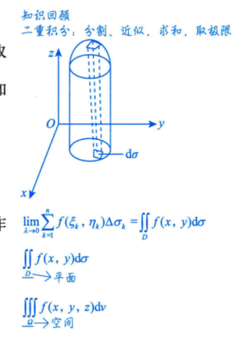
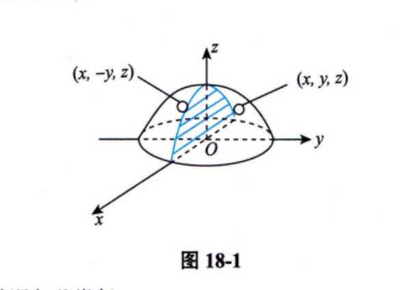
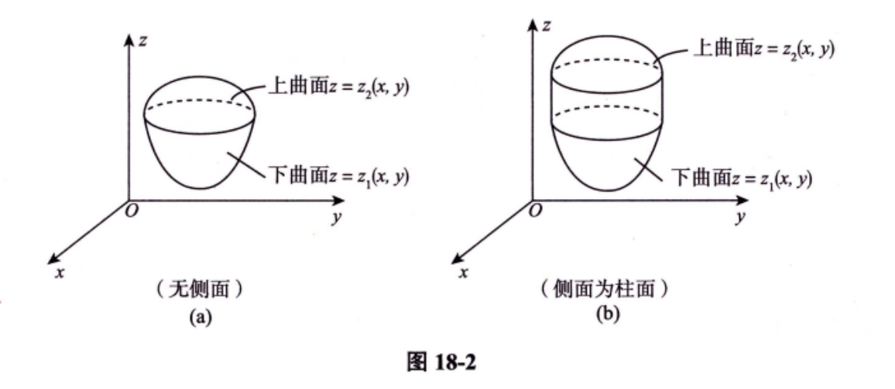
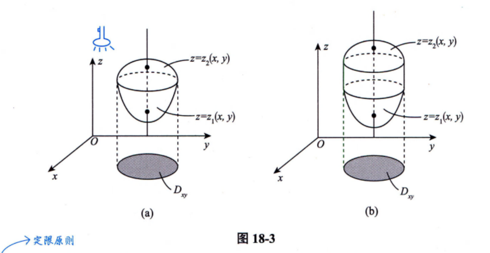
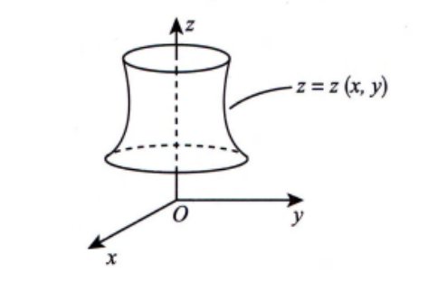
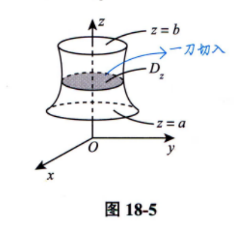
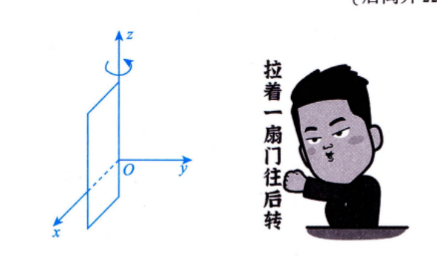
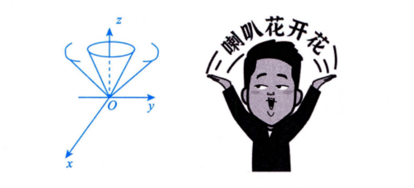
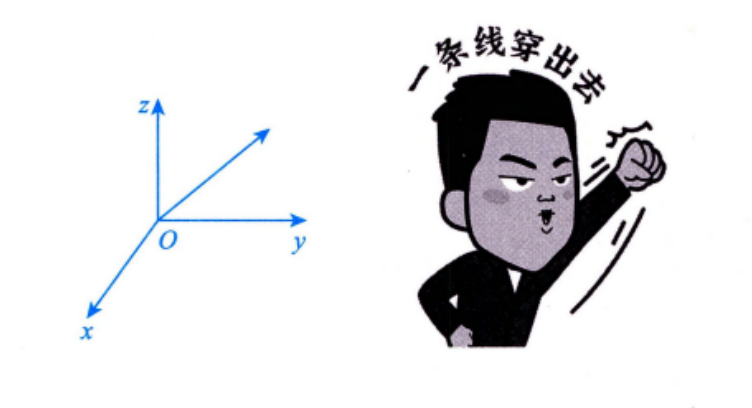

---

## 三重积分

### 概念

设 $f(x, y, z)$ 是空间有界闭区域 $\Omega$ 上的有界函数，将 $\Omega$ 任意分成 $n$ 个小闭区域 $\Delta v_1, \Delta v_2, \cdots, \Delta v_n$，其中 $\Delta v_i$ 表示第 $i$ 个小闭区域，也表示它的体积. 在每个 $\Delta v_i$ 上任取一点 $(\xi_i, \eta_i, \zeta_i)$，作乘积 $f(\xi_i, \eta_i, \zeta_i)\Delta v_i (i=1, 2, \cdots, n)$，并作和 $\sum_{i=1}^n f(\xi_i, \eta_i, \zeta_i) \Delta v_i$. 如果当各小闭区域直径中的最大值 $\lambda$ 趋于零时，这和的极限总存在（与 $\Delta v_i$ 的分法及 $(\xi_i, \eta_i, \zeta_i)$ 的取法均无关），则称此极限值为函数 $f(x, y, z)$ 在闭区域 $\Omega$ 上的三重积分，记作 $\iiint\limits_{\Omega} f(x, y, z) dv$，即

$$\iiint\limits_{\Omega} f(x, y, z) dv = \lim_{\lambda \to 0} \sum_{i=1}^n f(\xi_i, \eta_i, \zeta_i) \Delta v_i$$

其中 $f(x, y, z)$ 称为**被积函数**，$f(x, y, z)dv$ 称为**被积表达式**，$dv$ 称为**体积元素**，$x, y$ 与 $z$ 称为**积分变量**，$\Omega$ 称为**积分区域**，$\sum_{i=1}^n f(\xi_i, \eta_i, \zeta_i) \Delta v_i$ 称为**积分和**.

若 $f(x, y, z)$ 在 $\Omega$ 上连续，则三重积分 $\iiint\limits_{\Omega} f(x, y, z) dv$ 一定存在.

> 注：三重积分的物理意义：设一物体占有 $Oxyz$ 上的闭区域 $\Omega$，在点 $(x, y, z)$ 处的体密度为 $\rho(x, y, z)$，假定 $\rho(x, y, z)$ 在 $\Omega$ 上连续，则物体的质量
> 
> $$M = \iiint\limits_{\Omega} \rho(x, y, z) dv.$$

### 性质

以下总假设 $\Omega$ 为空间有界闭区域.

**性质 1（求空间区域的体积）** $\iiint\limits_{\Omega} 1 dv = \iiint\limits_{\Omega} dv = V$，其中 $V$ 为 $\Omega$ 的体积.

**性质 2（可积函数必有界）** 设 $f(x, y, z)$ 在 $\Omega$ 上可积，则其在 $\Omega$ 上必有界.

**性质 3（积分的线性性质）** 设 $k_1, k_2$ 为常数，则

$$\iiint\limits_{\Omega} [k_1 f(x, y, z) \pm k_2 g(x, y, z)] dv = k_1 \iiint\limits_{\Omega} f(x, y, z) dv \pm k_2 \iiint\limits_{\Omega} g(x, y, z) dv.$$

**性质 4（积分的可加性）** 设 $f(x, y, z)$ 在 $\Omega$ 上可积，且 $\Omega_1 \cup \Omega_2 = \Omega, \Omega_1 \cap \Omega_2 = \varnothing$，则

$$\iiint\limits_{\Omega} f(x, y, z) dv = \iiint\limits_{\Omega_1} f(x, y, z) dv + \iiint\limits_{\Omega_2} f(x, y, z) dv.$$

**性质 5（积分的保号性）** 设 $f(x, y, z), g(x, y, z)$ 在 $\Omega$ 上可积，且在 $\Omega$ 上 $f(x, y, z) \le g(x, y, z)$，则有

$$\iiint\limits_{\Omega} f(x, y, z) dv \le \iiint\limits_{\Omega} g(x, y, z) dv.$$

特殊地，有 $|\iiint\limits_{\Omega} f(x, y, z) dv| \le \iiint\limits_{\Omega} |f(x, y, z)| dv$.

**性质 6（三重积分的估值定理）** 设 $M, m$ 分别是 $f(x, y, z)$ 在 $\Omega$ 上的最大值和最小值，$V$ 为 $\Omega$ 的体积，则有

$$mV \le \iiint\limits_{\Omega} f(x, y, z) dv \le MV.$$

**性质 7（三重积分的中值定理）** 设 $f(x, y, z)$ 在 $\Omega$ 上连续，$V$ 为 $\Omega$ 的体积，则在 $\Omega$ 上至少存在一点 $(\xi, \eta, \zeta)$，使得

$$\iiint\limits_{\Omega} f(x, y, z) dv = f(\xi, \eta, \zeta) V.$$

### 普通对称性与轮换对称性

#### **普通对称性：**

假设 $\Omega$ 关于 $xOz$ 面对称（见图 18-1），则

$$\iiint\limits_{\Omega} f(x, y, z) dv = \begin{cases} 2\iiint\limits_{\Omega_1} f(x, y, z) dv, & f(x, y, z) = f(x, -y, z), \\ 0, & f(x, y, z) = -f(x, -y, z), \end{cases}$$

其中 $\Omega_1$ 是 $\Omega$ 在 $xOz$ 面右边的部分.

#### **轮换对称性：**

在直角坐标系下，若把 $x$ 与 $y$ 对调后，$\Omega$ 不变，则 $\iiint\limits_{\Omega} f(x, y, z) dxdydz = \iiint\limits_{\Omega} f(y, x, z) dxdydz$，这就是**轮换对称性**.

关于其他情况与此类似.

如 $\Omega = \{(x, y, z) \mid x^2 + y^2 + z^2 \le R^2\}$，则 $\iiint\limits_{\Omega} f(x) dxdydz = \iiint\limits_{\Omega} f(y) dxdydz = \iiint\limits_{\Omega} f(z) dxdydz$ 可以化简计算.

### 计算

#### 直角坐标系

##### 先一后二法（先 $z$ 后 $xy$ 法，也叫投影穿线法）.

a. **适用场合**.

$\Omega$ 有下曲面 $z = z_1(x, y)$、上曲面 $z = z_2(x, y)$，无侧面或侧面为柱面，如图 18-2 所示.

b. **计算方法**.

如图 18-3 所示，有 $\iiint\limits_{\Omega} f(x, y, z) dv = \iint\limits_{D_{xy}} d\sigma \int_{z_1(x, y)}^{z_2(x, y)} f(x, y, z) dz$.

##### 先二后一法（先 $xy$ 后 $z$ 法，也叫定限截面法）.

a. **适用场合**.

$\Omega$ 是旋转体，其旋转曲面方程为 $\Sigma: z = z(x, y)$，如图 18-4 所示.

b. **计算方法**.

如图 18-5 所示，有 $\iiint\limits_{\Omega} f(x, y, z) dv = \int_a^b dz \iint\limits_{D_z} f(x, y, z) d\sigma$.

#### 柱面坐标系 = 极坐标系下二重积分与定积分.

在直角坐标系的计算中，如若 $\iint\limits_{D_{xy}} d\sigma$ 适用于极坐标系，则令 $\begin{cases} x = r\cos\theta, \\ y = r\sin\theta, \end{cases}$ 便有

$$\iiint\limits_{\Omega} f(x, y, z) dxdydz = \iiint\limits_{\Omega} f(r\cos\theta, r\sin\theta, z) r dr d\theta dz,$$

此种计算方法称为柱面坐标系下三重积分的计算.

#### 球面坐标系

##### **适用场合**

a. 被积函数中含 $\begin{cases} f(x^2 + y^2 + z^2), \\ f(x^2 + y^2). \end{cases}$

b. 积分区域为 $\begin{cases} 球或球的部分, \\ 锥或锥的部分. \end{cases}$

##### **计算方法**

令 $\begin{cases} x = r\sin\varphi\cos\theta, \\ y = r\sin\varphi\sin\theta, \\ z = r\cos\varphi, \end{cases}$

则 $dv = r^2\sin\varphi drd\varphi d\theta$.

a. 过 $z$ 轴的半平面与 $xOz$ 面正向夹角为 $\theta$（取值范围 $[0, 2\pi]$） $\begin{cases} 先碰到 \Omega, 记 \theta_1, \\ 后离开 \Omega, 记 \theta_2. \end{cases}$

b. 顶点在原点，以 $z$ 轴为中心轴的圆锥面半顶角为 $\varphi$（取值范围 $[0, \pi]$） $\begin{cases} 先碰到 \Omega, 记 \varphi_1(\theta), \\ 后离开 \Omega, 记 \varphi_2(\theta). \end{cases}$

c. 从原点出发画一条长为 $r$ 的线（取值范围 $[0, +\infty)$） $\begin{cases} 先碰到 \Omega, 记 r_1(\varphi, \theta), \\ 后离开 \Omega, 记 r_2(\varphi, \theta). \end{cases}$

于是

$$\begin{aligned} \iiint_{\Omega} f(x, y, z) \mathrm{d}v &= \iiint_{\Omega} f(r \sin \varphi \cos \theta, r \sin \varphi \sin \theta, r \cos \varphi) r^2 \sin \varphi \mathrm{d}r \mathrm{d}\varphi \mathrm{d}\theta \\ &= \int_{\theta_1}^{\theta_2} \mathrm{d}\theta \int_{\varphi_1(\theta)}^{\varphi_2(\theta)} \mathrm{d}\varphi \int_{r_1(\varphi, \theta)}^{r_2(\varphi, \theta)} f(r \sin \varphi \cos \theta, r \sin \varphi \sin \theta, r \cos \varphi) r^2 \sin \varphi \mathrm{d}r . \end{aligned}$$

#### 换元法

$$\iiint_{\Omega_{xyz}} f(x, y, z) \mathrm{d}x\mathrm{d}y\mathrm{d}z$$

$x, y, z$ 换为 $u, v, w$: $\begin{cases} x=x(u, v, w) \\ y=y(u, v, w) \\ z=z(u, v, w) \end{cases}$

$$\iiint_{\Omega_{uvw}} f[x(u, v, w), y(u, v, w), z(u, v, w)] \left| \frac{\partial(x, y, z)}{\partial(u, v, w)} \right| \mathrm{d}u\mathrm{d}v\mathrm{d}w$$

① $f(x, y, z) \to f[x(u, v, w), y(u, v, w), z(u, v, w)]$ .

② $\iiint_{\Omega_{xyz}} \to \iiint_{\Omega_{uvw}}$ .

③ $\mathrm{d}x\mathrm{d}y\mathrm{d}z \to \left| \frac{\partial(x, y, z)}{\partial(u, v, w)} \right| \mathrm{d}u\mathrm{d}v\mathrm{d}w$ .

其中

a. $\begin{cases} x=x(u, v, w), \\ y=y(u, v, w), \\ z=z(u, v, w) \end{cases}$ 是空间 $(x, y, z)$ 到空间 $(u, v, w)$ 的一一映射；

b. $x=x(u, v, w), y=y(u, v, w), z=z(u, v, w)$ 有一阶连续偏导数，且

$$\frac{\partial(x, y, z)}{\partial(u, v, w)} = \begin{vmatrix} \frac{\partial x}{\partial u} & \frac{\partial x}{\partial v} & \frac{\partial x}{\partial w} \\ \frac{\partial y}{\partial u} & \frac{\partial y}{\partial v} & \frac{\partial y}{\partial w} \\ \frac{\partial z}{\partial u} & \frac{\partial z}{\partial v} & \frac{\partial z}{\partial w} \end{vmatrix} \neq 0 .$$

另外，令 $\begin{cases} x=r \cos \theta, \\ y=r \sin \theta, \\ z=z, \end{cases}$ 则

$$\begin{aligned} \iiint_{\Omega_{xyz}} f(x, y, z) \mathrm{d}x\mathrm{d}y\mathrm{d}z &= \iiint_{\Omega_{r\theta z}} f(r \cos \theta, r \sin \theta, z) \left| \frac{\partial(x, y, z)}{\partial(r, \theta, z)} \right| \mathrm{d}r\mathrm{d}\theta\mathrm{d}z \\ &= \iiint_{\Omega_{r\theta z}} f(r \cos \theta, r \sin \theta, z) \begin{vmatrix} \frac{\partial x}{\partial r} & \frac{\partial x}{\partial \theta} & \frac{\partial x}{\partial z} \\ \frac{\partial y}{\partial r} & \frac{\partial y}{\partial \theta} & \frac{\partial y}{\partial z} \\ \frac{\partial z}{\partial r} & \frac{\partial z}{\partial \theta} & \frac{\partial z}{\partial z} \end{vmatrix} \mathrm{d}r\mathrm{d}\theta\mathrm{d}z \\ &= \iiint_{\Omega_{r\theta z}} f(r \cos \theta, r \sin \theta, z) \begin{vmatrix} \cos \theta & -r \sin \theta & 0 \\ \sin \theta & r \cos \theta & 0 \\ 0 & 0 & 1 \end{vmatrix} \mathrm{d}r\mathrm{d}\theta\mathrm{d}z \\ &= \iiint_{\Omega_{r\theta z}} f(r \cos \theta, r \sin \theta, z) r \mathrm{d}r\mathrm{d}\theta\mathrm{d}z . \end{aligned}$$

这就是直角坐标系到柱面坐标系的换元过程.

令 $\begin{cases} x=r \sin \varphi \cos \theta, \\ y=r \sin \varphi \sin \theta, \\ z=r \cos \varphi, \end{cases}$ 则

$$\begin{aligned} \iiint_{\Omega_{xyz}} f(x, y, z) \mathrm{d}x\mathrm{d}y\mathrm{d}z &= \iiint_{\Omega_{r\theta\varphi}} f(r \sin \varphi \cos \theta, r \sin \varphi \sin \theta, r \cos \varphi) \left| \frac{\partial(x, y, z)}{\partial(r, \theta, \varphi)} \right| \mathrm{d}r\mathrm{d}\theta\mathrm{d}\varphi \\ &= \iiint_{\Omega_{r\theta\varphi}} f(r \sin \varphi \cos \theta, r \sin \varphi \sin \theta, r \cos \varphi) \begin{vmatrix} \frac{\partial x}{\partial r} & \frac{\partial x}{\partial \theta} & \frac{\partial x}{\partial \varphi} \\ \frac{\partial y}{\partial r} & \frac{\partial y}{\partial \theta} & \frac{\partial y}{\partial \varphi} \\ \frac{\partial z}{\partial r} & \frac{\partial z}{\partial \theta} & \frac{\partial z}{\partial \varphi} \end{vmatrix} \mathrm{d}r\mathrm{d}\theta\mathrm{d}\varphi \\ &= \iiint_{\Omega_{r\theta\varphi}} f(r \sin \varphi \cos \theta, r \sin \varphi \sin \theta, r \cos \varphi) \cdot \begin{vmatrix} \sin \varphi \cos \theta & -r \sin \varphi \sin \theta & r \cos \varphi \cos \theta \\ \sin \varphi \sin \theta & r \sin \varphi \cos \theta & r \cos \varphi \sin \theta \\ \cos \varphi & 0 & -r \sin \varphi \end{vmatrix} \mathrm{d}r\mathrm{d}\theta\mathrm{d}\varphi \\ &= \iiint_{\Omega_{r\theta\varphi}} f(r \sin \varphi \cos \theta, r \sin \varphi \sin \theta, r \cos \varphi) r^2 \sin \varphi \mathrm{d}r\mathrm{d}\theta\mathrm{d}\varphi . \end{aligned}$$

这就是直角坐标系到球面坐标系的换元过程.

### 应用

1. 若 $\Omega$ 是物体所占的空间区域，则其体积为 $V = \iiint_{\Omega} \mathrm{d}v$ .

2. 对于空间物体，若体密度为 $\rho(x, y, z)$，$\Omega$ 是物体所占的空间区域，则计算重心 $(\bar{x}, \bar{y}, \bar{z})$ 的公式为

	$$\bar{x} = \frac{\iiint_{\Omega} x \rho(x, y, z) \mathrm{d}v}{\iiint_{\Omega} \rho(x, y, z) \mathrm{d}v}, \bar{y} = \frac{\iiint_{\Omega} y \rho(x, y, z) \mathrm{d}v}{\iiint_{\Omega} \rho(x, y, z) \mathrm{d}v}, \bar{z} = \frac{\iiint_{\Omega} z \rho(x, y, z) \mathrm{d}v}{\iiint_{\Omega} \rho(x, y, z) \mathrm{d}v}$$

	由 $\bar{x} = \frac{\iiint_{\Omega} x \mathrm{d}v}{\iiint_{\Omega} \mathrm{d}v}$，得 $\iiint_{\Omega} x \mathrm{d}v = \bar{x} \cdot V$ ，其中 $V$ 为 $\Omega$ 的体积. 若 $\bar{x}$ 与 $V$ 均易于求出，则可快速计算出 $\iiint_{\Omega} x \mathrm{d}v$ ，以下同理.
	
	由 $\bar{y} = \frac{\iiint_{\Omega} y \mathrm{d}v}{\iiint_{\Omega} \mathrm{d}v}$，得 $\iiint_{\Omega} y \mathrm{d}v = \bar{y} \cdot V$ ，其中 $V$ 为 $\Omega$ 的体积.
	
	由 $\bar{z} = \frac{\iiint_{\Omega} z \mathrm{d}v}{\iiint_{\Omega} \mathrm{d}v}$，得 $\iiint_{\Omega} z \mathrm{d}v = \bar{z} \cdot V$ ，其中 $V$ 为 $\Omega$ 的体积.

3. 对于空间物体，若体密度为 $\rho(x, y, z)$，$\Omega$ 是物体所占的空间区域，则计算该物体对 $x$ 轴、$y$ 轴、$z$ 轴和原点 $O$ 的转动惯量 $I_x, I_y, I_z$ 和 $I_O$ 公式分别为

	$$I_x = \iiint_{\Omega} (y^2 + z^2) \rho(x, y, z) \mathrm{d}v, I_y = \iiint_{\Omega} (z^2 + x^2) \rho(x, y, z) \mathrm{d}v,$$
	
	
	$$I_z = \iiint_{\Omega} (x^2 + y^2) \rho(x, y, z) \mathrm{d}v, I_O = \iiint_{\Omega} (x^2 + y^2 + z^2) \rho(x, y, z) \mathrm{d}v .$$

4. 对于空间物体，若体密度为 $\rho(x, y, z)$，$\Omega$ 是物体所占的空间区域，则计算该物体对物体外一点 $M_0(x_0, y_0, z_0)$ 处的质量为 $m$ 的质点的引力 $(F_x, F_y, F_z)$ 公式为

	$$\begin{aligned} F_x &= Gm \iiint_{\Omega} \frac{\rho(x, y, z)(x-x_0)}{[(x-x_0)^2 + (y-y_0)^2 + (z-z_0)^2]^{\frac{3}{2}}} \mathrm{d}v, \\ F_y &= Gm \iiint_{\Omega} \frac{\rho(x, y, z)(y-y_0)}{[(x-x_0)^2 + (y-y_0)^2 + (z-z_0)^2]^{\frac{3}{2}}} \mathrm{d}v, \\ F_z &= Gm \iiint_{\Omega} \frac{\rho(x, y, z)(z-z_0)}{[(x-x_0)^2 + (y-y_0)^2 + (z-z_0)^2]^{\frac{3}{2}}} \mathrm{d}v . \end{aligned}$$