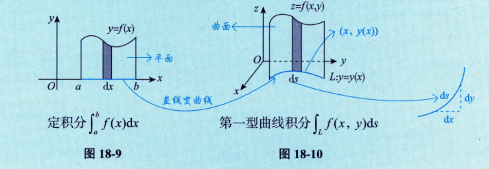

---

## 第一型曲线积分 

### 概念

设 $L$ 为 $xOy$ 面内的一条光滑曲线弧，函数 $f(x, y)$ 在 $L$ 上有界，在 $L$ 上任意插入一系列点 $M_1, M_2, \cdots, M_{n-1}$ 把 $L$ 分成 $n$ 个小段. 设第 $i$ 个小弧段的长度为 $\Delta s_i$，又 $(\xi_i, \eta_i)$ 为第 $i$ 个小弧段上任意取定的一点，作乘积 $f(\xi_i, \eta_i) \Delta s_i (i=1, 2, \cdots, n)$，并作和 $\sum_{i=1}^{n} f(\xi_i, \eta_i) \Delta s_i$，如果当各小弧段长度的最大值 $\lambda$ 趋于零时，这和的极限总存在（与 $\Delta s_i$ 的分法及 $(\xi_i, \eta_i)$ 的取法均无关），则称此极限为函数 $f(x, y)$ 在曲线弧 $L$ 上对弧长的曲线积分或第一型曲线积分，记作 $\int_L f(x, y) \mathrm{d}s$，即

$$\int_L f(x, y) \mathrm{d}s = \lim_{\lambda \to 0} \sum_{i=1}^n f(\xi_i, \eta_i) \Delta s_i$$

其中 $f(x, y)$ 称为被积函数，$f(x, y) \mathrm{d}s$ 称为被积表达式，$x$ 与 $y$ 称为积分变量，$L$ 称为积分弧段.

此定义可以类似地推广到积分弧段为空间曲线弧 $\Gamma$ 的情形，即函数 $f(x, y, z)$ 在曲线弧 $\Gamma$ 上对弧长的曲线积分

$$\int_{\Gamma} f(x, y, z) \mathrm{d}s = \lim_{\lambda \to 0} \sum_{i=1}^n f(\xi_i, \eta_i, \zeta_i) \Delta s_i$$

但事实上，如果仅理解到此，还是不够的. 不妨把定积分和第一型曲线积分放在一起作个对比，加深我们对概念的理解. 定积分定义在“直线段”上，而第一型曲线积分定义在“曲线段”上，如图 18-9、图 18-10 所示，由于 $f(x, y)$ 定义在 $L: y=y(x)$ 上，故曲线方程 $L$ 可代入被积函数，从而化简计算.

### 性质

以下总假设 $\Gamma$ 为空间有限长分段光滑曲线.

- **性质 1（求空间曲线的长度（弧长））** $\int_{\Gamma} 1 \mathrm{d}s = l_{\Gamma}$，其中 $l_{\Gamma}$ 为 $\Gamma$ 的长度.
    
- **性质 2（可积函数必有界）** 设 $f(x, y, z)$ 在 $\Gamma$ 上可积，则其在 $\Gamma$ 上必有界.
    
- **性质 3（积分的线性性质）** 设 $k_1, k_2$ 为常数，则
    
    $$\int_{\Gamma} [k_1 f(x, y, z) \pm k_2 g(x, y, z)] \mathrm{d}s = k_1 \int_{\Gamma} f(x, y, z) \mathrm{d}s \pm k_2 \int_{\Gamma} g(x, y, z) \mathrm{d}s$$
    
- **性质 4（积分的可加性）** 设 $f(x, y, z)$ 在 $\Gamma$ 上可积，且 $\Gamma_1 \cup \Gamma_2 = \Gamma, \Gamma_1 \cap \Gamma_2 = \varnothing$，则
    
    $$\int_{\Gamma} f(x, y, z) \mathrm{d}s = \int_{\Gamma_1} f(x, y, z) \mathrm{d}s + \int_{\Gamma_2} f(x, y, z) \mathrm{d}s$$

- **性质 5（积分的保号性）** 设 $f(x, y, z), g(x, y, z)$ 在 $\Gamma$ 上可积，且在 $\Gamma$ 上 $f(x, y, z) \leqslant g(x, y, z)$，则有
    
    $$\int_{\Gamma} f(x, y, z) \mathrm{d}s \leqslant \int_{\Gamma} g(x, y, z) \mathrm{d}s$$
    
    特殊地，有
    
    $$\left| \int_{\Gamma} f(x, y, z) \mathrm{d}s \right| \leqslant \int_{\Gamma} |f(x, y, z)| \mathrm{d}s$$
    
- **性质 6（第一型曲线积分的估值定理）** 设 $M, m$ 分别是 $f(x, y, z)$ 在 $\Gamma$ 上的最大值和最小值，$l_{\Gamma}$ 为 $\Gamma$ 的长度，则有
    
    $$m l_{\Gamma} \leqslant \int_{\Gamma} f(x, y, z) \mathrm{d}s \leqslant M l_{\Gamma}$$
    
- **性质 7（第一型曲线积分的中值定理）** 设 $f(x, y, z)$ 在 $\Gamma$ 上连续，$l_{\Gamma}$ 为 $\Gamma$ 的长度，则在 $\Gamma$ 上至少存在一点 $(\xi, \eta, \zeta)$，使得
    
    $$\int_{\Gamma} f(x, y, z) \mathrm{d}s = f(\xi, \eta, \zeta) l_{\Gamma}$$
    

### 普通对称性与轮换对称性

#### 普通对称性

假设 $\Gamma$ 关于 $xOz$ 面对称，则

$$\int_{\Gamma} f(x, y, z) \mathrm{d}s = \begin{cases} 2 \int_{\Gamma_1} f(x, y, z) \mathrm{d}s, & f(x, y, z) = f(x, -y, z), \\ 0, & f(x, y, z) = -f(x, -y, z), \end{cases}$$

其中 $\Gamma_1$ 是 $\Gamma$ 在 $xOz$ 面右边的部分.

关于其他坐标面对称的情况以此类推.

#### 轮换对称性

若把 $x$ 与 $y$ 对调后，$\Gamma$ 不变，则 $\int_{\Gamma} f(x, y, z) \mathrm{d}s = \int_{\Gamma} f(y, x, z) \mathrm{d}s$，这就是轮换对称性.

关于其他情况以此类推.

### 计算

由于第一型曲线积分就是由定积分推广而来的，因此计算第一型曲线积分的基本方法就是将其化为定积分. 口诀为“**一投二代三计算”.**

#### 平面情形

① 若平面曲线 $L$ 由 $y = y(x) (a \leqslant x \leqslant b)$ 给出，则 $\mathrm{d}s = \sqrt{1 + [y'(x)]^2} \mathrm{d}x$，且

$$\int_L f(x, y) \mathrm{d}s = \int_a^b f[x, y(x)] \sqrt{1 + [y'(x)]^2} \mathrm{d}x$$

② 若平面曲线 $L$ 由参数式 $\begin{cases} x = x(t), \\ y = y(t) \end{cases} (\alpha \leqslant t \leqslant \beta)$ 给出，则 $\mathrm{d}s = \sqrt{[x'(t)]^2 + [y'(t)]^2} \mathrm{d}t$，且

$$\int_L f(x, y) \mathrm{d}s = \int_{\alpha}^{\beta} f[x(t), y(t)] \sqrt{[x'(t)]^2 + [y'(t)]^2} \mathrm{d}t$$

③ 若平面曲线 $L$ 由极坐标形式 $r = r(\theta) (\alpha \leqslant \theta \leqslant \beta)$ 给出，则 $\mathrm{d}s = \sqrt{[r(\theta)]^2 + [r'(\theta)]^2} \mathrm{d}\theta$，且

$$\int_L f(x, y) \mathrm{d}s = \int_{\alpha}^{\beta} f[r(\theta)\cos\theta, r(\theta)\sin\theta] \sqrt{[r(\theta)]^2 + [r'(\theta)]^2} \mathrm{d}\theta$$

#### 空间情形

若空间曲线 $\Gamma$ 由参数式 $\begin{cases} x = x(t), \\ y = y(t), \\ z = z(t) \end{cases} (\alpha \leqslant t \leqslant \beta)$ 给出，则

$$\mathrm{d}s = \sqrt{[x'(t)]^2 + [y'(t)]^2 + [z'(t)]^2} \mathrm{d}t$$

且

$$\int_{\Gamma} f(x, y, z) \mathrm{d}s = \int_{\alpha}^{\beta} f[x(t), y(t), z(t)] \sqrt{[x'(t)]^2 + [y'(t)]^2 + [z'(t)]^2} \mathrm{d}t$$

### 应用

1. 对于空间光滑曲线 $\Gamma$，若其由参数式 $\begin{cases} x = x(t) \\ y = y(t) \\ z = z(t) \end{cases} (\alpha \leqslant t \leqslant \beta)$ 给出，则计算空间曲线的长度（弧长）的公式为

	$$l = \int_{\alpha}^{\beta} \sqrt{[x'(t)]^2 + [y'(t)]^2 + [z'(t)]^2} \mathrm{d}t$$

2. 对于空间光滑曲线 $L$，若线密度为 $\rho(x, y, z)$，则计算重心 $(\bar{x}, \bar{y}, \bar{z})$ 的公式为

	$$\bar{x} = \frac{\int_L x \rho(x, y, z) \mathrm{d}s}{\int_L \rho(x, y, z) \mathrm{d}s}, \bar{y} = \frac{\int_L y \rho(x, y, z) \mathrm{d}s}{\int_L \rho(x, y, z) \mathrm{d}s}, \bar{z} = \frac{\int_L z \rho(x, y, z) \mathrm{d}s}{\int_L \rho(x, y, z) \mathrm{d}s}$$

> 
> (1) 在考研的范畴内，重心就是质心.
> 
> (2) 当密度 $\rho(x, y)$ 或者 $\rho(x, y, z)$ 为常数时，重心就成了形心.
> 
> (3) 形心公式的逆用：
> 
> 由 $\bar{x} = \frac{\int_L x \mathrm{d}s}{\int_L \mathrm{d}s}$ 得 $\int_L x \mathrm{d}s = \bar{x} \cdot l$，其中 $l = \int_L 1 \mathrm{d}s$ 为曲线 $L$ 的长度；
> 
> 由 $\bar{y} = \frac{\int_L y \mathrm{d}s}{\int_L \mathrm{d}s}$ 得 $\int_L y \mathrm{d}s = \bar{y} \cdot l$，其中 $l = \int_L 1 \mathrm{d}s$ 为曲线 $L$ 的长度；
> 
> 由 $\bar{z} = \frac{\int_L z \mathrm{d}s}{\int_L \mathrm{d}s}$ 得 $\int_L z \mathrm{d}s = \bar{z} \cdot l$，其中 $l = \int_L 1 \mathrm{d}s$ 为曲线 $L$ 的长度.

3. 对于光滑曲线 $L$，线密度为 $\rho(x, y, z)$，则计算该曲线对 $x$ 轴、$y$ 轴、$z$ 轴和原点 $O$ 的转动惯量 $I_x, I_y, I_z$ 和 $I_O$ 公式分别为