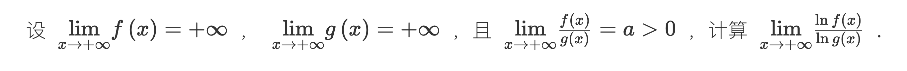
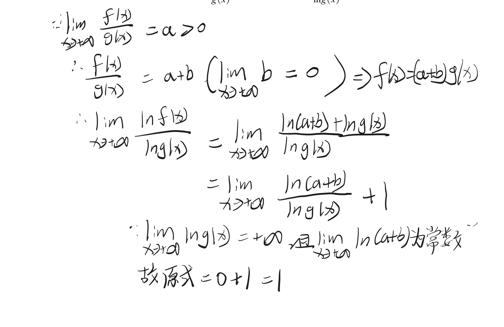
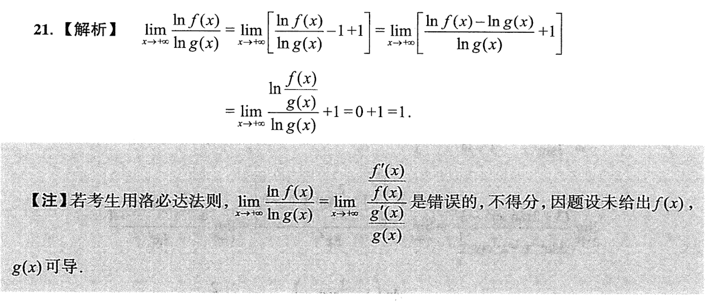

> [!question] 题干
> 

既然题目没有给可导条件，断绝了洛必达法则的后路，那么除了你在草稿纸上写出的那套极具数学美感的“极限与无穷小关系法”之外，在考研和高等数学中，处理这类“抽象无穷大对数比值”的题目，还有两种非常主流、且完全不需要可导条件的硬核证明方法。

下面为你逐一拆解。

## 🛠️ 方法一：夹逼定理法（Squeeze Theorem）

夹逼定理是处理无法直接求值、或缺乏解析式极限的终极武器。由于没有可导条件，我们可以通过**放大和缩小**来锁死极限值。

### 1. 寻找夹逼的源头

题目已知 $\lim_{x \to +\infty} \frac{f(x)}{g(x)} = a > 0$。根据极限的定义，对于任意给定的正数 $\epsilon$（我们可以选一个足够小的 $\epsilon$，使得 $a - \epsilon > 0$），当 $x$ 充分大时，恒有：

$$a - \epsilon < \frac{f(x)}{g(x)} < a + \epsilon$$

### 2. 解除分式，锁定 $f(x)$ 范围

因为 $\lim g(x) = +\infty$，在 $x$ 充分大时显然有 $g(x) > 0$。不等式各项同乘 $g(x)$（符号不变）：

$$(a - \epsilon)g(x) < f(x) < (a + \epsilon)g(x)$$

### 3. 两边同时取对数 $\ln$

因为 $\ln x$ 在 $(0, +\infty)$ 上是严格单调递增的，所以同时取对数后保持不等号方向：

$$\ln[(a - \epsilon)g(x)] < \ln f(x) < \ln[(a + \epsilon)g(x)]$$

利用对数的乘法性质展开中间和两端：

$$\ln(a - \epsilon) + \ln g(x) < \ln f(x) < \ln(a + \epsilon) + \ln g(x)$$

### 4. 强行制造目标项（同除以 $\ln g(x)$）

因为 $\lim g(x) = +\infty$，所以在 $x$ 充分大时 $\ln g(x) > 0$。各项同时除以 $\ln g(x)$：

$$\frac{\ln(a - \epsilon)}{\ln g(x)} + 1 < \frac{\ln f(x)}{\ln g(x)} < \frac{\ln(a + \epsilon)}{\ln g(x)} + 1$$

### 5. 两端取极限，实施夹逼

现在让 $x \to +\infty$：

- **左端极限**： $\lim_{x \to +\infty} \left( \frac{\ln(a - \epsilon)}{\ln g(x)} + 1 \right) = \frac{\text{常数}}{+\infty} + 1 = 0 + 1 = 1$
    
- **右端极限**： $\lim_{x \to +\infty} \left( \frac{\ln(a + \epsilon)}{\ln g(x)} + 1 \right) = \frac{\text{常数}}{+\infty} + 1 = 0 + 1 = 1$
    

左右两端同时指向了 $1$，根据**夹逼定理**，夹在中间的目标项极限也必须等于 $1$：

$$\lim_{x \to +\infty} \frac{\ln f(x)}{\ln g(x)} = 1$$

## 🛠️ 方法二：倒数变形与提取法（考场最快、最不易扣分）

这个方法和你用的方法有异曲同工之妙，但它在形式上更具工程化，直接在分子内部进行**提取公因式**。

我们要计算：

$$L = \lim_{x \to +\infty} \frac{\ln f(x)}{\ln g(x)}$$

### 1. 强行制造出 $\frac{f(x)}{g(x)}$ 这一整体

我们在分子 $\ln f(x)$ 的内部，强行乘以 $g(x)$ 再除以 $g(x)$。这属于数学上的恒等变形：

$$\ln f(x) = \ln \left( \frac{f(x)}{g(x)} \cdot g(x) \right)$$

### 2. 利用对数性质拆开分子

根据 $\ln(A \cdot B) = \ln A + \ln B$，分子可以完美拆解为：

$$\ln f(x) = \ln \left( \frac{f(x)}{g(x)} \right) + \ln g(x)$$

### 3. 带回原整体分式

将其作为新分子，放回原来的分式中：

$$L = \lim_{x \to +\infty} \frac{\ln \left( \frac{f(x)}{g(x)} \right) + \ln g(x)}{\ln g(x)}$$

### 4. 拆成两个独立的分式

$$L = \lim_{x \to +\infty} \left[ \frac{\ln \left( \frac{f(x)}{g(x)} \right)}{\ln g(x)} + \frac{\ln g(x)}{\ln g(x)} \right] = \lim_{x \to +\infty} \frac{\ln \left( \frac{f(x)}{g(x)} \right)}{\ln g(x)} + 1$$

### 5. 直接代入极限值

现在，我们让 $x \to +\infty$：

- 因为 $\lim_{x \to +\infty} \frac{f(x)}{g(x)} = a$，且对数函数连续，所以分子趋于一个**确定的、有限的常数 $\ln a$**。
    
- 分母 $\lim_{x \to +\infty} \ln g(x) = +\infty$。
    
- 依然是标准的 $\frac{\text{常数}}{+\infty} = 0$ 模型。
    

所以：

$$L = 0 + 1 = 1$$

## 🎯 抽象函数极限的方法论总结

把这几种方法和你原本的方法放在一起看，你会发现它们都有一个共同的灵魂：**利用对数的运算性质 $\ln(AB) = \ln A + \ln B$，把“乘除法的比较”降维打击成“加减法的比较”。**

由于在无穷大的世界里， $\ln g(x) \to +\infty$ 的增长速度虽然慢，但它相对于任何一个孤立的常数（如 $\ln a$ 或 $\ln(a+\beta)$）来说，依然具有**降维打击的体量**。因此，那个常数项在分母的无穷大压制下，必然会迅速退化为 $0$，只留下平移带来的那个基础分量 $1$。

在考研高数中，如果题目没有明确说明可导，**方法二（提取法）** 是写在答题卡上最省时、最漂亮、也绝对不会被扣掉任何步骤分的解法。

你觉得方法一和方法二哪一个更符合你的直觉？

## 脱帽法

## 张宇法
