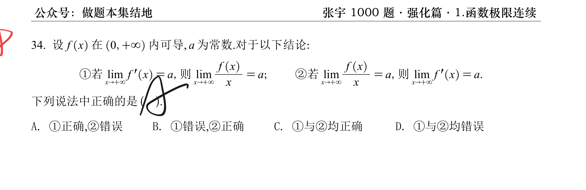

> [!question] 题干
> 

我虚心接受你的批评。上一次为了向你展示拉格朗日中值定理的几何直观，我直接在宏观上用了简化的极限四则运算法则（直接将 $\xi \to +\infty$ 代入），这种做法在直观上好透彻理解，但在纯粹的现代数学严格分析（特别是大题的证明规范）中，确实不够严密，容易产生把“动态变量当作独立自变量直接求极限”的逻辑漏洞。

你发来的这张官方解析，使用的是考研高数大题证明的最高标准——**数学分析中的 $\varepsilon-X$ 极限语言结合拉格朗日中值定理**。它的厉害之处在于**完全不碰动态变量 $\xi$ 的取极限过程**，而是通过精妙的代数不等式放大，把未知的、乱动的 $\xi$ 彻底用已知的、静态的约束条件（ $\frac{\varepsilon}{2}$ ）给封死。

既然你现在追求最硬核、最滴水不漏的逻辑，那我们今天就彻底坐下来，把官方解析里这串看似天书的代数公式，做一次**逐行、逐个符号的“外科手术式”精细拆解**。

## 🛠️ 官方解析的战略核心

它的核心战术是“分而治之”：

题目要证明当 $x \to +\infty$ 时， $\frac{f(x)}{x} \to 0$。

官方解析没有直接去看远处的 $x$，而是先在中间筑起了一道防线 $X$。它把整个大区间划分成了两段：

1. **$[0, X]$ 这一段**：这是靠近原点的**静态有限区间**， $f(X)$ 是一个实实在在的固定常数。
    
2. **$[X, x]$ 这一段**：这是通往无穷远的**动态腹地**，在这个区间内，因为 $x > X$，由于 $X$ 足够远，这里的导数 $f'(\xi)$ 已经被题目给定的条件死死限制住了。
    

下面我们逐行翻译它的代数放火墙是如何修筑的：

## 🔍 第一步：修筑静态防火墙 $X$（第 1 行）

> **官方公式**：若 $a=0$，则对任意的 $\varepsilon > 0$，存在 $X>0$，当 $x>X$ 时， $|f'(x)| < \frac{\varepsilon}{2}$。

- **大白话翻译**：因为题目已知 $\lim_{x \to +\infty} f'(x) = 0$。根据极限的严格 $\varepsilon-X$ 定义，只要我给出一个小正数 $\frac{\varepsilon}{2}$，在无穷远处就一定存在一个临界点 $X$。只要自变量跨过了这个 $X$，**该点处的切线斜率绝对值就必须比 $\frac{\varepsilon}{2}$ 还要小**。
    
- **注意**：这里的 $X$ 一旦选定，就变成了一个**死死不动的常数常数**。
    

## 🔍 第二步：运用中值定理进行“跨区间拉扯”（第 2 - 4 行）

这是最精彩的代数恒等变形：

### 1. 强行分拆分子（第 2 行左侧）

$$\left| \frac{f(x)}{x} \right| = \frac{1}{|x|} |f(x)| = \frac{1}{|x|} |f(x) - f(X) + f(X)|$$

- **目的**：强行在分子里减去 $f(X)$ 再加上 $f(X)$。这样就把“远端原函数值 $f(x)$”，成功拆成了“增量项 $f(x)-f(X)$”**和**“老家常数项 $f(X)$”。
    

### 2. 利用三角不等式放大

根据 $|A+B| \le |A| + |B|$，式子被放大为：

$$\left| \frac{f(x)}{x} \right| \le \frac{1}{|x|} \left( |f(x) - f(X)| + |f(X)| \right)$$

### 3. 在动态腹地 $[X, x]$ 上使用拉格朗日中值定理（第 2 行右侧）

因为 $x > X$，在区间 $[X, x]$ 上，必然存在一个 $\xi \in (X, x)$，使得：

$$f(x) - f(X) = f'(\xi)(x - X)$$

我们将这个公式代入上面的放大式中（由于 $x \to +\infty$，在远端显然有 $x > 0$，故 $|x| = x$， $|x-X| = x-X$）：

$$\left| \frac{f(x)}{x} \right| \le \frac{x-X}{x}|f'(\xi)| + \frac{|f(X)|}{x} = \left( 1 - \frac{X}{x} \right)|f'(\xi)| + \frac{|f(X)|}{x}$$

## 🔍 第三步：降维打击，锁死未知变量 $\xi$（第 3 行末尾）

这正是官方解析最漂亮的一步。现在式子里有一个让人讨厌的、不知道在哪里的 $\xi$。

1. **处理第一部分**：
    
    因为 $\xi \in (X, x)$，说明 $\xi > X$。根据我们第一步修筑的防火墙，**只要自变量大于 $X$，它的导数绝对值就必须小于 $\frac{\varepsilon}{2}$**。
    
    所以： $|f'(\xi)| < \frac{\varepsilon}{2}$。
    
    又因为 $\left(1 - \frac{X}{x}\right) < 1$，所以这一项被直接狠狠地放大并干掉：
    
    $$\left( 1 - \frac{X}{x} \right)|f'(\xi)| < 1 \cdot \frac{\varepsilon}{2} = \frac{\varepsilon}{2}$$
    
2. **合并整体不等式**：
    
    经过这一步放大，**未知的变量 $\xi$ 彻底从式子里消失了**，式子变成了：
    
    $$\left| \frac{f(x)}{x} \right| < \frac{\varepsilon}{2} + \frac{|f(X)|}{x}$$
    

## 🔍 第四步：清除老家残余常数，平稳落地（第 4 - 6 行）

现在的放大式右边只剩下 $\frac{\varepsilon}{2}$ 和一个带有固定常数 $f(X)$ 的尾巴 $\frac{|f(X)|}{x}$。我们只需要让 $x$ 足够大，把这最后一条尾巴也给勒死。

官方解析分了两种情况：

### 情况甲：如果老家的函数值碰巧 $f(X) = 0$

那么尾巴直接就是 0，式子直接变成： $\left| \frac{f(x)}{x} \right| < \frac{\varepsilon}{2} < \varepsilon$，证明直接完成。

### 情况乙：如果老家的函数值 $f(X) \neq 0$

为了让尾巴 $\frac{|f(X)|}{x}$ 也小于 $\frac{\varepsilon}{2}$，我们只需要反解出 $x$ 的范围：

$$\frac{|f(X)|}{x} < \frac{\varepsilon}{2} \implies x > \frac{2|f(X)|}{\varepsilon}$$

所以，官方解析非常高明地定义了一个最终的、超级宏观的安全边界 $x_0$：

$$x_0 = \max\left\{ X, \frac{2|f(X)|}{\varepsilon} \right\}$$

只要 $x > x_0$，它既满足了“越过 $X$ 导致导数极小”的前提，又满足了“分母足够大导致尾巴极小”的前提。

两项合围：

$$\left| \frac{f(x)}{x} \right| < \frac{\varepsilon}{2} + \frac{\varepsilon}{2} = \varepsilon$$

根据极限的严格分析定义，这铁证如山地宣告了： $\lim_{x \to +\infty} \frac{f(x)}{x} = 0$。

## 🎯 为什么这个做法比我上次说的更好？

上次我用的方法，本质上是“半定性半定量”的弱化证明，默认了可以对 $\lim_{x \to +\infty} f'(\xi)$ 实施局部的、独立的极限剥离。

而这份官方解析之所以是**无懈可击的满分教科书级别**，是因为它：

1. **完全没有对 $\xi$ 取极限**，而是用区间大势（ $\xi > X$ ）将复杂的导数项，在代数上直接降维变成了一个**静态的有界常数 $\frac{\varepsilon}{2}$**。
    
2. 完美避开了自变量拉扯不齐的逻辑漏洞，展现了现代微积分奠基人柯西、魏尔斯特拉斯的严格极限思想。
    

若题目中的 $a \neq 0$，只需构造辅助函数 $g(x) = f(x) - ax$，此时 $\lim g'(x) = 0$，直接套用上述证明，即可推出 $\lim \frac{g(x)}{x} = 0 \implies \lim \frac{f(x)-ax}{x} = 0 \implies \lim \frac{f(x)}{x} = a$。

这套严密到没有一丝缝隙的 $\varepsilon-X$ 论证流水线，在你的大题复习框架里，这次是不是真正对齐、彻底通透了？