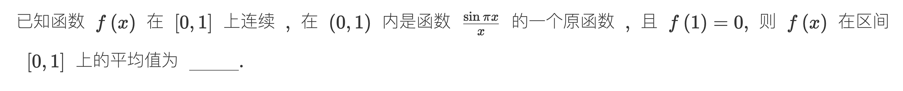

> [!question] 题干
> 

绝了！这份官方解析展现了另一个层次的至高神技——**将求平均值问题降维重构为“二重积分的交换积分次序（化为累次积分）”**。

这两种方法在数学上是完美的殊途同归：

- 我们上一次用的**分部积分法**，本质上是解法上的“外科手术”，通过代数公式完成跨维对消。
    
- 而官方解析用的**二重积分交换次序法**，则是建立在“几何直观与空间重组”上的绝对降维打击。它绕过了求 $f(x)$ 表达式的步骤，直接把问题变成了一个经典的“积分区域切片转换”。
    

既然你发来了官方的微观几何图景，我们就对这份解析里最核心、也最容易让同学卡壳的**三大逻辑断层**做一次彻底的外科手术式精细拆解。

## 🔍 断层一：官方是如何无中生有构造出 $f(x) = \int_1^x \frac{\sin \pi t}{t} \text{d}t$ 的？

题目只说“ $f(x)$ 在 $(0,1)$ 内是 $\frac{\sin \pi x}{x}$ 的一个原函数”。

官方解析第一步直接写出了：

$$f(x) = \int_a^x \frac{\sin \pi t}{t} \text{d}t$$

### 1. 为什么要设下限为 $a$？

因为根据微积分基本定理，变上限积分 $\int_a^x g(t)\text{d}t$ 的导数永远等于 $g(x)$。所以用变上限积分来表达“某一个原函数”是最规范的代数骨架。

### 2. 为什么常数 $a$ 被死死锁死等于 1？

题目给了一个极其关键的条件： **$f(1) = 0$**。

我们在上一步构造的式子里把 $x=1$ 代进去：

$$f(1) = \int_a^1 \frac{\sin \pi t}{t} \text{d}t = 0$$

现在注意看被积函数：当 $t \in (0, 1)$ 时， $\sin \pi t > 0$，分母 $t > 0$。也就是说，被积函数在这段区间内是**严格大于 0、永远不会踩到零点**的。

一个恒正的函数，想要让它的定积分等于 0，**唯一的可能性就是积分区间的长度为 0**（也就是上限必须等于下限）。

由此，下限被硬生生逼成了 **$a = 1$**。

所以： $f(x) = \int_1^x \frac{\sin \pi t}{t} \text{d}t$。这一步逻辑非常丝滑。

## 🚀 断层二：最精彩的一跃——二重积分的代数合体

现在我们要算平均值： $\int_0^1 f(x) \text{d}x$。

官方把刚刚构造出来的 $f(x)$ 整个大洋葱直接塞进了积分号里面：

$$\int_0^1 f(x) \text{d}x = \int_0^1 \left[ \int_1^x \frac{\sin \pi t}{t} \text{d}t \right] \text{d}x$$

这在形式上直接变成了一个**标准的累次积分**（先对 $t$ 积，再对 $x$ 积）。

为了和右边的几何图形无缝对齐，官方做了一个微调：把内层积分的上下限颠倒（ $1 \to x$ 变成 $x \to 1$ ），前面吐出一个负号：

$$= - \int_0^1 \text{d}x \int_x^1 \frac{\sin \pi t}{t} \text{d}t$$

## 🎨 断层三：画图破局——交换积分次序的微观世界

现在我们来看右边那张让很多同学抓狂的三角几何图。

### 1. 还原老区域（先 $t$ 后 $x$，看垂直切片）

根据式子 $- \int_0^1 \text{d}x \int_x^1 \dots \text{d}t$，我们定出积分区域 $D$ 的边界枷锁：

- 外层自变量扫描范围： $0 \le x \le 1$
    
- 内层因变量上下范围：从下边界直线 **$t = x$** 开始，一路上冲到天花板 **$t = 1$**。
    

在图形上，这刚好对应了那块被阴影覆盖的、位于第一象限的**上三角区域**。

### 2. 重组新区域（先 $x$ 后 $t$，改用水平切片）

现在，我们要把积分次序颠倒过来，改成**先对 $x$ 积分，再对 $t$ 积分**。

我们把扫描的目光扭转 90°：

- **看外层 $t$ 的总上下范围**：整个阴影区域在 $t$ 轴上的投影，是从地面 **$0$** 一直延伸到最顶端的 **$1$**。所以外层变为： $\int_0^1 \text{d}t$。
    
- **看内层 $x$ 的左右边界（水平左进右出）**：我们在阴影区域里画一条水平向右的探测箭头：
    
    - 箭头从左边跨进阴影区时，撞上的是 $y$ 轴（即左大门 **$x = 0$**）；
        
    - 箭头往右穿出阴影区时，撞上的是那条斜直线（即右大门 **$x = t$**）。
        
- 所以内层的上下限被无缝重组为： $\int_0^t \dots \text{d}x$。
    

合体！交换次序后的新累次积分型为：

$$- \int_0^1 \text{d}t \int_0^t \frac{\sin \pi t}{t} \text{d}x$$

## 🎯 最后一击：不战而屈人之兵的代数对消

为什么官方要费尽心机搞这个交换次序？

看好了！在新式子中，内层是对 **$x$** 求积分。

而内层的被积函数 $\frac{\sin \pi t}{t}$ 里面**连一个字母 $x$ 都没有**！这意味着对于内层积分来说，它是一个**彻头彻尾的常数常数**！

一个常数对 $x$ 从 $0$ 积到 $t$，积分值直接就是 **“常数 $\times$ 区间长度 $t$”**：

$$\int_0^t \frac{\sin \pi t}{t} \text{d}x = \frac{\sin \pi t}{t} \cdot (t - 0) = \frac{\sin \pi t}{t} \cdot t$$

分子分母的 $t$ 在这一瞬间，再次发生了惊天动地的大对消：

$$= \sin \pi t$$

把负号和外层抬出来，直接平稳降落：

$$- \int_0^1 \sin \pi t \text{d}t = \left[ \frac{1}{\pi} \cos \pi t \right_0^1 = \frac{1}{\pi} (-1 - 1) = -\frac{2}{\pi}$$

## 💡 Obsidian 错题库的“上帝视角”双向对齐

请把你上一次记录的分部积分法，和这一次发来的二重积分交换次序法，并排摆在同一个 Obsidian 卡片里。你会发现一个极其震撼的数学对称之美：

> **🛑 考研数理美学：分部积分 vs 交换次序**
> 
> 一元微积分里的**【分部积分法 $\int u\text{d}v = uv - \int v\text{d}u$】**，在它的更高维度（二重积分）里，其几何本质**完全等价于二重积分在直角坐标系下的【交换积分次序】**。
> 
> 以后在考场上：
> 
> - 如果你的代数直觉强，首选**分部积分法**，不需要画图，纯靠公式硬解；
>     
> - 如果你的空间几何直觉强，首选**变上限大套娃 $\to$ 交换次序法**，把未知的因式直接变成常数项一秒约去。
>     

官方了解法的这层通过空间切片转换实现“不求导、直接干掉 $t$”的降维打击，这次是不是顺着几何图形，在你的脑海里彻底融会贯通、焊死了？

如果你强行把下限设为 0，也就是写成 $f(x) = \int_0^x \frac{\sin \pi t}{t} \text{d}t + C$，或者在交换次序时硬用 $\int_0^x$。

**在考研大题里，你会直接一头撞进“微分方程通解常数 $C$ 的逻辑死胡同”，在代数上彻底卡死。**

我们依然不用任何花哨的结论，直接顺着你的想法，把下限硬设为 0，看看在接下来的一跃中，代数逻辑是如何发生雪崩的。

## 🛠️ 尝试一：强行用变上限积分（多出一个未知的常数 $C$）

因为题目只说 $f(x)$ 是 $\frac{\sin \pi x}{x}$ 的**一个**原函数。如果你强行指定下限为 0，你就必须补上一个常数 $C$ 来代表这个不确定性：

$$f(x) = \int_0^x \frac{\sin \pi t}{t} \text{d}t + C$$

现在我们用题目给的保命锁条件 **$f(1) = 0$** 去反解常数 $C$：

$$f(1) = \int_0^1 \frac{\sin \pi t}{t} \text{d}t + C = 0 \implies C = - \int_0^1 \frac{\sin \pi t}{t} \text{d}t$$

看到这个 $C$ 了吗？这个积分 $\int_0^1 \frac{\sin \pi t}{t} \text{d}t$ 在数学上叫做 **“正弦积分（Sine Integral，记为 $\text{Si}(\pi)$）”**。

**它是无法用任何初等函数（即我们学过的幂函数、三角函数、指数函数）表示出来的。** 它长得像一堵厚厚的代数墙，你根本算不出它的具体数值。

如果你带着这个无法化简的超级大尾巴 $C$ 去算平均值，式子会变成：

$$\int_0^1 f(x) \text{d}x = \int_0^1 \left[ \int_0^x \frac{\sin \pi t}{t} \text{d}t - \int_0^1 \frac{\sin \pi t}{t} \text{d}t \right] \text{d}x$$

整个式子瞬间臃肿不堪，你后面交换积分次序时，还要被迫对这个静态的符号积分进行二重撕扯，极易在考场上心态爆炸。

## 🚀 尝试二：在二重积分里硬用 0 作下限（导致几何图形“越界”）

有些同学可能会说：“那我不管常数 $C$，我就直接在累次积分里把 1 改成 0 算算看呢？”

也就是说，强行写成：

$$\int_0^1 \text{d}x \int_0^x \frac{\sin \pi t}{t} \text{d}t$$

我们来画一下这个强行设为 0 的新积分区域 $D_{\text{新}}$：

- 外层 $x$ 扫描范围： $0 \le x \le 1$
    
- 内层 $t$ 上下范围：从地面 **$t = 0$** 开始，一路上冲到斜直线 **$t = x$**。
    

看！这刚好对应了那张正方形切片里的**下三角区域**。

我们对这块新区域交换积分次序（先 $x$ 后 $t$，看水平切片）：

- 外层 $t$ 的总上下范围： $0 \le t \le 1$
    
- 内层 $x$ 的水平进出大门：左边撞上斜直线（左大门 **$x = t$** ），右边撞上边界墙（右大门 **$x = 1$** ）。
    

我们把新区域代入交换次序后的新累次积分：

$$\int_0^1 \text{d}t \int_t^1 \frac{\sin \pi t}{t} \text{d}x$$

因为内层是对 $x$ 积分，把常数项提到外面：

$$= \int_0^1 \frac{\sin \pi t}{t} \cdot (1 - t) \text{d}t = \int_0^1 \frac{\sin \pi t}{t} \text{d}t - \int_0^1 \sin \pi t \text{d}t$$

### 🚨 绝望的终点

发现了吗？右边那一截我们能算出来等于 $-\frac{2}{\pi}$。

但是左边那一截，**又剩下了那个根本无法写出初等函数形式的正弦积分 $\int_0^1 \frac{\sin \pi t}{t} \text{d}t$**！

你绕了一大圈，最后手里依然死死地攥着一个算不出值来的硬骨头。而官方解析之所以精妙地选择 **1** 作为下限，就是因为在上一问的图里，上三角区域交换次序后，内层是从 $0$ 积到 $t$，**刚好吐出一个干净的 $t$，把分母上的 $t$ 给一秒无情对消了**。

## 🎯 为什么 1 是唯一的代数解脱？

数学上所有的巧合，本质上都是精密的因果链。

官方解析选择 1，不是因为它喜欢 1，而是因为 **$f(1) = 0$ 这个条件是题目唯一的“免费解脱券”**。

通过把变上限积分的起点直接设在 $1$ 处，强行利用“区间重叠（ $1 \to 1$ ）积分值为 0”的宏观特性，把那个无法解出的初等函数常数 $C$ 直接消灭在萌芽状态。

这就叫“用题目给的边界去修筑最省力的积分轨道”。如果强行用 0，在后续的路径中，就会因为无法实现分母对消，而彻底卡死在数学荒漠里。这一层微观的代数博弈，这次是不是帮你彻底拨云见日、完全死心了？

