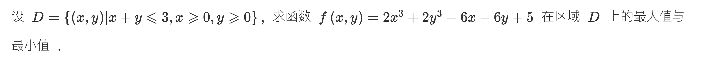

> [!question] 题干
> 


这道题是考研高数多元函数微分学中非常标准的**闭区域最值大题**。

解决这类“画地为牢”的区域最值问题，核心逻辑是“内外两路合围”：先把内部所有的“驻点”抓出来，再沿边界拆成一元函数清扫。最后，把所有嫌疑点的函数值排成一排进行大比拼，最大的就是全局最大，最小的就是全局最小。

另外，这道题的函数 $f(x,y)$ 和区域 $D$ 具有**极其完美的轮换对称性（对调 $x,y$ 完全不变）**，利用好这一点可以帮我们在考场上省下一半的算力。

## 📐 第一步：描绘战场（明确区域 $D$）

区域 $D$ 是一个由三个顶点 $(0,0)$、 $(3,0)$、 $(0,3)$ 围成的**第一象限闭合直角三角形**。

它的边界由三条线段组成：

1. **底边 $L_1$**： $y = 0 \quad (0 \le x \le 3)$
    
2. **左边 $L_2$**： $x = 0 \quad (0 \le y \le 3)$
    
3. **斜边 $L_3$**： $x + y = 3 \implies y = 3 - x \quad (0 \le x \le 3)$
    

## 🚀 第二步：打入内部（搜捕内部驻点）

我们对 $f(x,y) = 2x^3 + 2y^3 - 6x - 6y + 5$ 分别求一阶偏导数，并令其等于 0：

$$\begin{cases} f_x = 6x^2 - 6 = 0 \implies x^2 = 1 \\ f_y = 6y^2 - 6 = 0 \implies y^2 = 1 \end{cases}$$

因为驻点必须落在区域 $D$ 的**严格内部**，内部要求 $x > 0, y > 0$，所以我们丢弃负数解，只斩获唯一合法的内部驻点：

$$\mathbf{P_0(1,1)}$$

- **安全校验**： $1 + 1 = 2 < 3$，该点确实在三角形内部，安全。
    
- **计算函数值**：
    
    $$f(1,1) = 2(1)^3 + 2(1)^3 - 6(1) - 6(1) + 5 = 2 + 2 - 12 + 5 = -3$$
    

## 🚀 第三步：清扫边界（沿三条边降维单挑）

当自变量退化到边界上时，多元函数降维变成一元函数。

### 1. 清扫底边 $L_1$ ( $y = 0$ )

将 $y = 0$ 静态代入原函数，得到一元函数：

$$g_1(x) = f(x,0) = 2x^3 - 6x + 5 \quad (0 \le x \le 3)$$

求导找驻点： $g_1'(x) = 6x^2 - 6 = 0 \implies x = 1$。

- **捕获边界驻点**： **$(1,0)$**，此时函数值： $f(1,0) = 2(1) - 6(1) + 5 = 1$。
    
- **捕获端点（三角形顶点）**：
    
    - 原点 **$(0,0)$**： $f(0,0) = 5$
        
    - 右顶点 **$(3,0)$**： $f(3,0) = 2(3)^3 - 6(3) + 5 = 54 - 18 + 5 = 41$
        

### 2. 清扫左边 $L_2$ ( $x = 0$ )

根据 **$x,y$ 的轮换对称性**，我们根本不需要重新算一遍，直接同步镜像复制：

- **捕获边界驻点**： **$(0,1)$**，此时函数值： $f(0,1) = 1$。
    
- **捕获端点**：上顶点 **$(0,3)$**，此时函数值： $f(0,3) = 41$。
    

### 3. 清扫斜边 $L_3$ ( $y = 3 - x$ )

将 $y = 3 - x$ 强行代入原函数：

$$g_3(x) = 2x^3 + 2(3-x)^3 - 6x - 6(3-x) + 5$$

这里展现一记漂亮的代数消去法。展开立方项： $2(3-x)^3 = 2(27 - 27x + 9x^2 - x^3) = 54 - 54x + 18x^2 - 2x^3$。

代入合并后，**三次项 $2x^3$ 与 $-2x^3$ 奇迹般地全体对消了**！

$$g_3(x) = 18x^2 - 54x + 54 - 6x - 18 + 6x + 5 = 18x^2 - 54x + 41 \quad (0 \le x \le 3)$$

求导寻找斜边的驻点：

$$g_3'(x) = 36x - 54 = 0 \implies x = \frac{54}{36} = \frac{3}{2}$$

此时 $y = 3 - \frac{3}{2} = \frac{3}{2}$。

- **捕获斜边驻点**： **$\left(\frac{3}{2}, \frac{3}{2}\right)$**，此时函数值：
    
    $$f\left(\frac{3}{2}, \frac{3}{2}\right) = 18\left(\frac{3}{2}\right)^2 - 54\left(\frac{3}{2}\right) + 41 = 18 \cdot \frac{9}{4} - 81 + 41 = \frac{81}{2} - 40 = 0.5 = \frac{1}{2}$$
    

## ⚖️ 第四步：总决选（大榜单终极对撞）

现在，所有在内部和边界上抓到的“嫌疑人”全部到齐，我们列成最清爽的表格进行数值大洗牌：

|**嫌疑点类型**|**坐标 (x,y)**|**函数值 f(x,y)**|**角色宣判**|
|---|---|---|---|
|**内部唯一种子**|$(1,1)$|**$-3$**|🏆 **绝对最小值**|
|**底边/左边驻点**|$(1,0)$ / $(0,1)$|$1$|普通陪跑|
|**斜边中点驻点**|$\left(\frac{3}{2}, \frac{3}{2}\right)$|$\frac{1}{2}$|普通陪跑|
|**区域原点**|$(0,0)$|$5$|普通陪跑|
|**外围两翼顶点**|$(3,0)$ / $(0,3)$|**$41$**|🏆 **绝对最大值**|

## 🎯 规范化考场满分输出

**【解】**

1. **求区域内部的驻点**：
    
    由 $f_x = 6x^2 - 6 = 0, f_y = 6y^2 - 6 = 0$ 且 $x>0, y>0, x+y<3$，解得内部唯一驻点为 $(1,1)$。
    
    此时函数值为： $f(1,1) = -3$。
    
2. **求边界上的极值点与端点值**：
    
    - 在边界 $y=0$ （ $0 \le x \le 3$ ）上， $f(x,0) = 2x^3 - 6x + 5$，令其导数为 0 得 $x=1$。得点 $(1,0)$ 处 $f(1,0) = 1$；端点处 $f(0,0)=5, f(3,0)=41$。
        
    - 由轮换对称性，在边界 $x=0$ （ $0 \le y \le 3$ ）上，得点 $(0,1)$ 处 $f(0,1) = 1$；端点处 $f(0,3)=41$。
        
    - 在边界 $x+y=3$ （ $0 \le x \le 3$ ）上， $f(x,3-x) = 18x^2 - 54x + 41$，令其导数为 0 得 $x=\frac{3}{2}$。得点 $\left(\frac{3}{2}, \frac{3}{2}\right)$ 处 $f\left(\frac{3}{2}, \frac{3}{2}\right) = \frac{1}{2}$。
        
3. **比较大小**：
    
    综上所述，比较各候选点的函数值可知：
    
    函数 $f(x,y)$ 在区域 $D$ 上的**最大值为 $41$**（在点 $(3,0)$ 和 $(0,3)$ 处取得）；**最小值为 $-3$**（在点 $(1,1)$ 处取得）。
    

## 💡 沉淀进 Obsidian 的“闭区域最值”全景芯片

Markdown

```
## 📂 核心工具：有界闭区域最值的“拉网收网流”

### 🛑 黄金判定工序（三步走八股文）
1. **【打内线】**：求一阶偏导数阻击【内部驻点】，用开区间严格不等式过滤掉区域外的坏点。
2. **【清边线】**：将各段边界方程逐一反代，降维变成一元函数，收集【边界驻点】和【区域顶点】。
3. **【大点兵】**：不进行二阶求导判定！直接把所有候选点的值排成一排，肉眼比大小。

### 🚀 考场偷懒外挂：轮换对称性
* **视觉信号**：若函数因式中 $x,y$ 的【系数与指数完全对称】（如 $2x^3+2y^3 - 6x-6y$），且边界图形关于对角线 $y=x$ 对称。
* **算力红利**：算完 $y=0$ 的整条直线后， $x=0$ 的边线结果【无脑直接镜像复制】，大题可以直接写“由轮换对称性同理可得...”，这是考场合法抢时间的标准制导武器。
```