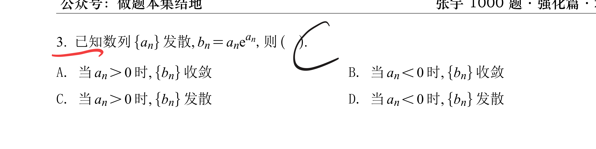

> [!question] 题干
> 

这道题考查的是数列极限与函数连续性、单调性之间的关系。

正确答案是 **(C) 当 $a_n > 0$ 时，$\{b_n\}$ 发散。**

下面为您进行详细的推导和分析：

### 1. 证明选项 (C) 正确

构造函数 $f(x) = x e^x$。当 $a_n > 0$ 时，我们可以考察函数在区间 $(0, +\infty)$ 上的性质：

- 求导数：$f'(x) = e^x + x e^x = e^x(x + 1)$。
    
- 当 $x > 0$ 时，显然有 $f'(x) > 0$，因此函数 $f(x) = x e^x$ 在 $(0, +\infty)$ 上是**严格单调递增**的。
    

因为 $f(x)$ 在该区间上严格单调且连续，所以它存在连续的反函数，记为 $f^{-1}(y)$。

现在我们采用**反证法**：假设数列 $\{b_n\}$ 收敛于某个极限 $B$。

由于已知 $a_n > 0$，必然有 $b_n = a_n e^{a_n} > 0$。

- **情况一：如果 $B > 0$**
    
    根据反函数的连续性，有：
    
    $$\lim_{n \to \infty} a_n = \lim_{n \to \infty} f^{-1}(b_n) = f^{-1}(B)$$
    
    这意味着数列 $\{a_n\}$ 收敛，这与题目已知条件“数列 $\{a_n\}$ 发散”相矛盾。
    
- **情况二：如果 $B = 0$**
    
    因为 $a_n > 0$，所以 $e^{a_n} > 1$。
    
    我们可以得到不等式：$0 < a_n < a_n e^{a_n} = b_n$。
    
    根据夹逼定理，既然 $\lim_{n \to \infty} b_n = 0$，那么必定有 $\lim_{n \to \infty} a_n = 0$。这同样意味着 $\{a_n\}$ 收敛，与已知条件矛盾。
    

综上所述，假设不成立。当 $a_n > 0$ 时，数列 $\{b_n\}$ 必定发散。因此 (C) 正确，(A) 错误。

### 2. 排除选项 (B) 和 (D)

当 $a_n < 0$ 时，数列 $\{b_n\}$ 的敛散性是不确定的，我们可以通过举反例来排除这两个选项。

- **反例 1（证明 (D) 错误）：**
    
    令 $a_n = -n$。
    
    显然当 $n \to \infty$ 时，$a_n \to -\infty$，数列 $\{a_n\}$ 发散。
    
    此时 $b_n = -n e^{-n} = \frac{-n}{e^n}$。
    
    根据洛必达法则（或指数函数增长速度远大于幂函数），我们有 $\lim_{n \to \infty} b_n = 0$。
    
    在这种情况下，**$\{b_n\}$ 收敛**。因此“必定发散”的选项 (D) 错误。
    
- **反例 2（证明 (B) 错误）：**
    
    令 $a_n = -2 + (-1)^n$。
    
    该数列的值在 $-1$ 和 $-3$ 之间不断震荡，因此数列 $\{a_n\}$ 发散。
    
    此时 $b_n$ 的值在 $-e^{-1}$ 和 $-3e^{-3}$ 之间震荡，存在两个不同的聚点。
    
    在这种情况下，**$\{b_n\}$ 发散**。因此“必定收敛”的选项 (B) 错误。

[[如果没有单调性还能有反函数吗]]

[[反函数具有的性质]]

[[如何理解严格单调连续函数必有连续反函数]]

