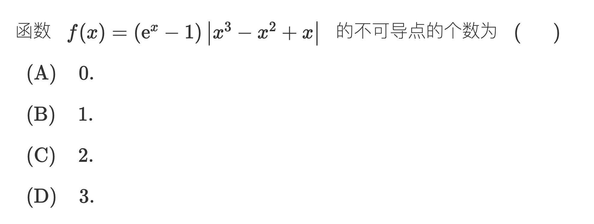

> [!question] 题干
> 

这道题是一道非常典型且巧妙的考研高数题。它完美契合了我们刚刚讨论过的核心模型：**“无穷小量抚平尖点”**。

正确答案是 **(A) 0**。

下面为您进行详细的推导和结构剖析：

### 第一步：化简绝对值内部的表达式

首先，我们需要分析绝对值符号里面的多项式 $x^3 - x^2 + x$ 的符号变化情况。我们对其提取公因式：

$$x^3 - x^2 + x = x(x^2 - x + 1)$$

观察括号内的二次三项式 $x^2 - x + 1$。计算它的判别式 $\Delta$：

$$\Delta = (-1)^2 - 4 \cdot 1 \cdot 1 = -3 < 0$$

因为二次项系数大于 0 且 $\Delta < 0$，这说明对于任意实数 $x$，恒有：

$$x^2 - x + 1 > 0$$

既然这一部分恒为正数，它就可以直接从绝对值符号里面拿出来。原函数就可以等价变形为：

$$f(x) = (e^x - 1)|x|(x^2 - x + 1)$$

### 第二步：寻找“嫌疑点”

化简后的函数由三个部分相乘构成：

1. $(e^x - 1)$：基本初等函数，处处可导。
    
2. $(x^2 - x + 1)$：多项式函数，处处可导。
    
3. $|x|$：含有绝对值，**在 $x=0$ 处连续但不可导**。
    

根据复合与乘积函数的性质，除了 $x=0$ 这个点之外，其他所有点都是几个可导函数的乘积，必然可导。因此，整个函数 $f(x)$ 唯一可能发生不可导的“嫌疑点”**只有 $x=0$**。
[[3.1#这句话如何理解]]
### 第三步：利用导数定义进行“判决”

对于 $x=0$ 这个疑似不可导的尖点，我们不能生搬硬套求导公式，必须回归到导数的最初定义。

考察 $x \to 0$ 时的导数极限式：

$$f'(0) = \lim_{x \to 0} \frac{f(x) - f(0)}{x - 0}$$

将 $f(0) = 0$ 和 $f(x)$ 的表达式代入：

$$f'(0) = \lim_{x \to 0} \frac{(e^x - 1)|x|(x^2 - x + 1)}{x}$$

为了方便计算，我们将式子稍微重新组合一下：

$$f'(0) = \lim_{x \to 0} \left[ \frac{e^x - 1}{x} \cdot |x| \cdot (x^2 - x + 1) \right]$$

接下来进行极限的计算：

1. 当 $x \to 0$ 时，根据等价无穷小替换，$e^x - 1 \sim x$，所以 $\lim_{x \to 0} \frac{e^x - 1}{x} = 1$。
    
2. 当 $x \to 0$ 时，多项式部分 $\lim_{x \to 0} (x^2 - x + 1) = 1$。
    
3. 当 $x \to 0$ 时，绝对值部分 $|x| \to 0$。
    

将这三部分相乘：

$$f'(0) = 1 \cdot 0 \cdot 1 = 0$$

因为该极限存在（等于 0），所以得出结论：**函数 $f(x)$ 在 $x=0$ 处是可导的，且 $f'(0) = 0$。**

综上所述，该函数在全域内处处可导，不可导点的个数为 0。

### 💡 核心模型印证

这道题是前面提到的“尖点被抚平”理论的完美实战演练：

原本 $|x|$ 在 $x=0$ 处是一个不可导的尖角。

但是，它前面乘了一个因子 $(e^x - 1)$。由于当 $x \to 0$ 时，$(e^x - 1) \to 0$，这个趋于 0 的因子就像一个强大的“平滑器”，它不仅抹平了 $|x|$ 的尖锐折角，甚至还把这一点的切线直接压成了水平线（导数为 0）。

**考场秒杀口诀**：若函数形式为 $f(x) = g(x)|x - a|$，且 $g(x)$ 在 $x=a$ 处可导。

- 如果 $g(a) \neq 0$，则 $f(x)$ 在 $x=a$ 处不可导。
    
- 如果 $g(a) = 0$，则 $f(x)$ 在 $x=a$ 处必定可导，且导数为 0。
    

本题中，相当于 $a=0$，$g(x) = (e^x - 1)(x^2 - x + 1)$。因为 $g(0) = (1 - 1)(1) = 0$，所以直接秒定它在 $x=0$ 处可导！

## 这句话如何理解

这个问题问得非常深刻，它直击了高等数学中“函数的局部性质”**与**“导数四则运算法则”的底层逻辑。

之所以可以说“除了 $x=0$ 之外，其他所有点都必然可导”，是由以下两个数学确定性共同支撑的：

### 第一步：为什么当 $x \neq 0$ 时，各个独立因式各自都可导？

我们把原函数拆解为三个因式的乘积：$f(x) = f_1(x) \cdot f_2(x) \cdot f_3(x)$

1. $f_1(x) = e^x - 1$
    
2. $f_2(x) = x^2 - x + 1$
    
3. $f_3(x) = |x|$
    

对于 $f_1(x)$ 和 $f_2(x)$，它们是基本初等函数（指数函数、多项式函数）的简单组合，在整个实数集 $\mathbb{R}$ 上都是处处光滑、处处可导的。

关键在于带绝对值的 $f_3(x) = |x|$。我们需要用“局部”的眼光来看待它：

- **在 $x > 0$ 的区域**：在这个局部的任意一点，|x| 都可以直接去掉绝对值符号，等价于线性函数 $y = x$。它的导数恒为 $1$，因而是可导的。
    
- **在 $x < 0$ 的区域**：在这个局部的任意一点，|x| 等价于线性函数 $y = -x$。它的导数恒为 $-1$，因而也是可导的。
    

也就是说，**绝对值函数 $|x|$ 仅仅只在 $x=0$ 这一个孤立的点上由于左右导数不相等而不可导；在除此之外的其他地方（$x > 0$ 或 $x < 0$），它在局部表现得和普通的单项式一样温顺、光滑。** 因此，只要避开 $x=0$，这三个因式在任何一个确定的点 $x_0$ 处，**各自都是 100% 可导的**。

### 第二步：为什么“可导函数的乘积”必然可导？（严密的数学证明）

这依赖于微积分中的基石定理——**导数的乘积法则（莱布尼茨法则）**。

> **定理**：若函数 $u(x)$ 和 $v(x)$ 在点 $x_0$ 处均可导，则它们的乘积 $w(x) = u(x) \cdot v(x)$ 在点 $x_0$ 处也必然可导。

我们可以用极限的定义来进行严密的证明：

根据导数定义，乘积函数 $w(x)$ 在 $x_0$ 处的导数为：

$$w'(x_0) = \lim_{\Delta x \to 0} \frac{u(x_0 + \Delta x)v(x_0 + \Delta x) - u(x_0)v(x_0)}{\Delta x}$$

为了能利用已知 $u(x)$ 和 $v(x)$ 可导的条件，我们在分子中间**恶意地加入并减去**同一个项 $u(x_0)v(x_0 + \Delta x)$（这是高数证明中常用的“加项减项”拼凑技巧）：

$$= \lim_{\Delta x \to 0} \frac{u(x_0 + \Delta x)v(x_0 + \Delta x) - u(x_0)v(x_0 + \Delta x) + u(x_0)v(x_0 + \Delta x) - u(x_0)v(x_0)}{\Delta x}$$

然后将分子分两组进行提取公因式：

$$= \lim_{\Delta x \to 0} \left[ \frac{u(x_0 + \Delta x) - u(x_0)}{\Delta x} \cdot v(x_0 + \Delta x) + u(x_0) \cdot \frac{v(x_0 + \Delta x) - v(x_0)}{\Delta x} \right]$$

接下来对各部分单独求极限：

1. 因为 $u(x)$ 在 $x_0$ 处可导，所以 $\lim_{\Delta x \to 0} \frac{u(x_0 + \Delta x) - u(x_0)}{\Delta x} = u'(x_0)$。
    
2. 因为 $v(x)$ 在 $x_0$ 处可导，**可导必连续**，所以当 $\Delta x \to 0$ 时，$\lim_{\Delta x \to 0} v(x_0 + \Delta x) = v(x_0)$。
    
3. 因为 $v(x)$ 在 $x_0$ 处可导，所以 $\lim_{\Delta x \to 0} \frac{v(x_0 + \Delta x) - v(x_0)}{\Delta x} = v'(x_0)$。
    

由于这几部分的极限全部存在，根据极限的四则运算法则，我们可以把大极限拆开：

$$w'(x_0) = u'(x_0)v(x_0) + u(x_0)v'(x_0)$$

这个极限不仅存在，而且算出了具体的导数公式（即我们熟知的 $(uv)' = u'v + uv'$）。这便**严格证明了两个可导函数的乘积必然可导**。

### 结论的推广

既然两个可导函数的乘积必然可导，那么通过数学归纳法，三个、四个乃至有限多个可导函数的乘积也必然可导（例如把三个函数看作 $[f_1(x)f_2(x)] \cdot f_3(x)$）。

所以在原题中，当 $x \neq 0$ 时，每一个组成部分都是可导函数，它们乘在一起构成的新函数，在微积分的法则保护下，就**绝对不可能**在这些点上产生不可导的尖角或断层。我们唯一需要特殊拉出来审判的，就只有那个让 $|x|$ 发生性质突变的 $x=0$ 点。