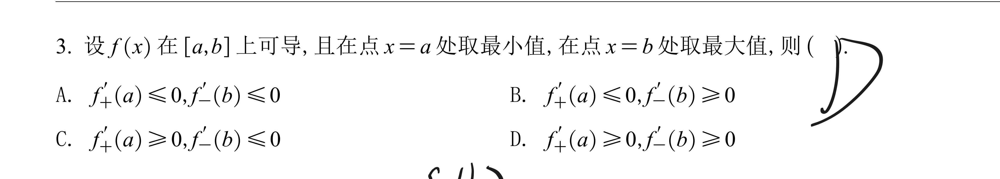

> [!question] 题干
> 

这道题考查的是**闭区间上最值点的导数符号判定**，它属于**费马引理在区间端点处的延伸变体**。

在做这道题时，千万不能死记常规极值点“导数等于 0”的结论，因为 **$a$ 和 $b$ 是区间的端点**，自变量在端点处只能单向趋近。

正确答案是 **D. $f'_+(a) \geqslant 0, f'_-(b) \geqslant 0$**。

下面利用**导数定义（极限的保号性）**和**几何直观**为你带来严密的拆解：

## 🛠️ 外科手术式拆解

### 1. 审判左端点 $x=a$ （最小值点）

因为 $x=a$ 是左端点，自变量只能从右侧趋近于 $a$，所以我们只能讨论**右导数 $f'_+(a)$**。

根据导数的定义：

$$f'_+(a) = \lim_{x \to a^+} \frac{f(x) - f(a)}{x - a}$$

我们来分析极限号右侧这个分式的正负号性质：

- **分子 $f(x) - f(a)$**：题目已知 $f(a)$ 是整个 $[a, b]$ 区间上的**最小值**，所以区间内任意一点的函数值 $f(x)$ 必然大于或等于 $f(a)$。因此，分子恒有：$f(x) - f(a) \geqslant 0$。
    
- **分母 $x - a$**：因为 $x \to a^+$（即 $x$ 从右侧逼近 $a$），所以必然有 $x > a$。因此，分母恒有：$x - a > 0$。
    

根据**极限的保号性**，一个分子 $\geqslant 0$ 且分母 $> 0$ 的分式，其极限值必然大于或等于 0：

$$f'_+(a) \geqslant 0$$

### 2. 审判右端点 $x=b$ （最大值点）

因为 $x=b$ 是右端点，自变量只能从左侧趋近于 $b$，所以我们只能讨论**左导数 $f'_-(b)$**。

根据导数的定义：

$$f'_(b) = \lim_{x \to b^-} \frac{f(x) - f(b)}{x - b}$$

我们来分析这个分式的正负号性质：

- **分子 $f(x) - f(b)$**：题目已知 $f(b)$ 是整个 $[a, b]$ 区间上的**最大值**，所以区间内任何一点的 $f(x)$ 都不会超过 $f(b)$。因此，分子恒有：$f(x) - f(b) \leqslant 0$。
    
- **分母 $x - b$**：因为 $x \to b^-$（即 $x$ 从左侧逼近 $b$），所以必然有 $x < b$。因此，分母恒有：$x - b < 0$。
    

再次根据极限的保号性，分子 $\leqslant 0$ 且分母 $< 0$（**负负得正**），所以两者的商在取极限后必然大于或等于 0：

$$f'_-(b) \geqslant 0$$

## 💡 几何直观（一秒肉眼可见）

如果觉得公式符号绕，直接拉出几何图形来进行闭环：

- **在左端点 $a$ 处**：因为 $f(a)$ 是**最低点**，曲线从 $a$ 出发往右走时，为了离开这个最低点，图形的趋势只能是**一路上扬（或者至少平滑水平）**。曲线向右上扬，斜率（右导数）自然满足 $f'_+(a) \geqslant 0$。
    
- **在右端点 $b$ 处**：因为 $f(b)$ 是**最高点**，曲线从左边一路爬坡到 $b$ 达到巅峰。所以在快要接近 $b$ 的那一瞬间，图形的趋势同样必须是**一路上扬（或者至少平滑水平）**。曲线向右上扬，斜率（左导数）自然满足 $f'_-(b) \geqslant 0$。
    

综合两点，双重大于或等于 0，秒杀锁定 **D**。

## 🎒 错题本升华：单向端点最值的“反射定律”

在考研微分学的综合大题（尤其是利用中值定理证明不等式、或者凹凸性零点讨论）中，经常要借用端点最值的导数符号。请把这个结论作为肌肉记忆锁死：

$$\text{左端点 } a \text{ 为最小值 } \implies f'_+(a) \geqslant 0 \quad (\text{往右上扬})$$

$$\text{左端点 } a \text{ 为最大值 } \implies f'_+(a) \leqslant 0 \quad (\text{往右下坠})$$

$$\text{右端点 } b \text{ 为最小值 } \implies f'_-(b) \leqslant 0 \quad (\text{左边下坠到此})$$

$$\text{右端点 } b \text{ 为最大值 } \implies f'_-(b) \geqslant 0 \quad (\text{左边爬坡到此})$$

这个结论只要脑海里有一幅“山谷与山峰”的闭区间曲线图，就绝对不会记混。如果这道题把条件改成“在 $a$ 处取最大值，在 $b$ 处取最小值”，你能瞬间反射出应该选哪个选项吗？