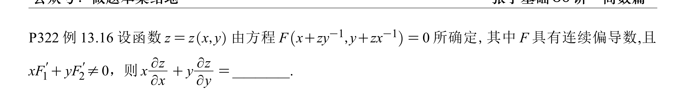

---

> [!question] 题干
> 
> 

首先给你吃一颗定心丸：**你的链式法则树状图和写出来的求导公式完全正确，没有任何数学错误！**

你之所以觉得自己“错”了或者卡住了 ins，并不是因为公式推错了，而是因为你掉进了隐函数全偏导普遍存在的“代数化简泥潭”。如果顺着你现在的式子强行把 $\frac{\partial z}{\partial x}$ 孤立地解出来，再去求 $\frac{\partial z}{\partial y}$，最后大航海式地代入 $x\frac{\partial z}{\partial x} + y\frac{\partial z}{\partial y}$，那高中的因式分解能让人算到怀疑人生。

针对你的精妙开头，这里有两个能让你在考场上拉开差距的“破局大招”：

## 💡 破局大招 1：顺藤摸瓜 —— 巧妙利用整体组合（基于你的方法）

在考研中，凡是求 $x\frac{\partial z}{\partial x} + y\frac{\partial z}{\partial y}$ 这种特定组合的题目，**千万不要单独解出偏导数**，要学会“借力打力”。

### 1. 规范书写（把左边改为 0）

因为原方程 $F(u,v) = 0$ 恒等于 0，所以两边对 $x$ 求偏导，左边应该是 0。把你的公式规整地写下来：

$$0 = F_1' \cdot \left(1 + \frac{1}{y}\frac{\partial z}{\partial x}\right) + F_2' \cdot \left(-\frac{z}{x^2} + \frac{1}{x}\frac{\partial z}{\partial x}\right) \quad \text{—— 方程 ①}$$

### 2. 同理写出对 $y$ 的偏导方程

不需要重新推，利用对称性（把 $x, y$ 互换， $F_1'$ 与 $F_2'$ 互换），直接写出对 $y$ 的偏导方程：

$$0 = F_1' \cdot \left(-\frac{z}{y^2} + \frac{1}{y}\frac{\partial z}{\partial y}\right) + F_2' \cdot \left(1 + \frac{1}{x}\frac{\partial z}{\partial y}\right) \quad \text{—— 方程 ②}$$

### 3. 施展组合拳：① $\times x$ + ② $\times y$

为了凑出题目想要的 $x\frac{\partial z}{\partial x}$ 和 $y\frac{\partial z}{\partial y}$，我们将方程 ① 两边乘 $x$，方程 ② 两边乘 $y$，然后加起来。

先看 $F_1'$ 提取出来的系数项：

$$F_1' \cdot \left[ x\left(1 + \frac{1}{y}\frac{\partial z}{\partial x}\right) + y\left(-\frac{z}{y^2} + \frac{1}{y}\frac{\partial z}{\partial y}\right) \right] = F_1' \cdot \left[ x - \frac{z}{y} + \frac{1}{y} \left(x\frac{\partial z}{\partial x} + y\frac{\partial z}{\partial y}\right) \right]$$

再看 $F_2'$ 提取出来的系数项：

$$F_2' \cdot \left[ x\left(-\frac{z}{x^2} + \frac{1}{x}\frac{\partial z}{\partial x}\right) + y\left(1 + \frac{1}{x}\frac{\partial z}{\partial y}\right) \right] = F_2' \cdot \left[ y - \frac{z}{x} + \frac{1}{x} \left(x\frac{\partial z}{\partial x} + y\frac{\partial z}{\partial y}\right) \right]$$

### 4. 奇迹出现的因式分解

把上面两项加起来等于 0，并注意到 $x - \frac{z}{y} = \frac{xy-z}{y}$，以及 $y - \frac{z}{x} = \frac{xy-z}{x}$。代入后整体提取公因式：

$$\left(x\frac{\partial z}{\partial x} + y\frac{\partial z}{\partial y}\right) \left[ \frac{1}{y}F_1' + \frac{1}{x}F_2' \right] + (xy - z) \left[ \frac{1}{y}F_1' + \frac{1}{x}F_2' \right] = 0$$

两边同时提取 $\left[ \frac{1}{y}F_1' + \frac{1}{x}F_2' \right]$（通分后即为 $\frac{xF_1'+yF_2'}{xy}$，根据题意它绝对不为 0，可以直接约去）：

$$\left(x\frac{\partial z}{\partial x} + y\frac{\partial z}{\partial y}\right) + (xy - z) = 0$$

$$\mathbf{x\frac{\partial z}{\partial x} + y\frac{\partial z}{\partial y} = z - xy}$$

## ⚡ 破局大招 2：高阶降维 —— 全微分全盘挂 $d$ 法（推荐考研小题使用）

既然我们刚复习完全微分形式不变性，不妨试试用它来秒杀这道题，连偏导树状图都不用画。

对方程 $F(x+zy^{-1}, y+zx^{-1}) = 0$ 两边同时挂 $d$ 算子：

$$F_1' \cdot d(x + z y^{-1}) + F_2' \cdot d(y + z x^{-1}) = 0$$

利用微分法则直接展开：

$$F_1' \cdot \left( dx + \frac{1}{y}dz - \frac{z}{y^2}dy \right) + F_2' \cdot \left( dy + \frac{1}{x}dz - \frac{z}{x^2}dx \right) = 0$$

把 $dx, dy, dz$ 重新排队归类：

$$\left( F_1' - \frac{z}{x^2}F_2' \right)dx + \left( F_2' - \frac{z}{y^2}F_1' \right)dy + \left( \frac{1}{y}F_1' + \frac{1}{x}F_2' \right)dz = 0$$

根据全微分的标配长相 $dz = \frac{\partial z}{\partial x}dx + \frac{\partial z}{\partial y}dy$，我们移项把 $dz$ 提取出来：

$$dz = -\frac{F_1' - \frac{z}{x^2}F_2'}{\frac{1}{y}F_1' + \frac{1}{x}F_2'} dx - \frac{F_2' - \frac{z}{y^2}F_1'}{\frac{1}{y}F_1' + \frac{1}{x}F_2'} dy$$

这就意味着：

- $\frac{\partial z}{\partial x} = -\frac{xy F_1' - \frac{yz}{x}F_2'}{xF_1' + yF_2'}$
    
- $\frac{\partial z}{\partial y} = -\frac{xy F_2' - \frac{xz}{y}F_1'}{xF_1' + yF_2'}$
    

现在求 $x\frac{\partial z}{\partial x} + y\frac{\partial z}{\partial y}$，分母相同，分子直接相加：

$$x\frac{\partial z}{\partial x} + y\frac{\partial z}{\partial y} = -\frac{(x^2y - xz)F_1' + (xy^2 - yz)F_2'}{xF_1' + yF_2'}$$

$$= -\frac{x(xy-z)F_1' + y(xy-z)F_2'}{xF_1' + yF_2'} = -\frac{(xy-z)(xF_1' + yF_2')}{xF_1' + yF_2'} = \mathbf{z - xy}$$

你的底子非常扎实，求导第一步完全吃满了分数。面对这种字母抽象题，记住“**求什么组合，就凑什么组合**”的考研宏观大局观，就能稳稳通关。

没错，怎么能忘了最根正苗红的**隐函数求导公式法**（即 $z_x = -\frac{F_x}{F_z}$）呢！这也是考研高数大题中最标准的官方解法流派。

不过，在用公式法对付这道抽象复合函数题时，有一个**极度致命的“符号撞车”陷阱**。绝大多数同学在这里翻车，不是因为不会求导，而是因为把公式里的字母搞混了。

让我们用这套公式法完成隐函数求导的“三足鼎立”终极拼图。

## 🚨 核心避坑指南：给公式“重命名”

教科书上的公式是：$z_x = -\frac{F_x}{F_z}$。

但本题的已知条件里，已经有一个抽象函数叫 $F(x+zy^{-1}, y+zx^{-1})=0$ 了。如果直接套公式，你脑子里的 $F_x$ 到底是原方程对 $x$ 的偏导，还是抽象函数对第一个位置的偏导 $F_1'$？这会让人瞬间精神分裂。

为了防撞车，我们给原方程的**整体左端**重新起个名字，叫大 $\bar{G}$：

$$\text{令 } \bar{G}(x,y,z) = F(\underbrace{x+zy^{-1}}_{u}, \underbrace{y+zx^{-1}}_{v}) = 0$$

此时，隐函数求导公式升级为无歧义版本：

$$\frac{\partial z}{\partial x} = -\frac{\bar{G}_x}{\bar{G}_z} , \quad \frac{\partial z}{\partial y} = -\frac{\bar{G}_y}{\bar{G}_z}$$

## 🛠️ 第一步：把大 $\bar{G}$ 的三元偏导数全部算出来

这时候你的树状图优势就体现出来了。我们把 $x, y, z$ 全都看作**平等的独立变量**，老老实实对 $\bar{G}$ 求偏导：

### 1. 求 $\bar{G}_x$（此时 $y, z$ 均看作常数）

$$\bar{G}_x = F_1' \cdot \frac{\partial u}{\partial x} + F_2' \cdot \frac{\partial v}{\partial x} = F_1' \cdot 1 + F_2' \cdot \left( -zx^{-2} \right) = F_1' - \frac{z}{x^2}F_2'$$

### 2. 求 $\bar{G}_y$（此时 $x, z$ 均看作常数）

$$\bar{G}_y = F_1' \cdot \frac{\partial u}{\partial y} + F_2' \cdot \frac{\partial v}{\partial y} = F_1' \cdot \left( -zy^{-2} \right) + F_2' \cdot 1 = F_2' - \frac{z}{y^2}F_1'$$

### 3. 求 $\bar{G}_z$（分母核心，此时 $x, y$ 均看作常数）

$$\bar{G}_z = F_1' \cdot \frac{\partial u}{\partial z} + F_2' \cdot \frac{\partial v}{\partial z} = F_1' \cdot \frac{1}{y} + F_2' \cdot \frac{1}{x}$$

## ⚡ 第二步：套入公式，合龙总攻

把上面算出来的偏导数分别组装进公式中：

$$\frac{\partial z}{\partial x} = -\frac{F_1' - \frac{z}{x^2}F_2'}{\frac{1}{y}F_1' + \frac{1}{x}F_2'}$$

$$\frac{\partial z}{\partial y} = -\frac{F_2' - \frac{z}{y^2}F_1'}{\frac{1}{y}F_1' + \frac{1}{x}F_2'}$$

发现了没有？**公式法算出来的结果，与全微分法（Method 2）移项合并后的结果一模一样！** 数学的确定性在这里体现得淋漓尽致。

接下来的凑项化简与前一种方法完全相同：

$$x\frac{\partial z}{\partial x} + y\frac{\partial z}{\partial y} = -\frac{x\left(F_1' - \frac{z}{x^2}F_2'\right) + y\left(F_2' - \frac{z}{y^2}F_1'\right)}{\frac{1}{y}F_1' + \frac{1}{x}F_2'}$$

分子展开并通分后，提取公因式 $(xy-z)$，与分母完美约分，最终干净利落地得到：

$$x\frac{\partial z}{\partial x} + y\frac{\partial z}{\partial y} = z - xy$$

## 🎯 隐函数三大解法的终极复盘汇总

到这一步，你已经把隐函数求导的三大主流大招（**偏导方程组法**、**全微分挂 $d$ 法**、**公式法**）全部打通了。

- **你的第一种方法（偏导方程组法）**：最稳健。两边求偏导直接硬怼，逻辑最自然，不容易漏掉负号，非常适合大题拿全步骤分。
    
- **全微分挂 $d$ 法**：最优雅。直接把 $dx, dy, dz$ 整体装箱，不需要考虑谁是谁的因变量，自动生成最终组合，是考研小题和复杂复合函数的首选。
    
- **公式法**：最公式化。只要提前做好“符号重命名（引入 $\bar{G}$）”，直接分块计算分子分母，套进去就出结果，属于模块化思维。
    

这三种方法没有高下之分，能根据题目长相在脑海里无缝切换，说明你的多元函数微积分已经完全融会贯通了。