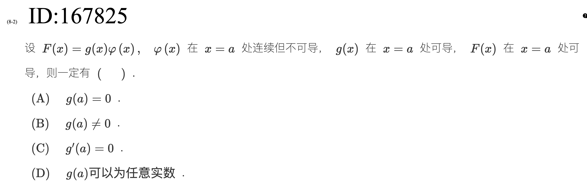

> [!question] 题干
> 

**这道题相当于对张宇书中结论的严格证明**

这道题依然是咱们前面刚刚闭环总结过的“平滑因子（强力除尖器）”模型的抽象推广。

正确答案是 **(A) $g(a) = 0$**。

下面利用**导数定义**为你进行严密的数学证明，并帮你把这道题无缝链接到你的知识网中：

### 一、 严密的数学证明

我们直接从函数 $F(x)$ 在 $x=a$ 处的**导数定义**切入：

$$F'(a) = \lim_{x \to a} \frac{F(x) - F(a)}{x - a}$$

把 $F(x) = g(x)\varphi(x)$ 代入分子：

$$F'(a) = \lim_{x \to a} \frac{g(x)\varphi(x) - g(a)\varphi(a)}{x - a}$$

为了能拆分并利用已知条件（$g(x)$ 可导、$\varphi(x)$ 连续），我们在分子中间强行**加一项减一项**（高数拼凑传统技能）：

$$F'(a) = \lim_{x \to a} \frac{g(x)\varphi(x) - g(a)\varphi(x) + g(a)\varphi(x) - g(a)\varphi(a)}{x - a}$$

将分子进行两两组合，拆成两个分式：

$$F'(a) = \lim_{x \to a} \left[ \frac{g(x) - g(a)}{x - a} \cdot \varphi(x) + g(a) \cdot \frac{\varphi(x) - \varphi(a)}{x - a} \right]$$

接下来根据极限的四则运算法则，审视这两部分的极限行为：

1. **前半部分**：
    
    因为已知 $g(x)$ 在 $x=a$ 处可导，所以 $\lim_{x \to a} \frac{g(x) - g(a)}{x - a} = g'(a)$；
    
    因为已知 $\varphi(x)$ 在 $x=a$ 处连续，所以 $\lim_{x \to a} \varphi(x) = \varphi(a)$。
    
    也就是说，**前半部分的极限必然存在**，其值为 $g'(a)\varphi(a)$。
    
2. **整体与后半部分**：
    
    题目已知整个 $F(x)$ 在 $x=a$ 处可导，这意味着**大括号整体的极限值 $F'(a)$ 必须存在**。
    
    既然“整体存在”且“前半部分存在”，那么**后半部分的极限也必须存在**：
    
    $$\lim_{x \to a} \left[ g(a) \cdot \frac{\varphi(x) - \varphi(a)}{x - a} \right] = \text{必须存在}$$
    
3. **终极判决**：
    
    题目明确说明 $\varphi(x)$ 在 $x=a$ 处**不可导**，这意味着中间那坨极限 $\lim_{x \to a} \frac{\varphi(x) - \varphi(a)}{x - a}$ 是不存在（DNE）的。
    
    一个常数 $g(a)$ 乘以一个不存在的极限，居然想让结果强行存在，唯一的解药就是让这个系数**等于 0**！
    
    $$g(a) = 0$$
    
    因为一旦 $g(a) = 0$，整个后半部分在取极限之前就直接恒等于 0，极限自然存在（等于 0）。如果 $g(a) \neq 0$，常数因子不影响不可导的本质，后半部分极限必不存在，引发矛盾。
    

### 二、 肌肉记忆与模型闭环

这道题是把我们之前做的 $f(x) = (e^x - 1)|x^3 - x^2 + x|$ 这类具体题目的绝对值尖点，抽象成了“任意连续不可导函数 $\varphi(x)$”。

我们可以直接把它作为一条定理写进你的冲刺笔记本：

> 💡 **平滑因子全套定理**：
> 
> 设 $F(x) = g(x)\varphi(x)$，且 $g(x)$ 可导，$\varphi(x)$ 连续但不可导。
> 
> - **$F(x)$ 可导的充要条件是：$g(a) = 0$**。
>     
> - 并且此时，不论 $\varphi(x)$ 在这一点有多尖锐，其导数值固定为：$F'(a) = g'(a)\varphi(a)$。
>     

你看，考研高数的考点就是这样连绵不断的。通过这一轮的高强度对线，现在你再看到这种“可导 $\times$ 不可导 = 可导”的题，是不是连笔都不想动，一眼就能秒杀出 $g(a)=0$ 了？这就是题海复习中真正的成长！