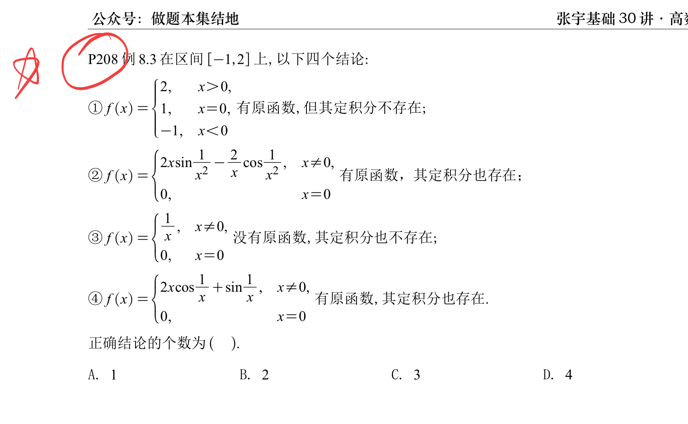

> [!question] 题干
> 

这道题是考研高数中关于“原函数存在定理”**与**“定积分存在定理（可积性）”交叉钓鱼的顶级经典好题！它把第一章的间断点分类、第六章的导函数性质、以及定积分的定性判定全盘熔于一炉。

这道题的正确答案是 **B. 2**（只有 ③ 和 ④ 是正确的）。

在给这四个结论动外科手术之前，请在脑海里无条件拉出这两条**铁律防线**：

1. **原函数存在的“判官”**：连续函数必有原函数；含有第一类间断点（跳跃、可去）的函数必无原函数；含有第二类间断点的函数可能有、可能没有。
    
2. **定积分存在的“底线”**：在闭区间上，**“有界”是定积分存在的必要条件**！如果一个函数在闭区间上**无界**，它的常规定积分（黎曼积分）**绝绝对对不存在**（不用看别的，无界直接一枪干掉）。如果有界且只有有限个间断点，则定积分必存在。
    

## 🛠️ 逐个结论外科手术式拆解

### ① 审判 $f(x) = \begin{cases} 2, & x>0 \\ 1, & x=0 \\ -1, & x<0 \end{cases}$ （完全错误❌）

- **原函数审判**：
    
    看 $x=0$ 处，左极限 $\lim_{x\to0^-}f(x) = -1$，右极限 $\lim_{x\to0^+}f(x) = 2$。
    
    这是一个标准的**第一类跳跃间断点**。
    
    根据达布定理（导数介值性），导函数绝对不能跳跃。因此，这个函数**绝对没有原函数**。结论中说“有原函数”错误。
    
- **定积分审判**：
    
    该函数在 $[-1, 2]$ 上通体最高是 2，最低是 -1，属于**严格有界**。而且全域只有 $x=0$ 这一个孤立的间断点。
    
    有界且只有有限个间断点，其**定积分必然存在**。结论中说“定积分不存在”错误。
    

### ② 审判 $f(x) = \begin{cases} 2x\sin\frac{1}{x^2} - \frac{2}{x}\cos\frac{1}{x^2}, & x\neq0 \\ 0, & x=0 \end{cases}$ （前半句对，后半句错❌）

- **原函数审判**：
    
    我们尝试构造一个函数 $F(x) = x^2\sin\frac{1}{x^2}$（ $x\neq0$ ）， $F(0)=0$。
    
    - 当 $x\neq0$ 时，求导： $F'(x) = 2x\sin\frac{1}{x^2} + x^2\cos\frac{1}{x^2}\cdot\left(-\frac{2}{x^3}\right) = 2x\sin\frac{1}{x^2} - \frac{2}{x}\cos\frac{1}{x^2} = f(x)$。
        
    - 当 $x=0$ 时，用定义求导： $F'(0) = \lim_{x\to0}\frac{x^2\sin(1/x^2) - 0}{x} = \lim_{x\to0}x\sin\frac{1}{x^2} = 0 = f(0)$。
        
    - 证明完毕， $F(x)$ 确实是 $f(x)$ 全域合法的原函数。所以“有原函数”是正确的。
        
- **定积分审判**：
    
    紧盯第二项 $-\frac{2}{x}\cos\frac{1}{x^2}$。当 $x \to 0$ 时，由于分母上有个 $x$，当 $\cos\frac{1}{x^2}=1$ 时（对应的点列会无限逼近0），这一项会直接飙到 **$\infty$**。
    
    这意味着 $f(x)$ 在包含 0 的区间 $[-1, 2]$ 上是无界（Unbounded）的！
    
    底线触发：**闭区间上无界函数，定积分必不存在！** 结论中说“其定积分也存在”错误。
    

### ③ 审判 $f(x) = \begin{cases} \frac{1}{x}, & x\neq0 \\ 0, & x=0 \end{cases}$ （完全正确内容✅）

- **原函数审判**：
    
    当 $x\to0$ 时， $\lim_{x\to0}f(x) = \infty$，属于第二类无穷间断点。如果它有原函数 $F(x)$，那 $F(x)$ 在 0 处必须可导（从而必须连续），但在 0 附近 $F'(x)=\frac{1}{x}$，积分回去是 $\ln|x|$，在 0 处直接爆炸，根本无法做到连续可导。所以它**没有原函数**，前半句正确。
    
- **定积分审判**：
    
    同样，函数在 $x=0$ 附近显然**无界**。
    
    无界则黎曼**定积分必然不存在**（注意：考研里的“定积分”专指正常的黎曼积分，不包含反常积分发散/收敛的讨论；况且即使作为反常积分，它在 0 处也是发散的）。后半句正确。
    

### ④ 审判 $f(x) = \begin{cases} 2x\cos\frac{1}{x} + \sin\frac{1}{x}, & x\neq0 \\ 0, & x=0 \end{cases}$ （完全正确内容✅）

- **原函数审判**：
    
    这也是考研高数最爱考的明星反例模板。我们构造 $F(x) = x^2\cos\frac{1}{x}$（ $x\neq0$ ）， $F(0)=0$。
    
    - 当 $x\neq0$ 时： $F'(x) = 2x\cos\frac{1}{x} + x^2\left(-\sin\frac{1}{x}\right)\cdot\left(-\frac{1}{x^2}\right) = 2x\cos\frac{1}{x} + \sin\frac{1}{x} = f(x)$。
        
    - 当 $x=0$ 时： $F'(0) = \lim_{x\to0}\frac{x^2\cos(1/x) - 0}{x} = \lim_{x\to0}x\cos\frac{1}{x} = 0 = f(0)$。
        
    - 因此， $f(x)$ **绝对拥有原函数**，前半句正确。
        
- **定积分审判**：
    
    仔细观察整个表达式：因为 $|2x\cos\frac{1}{x} + \sin\frac{1}{x}| \le 2|x| + 1 \le 2(2)+1 = 5$，所以它在 $[-1, 2]$ 上是**死死被控住的有界函数**！
    
    它唯一的恶行，只是在 $x=0$ 处由于 $\sin\frac{1}{x}$ 的存在长了一个**震荡间断点**。
    
    满足大前提：**有界且只有有限个间断点，定积分必存在！** 后半句正确。
    

## 🎒 错题本终极降维总结

请把这道题凝练成下面两句可以在考场上瞬发杀招的**二级结论**：

1. 看到类似 **$x^n\sin\frac{1}{x^m}$ 型求导产物**，原函数的存在性全靠前面的 $x$ 顶不顶得住定义（一般都存在）；但可积性（定积分存在性）**必须看求导后有没有把 $x$ 翻到分母上去**。分母有 $x$ 导致无界 $\implies$ 定积分必灭亡（如结论②）；分母无 $x$ 保持有界 $\implies$ 定积分必存活（如结论④）。
    
2. **“有原函数”与“定积分存在”之间，没有任何绝对的恩怨和因果关系。** 有原函数的可能不可积（结论②），可积的可能没有原函数（如把结论①里的 $f(0)$ 改成 2 依然可积但无原函数）。各自独立审判，方能立于不败之地。

[[如何理解有界振荡和无界振荡]]
