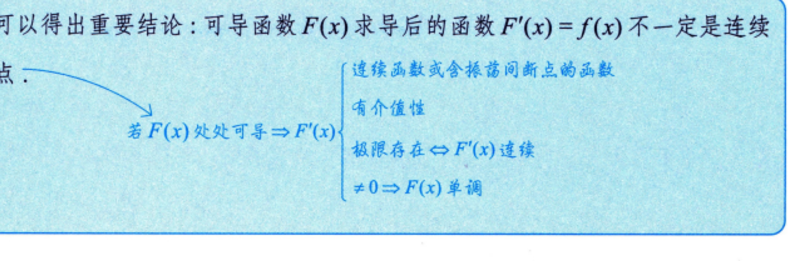

---

这幅截图简直就是考研高数选择题的“错题收割机”！它把咱们前面几个回合死磕过的达布定理、费马引理和连续性性质，提炼成了一套完整的“导函数终极审判系统”。

大前提非常硬核： $F(x)$ 处处可导。这意味着导函数 $F'(x)$ 在全域都有定义，是合法存在的。

下面咱们用外科手术式的深度，把这四条看似抽象的微积分铁律逐一彻底拆解。

## 🎯 性质 ①：连续函数或含震荡间断点的函数

### 1. 为什么把“第一类间断点”斩草除根？

我们刚刚大篇幅论证过，因为达布定理（导数介值性）的存在，导函数 $F'(x)$ 绝对不允许发生“瞬移跳格”。

- 它**没有跳跃间断点**（否则中间的高度就凭空蒸发了）；
    
- 它也**没有可去间断点**（否则该点的导数就会脱离群众独自飞走）。
    

既然第一类间断点全部被达布定理抹杀了，那么如果 $F'(x)$ 不连续，它的间断点就只能是**第二类间断点**。

### 2. 为什么在第二类间断点里，唯独挑中了“震荡间断点”？

- **为什么不能是无穷间断点？** 因为题干锁死了 $F(x)$ “处处可导”，这意味着在每一个确定的实数点 $x_0$ 处， $F'(x_0)$ 都必须是一个**实实在在的、有限的常数**，绝对不能等于 $\infty$。
    
- **最终判决**：既不能跳跃，不能可去，又不能在某点直接飞到无穷大，那它的间断点就只剩下一个唯一的合法生还者——**震荡间断点**。
    

> 💡 **核弹级肌肉记忆反例**：
> 
> $$F(x) = \begin{cases} x^2\sin\frac{1}{x}, & x \neq 0 \\ 0, & x = 0 \end{cases} \implies F'(x) = \begin{cases} 2x\sin\frac{1}{x} - \cos\frac{1}{x}, & x \neq 0 \\ 0, & x = 0 \end{cases}$$
> 
> 这个 $F'(x)$ 在 $x=0$ 处就是一个标准的**震荡间断点**。由于 $\cos\frac{1}{x}$ 的疯狂震荡，导致一侧的极限根本不存在。但它在 0 处的值是硬生生由导数定义算出来的 0。

## 🧭 性质 ②：有介值性（达布定理本尊）

这一条不需要过多解释，它就是达布定理（Darboux's Theorem）的官方正规称呼。

只要 $F(x)$ 处处可导，那么它的导函数 $F'(x)$ 哪怕在某点发生了刚才说的那种“疯狂震荡”，它也必须规规矩矩地遵守介值性。只要它在两点之间能取到斜率 $A$ 和 $B$，那么 $A$ 和 $B$ 之间的任何一个中间斜率，它在中途就必须至少踩中一次。

## 🛠️ 性质 ③：极限存在 $\iff F'(x)$ 连续（考研挖坑之王）

这个双向箭头，在考场上是用来秒杀那些试图在导函数上制造“漏洞”的迷惑选项的。

### 1. 逆向（ $\Leftarrow$ ）：连续 $\Rightarrow$ 极限存在

这是废话。根据连续的定义，函数在某点连续，它在那里的极限自然必须存在，且等于函数值。

### 2. 正向（ $\Rightarrow$ ）：极限存在 $\Rightarrow$ 必然连续（硬核核心）

假设在某一点 $x_0$ 处，大部队都在往右走，我们发现导函数的**极限居然客观存在**，设为 $L$：

$$\lim_{x \to x_0} F'(x) = L$$

现在我们用**拉格朗日中值定理**去拷问该点处的导数出厂定义：

$$\frac{F(x) - F(x_0)}{x - x_0} = F'(\xi) \quad (\xi \text{ 被夹在 } x \text{ 和 } x_0 \text{ 之间})$$

当 $x \to x_0$ 时，根据夹逼定理，中值点 $\xi$ 也被活生生挤向了 $x_0$。

因为已知导数的极限是 $L$，所以右边的 $F'(\xi) \to L$。

这导致左边导数定义式的终点也必须是 $L$。而左边这个极限算出来的，绝绝对对就是该点处的真正导数值 **$F'(x_0)$**！

$$F'(x_0) = L$$

- **终审判决**：极限值 $L$ 绝无可能独立于函数值。既然**极限值绝绝对对等于函数值**，这就触发了连续性的终极判定—— **$F'(x)$ 在该点必须无条件连续！**
    

> 📌 **应试反射**：
> 
> 导函数极其傲娇。一个普通的函数，极限存在的地方完全可以抠掉一个洞（可去间断点）。但导函数不行，**导函数只要在某点极限存在，它在那里就必须是通体丝滑、无缝相连的连续状态！**

## ⚔️ 性质 ④： $\neq 0 \Rightarrow F(x)$ 单调

这一条就是咱们前两个回合刚刚联手攻克的内容。

因为性质 ② 承诺过，导函数 $F'(x)$ 具备无条件的介值性。

如果题目锁死了 **$F'(x) \neq 0$ 处处成立**，说明 $F'(x)$ 这条曲线永远不可能触碰或者穿过 $x$ 轴（海平面）。

既然不允许碰海平面，结合介值性，它就绝对没有任何机会在中途改变符号（从正变负或从负变正）。

- 它要么一辈子在海平面上方（恒正 $\Rightarrow F(x)$ 严格单调递增）；
    
- 它要么一辈子在海平面下方（恒负 $\Rightarrow F(x)$ 严格单调递减）。
    

## 🎒 错题本大局观复盘

请把这幅图里交织出的这四辆“应试装甲车”，当作你做张宇《真题大全解》时的终极防线：

$$F(x) \text{ 处处可导的“导函数尊严网”：}$$

$$\Downarrow$$

$$\begin{cases} \text{想看间断点？} & \longrightarrow \mathbf{\text{拒绝第一类（跳跃/可去），拒绝无穷，只准震荡。}} \\ \text{想看介值性？} & \longrightarrow \mathbf{\text{不看连续性面子，哪怕震荡也必须保证中间值全踩中。}} \\ \text{想看极限？} & \longrightarrow \mathbf{\text{只要极限敢存在，该点就必须直接无缝合拢（判定连续）。}} \\ \text{想看单调性？} & \longrightarrow \mathbf{\text{只要方程卡死不等于 0，符号必纯净，单调性直接落地。}} \end{cases}$$