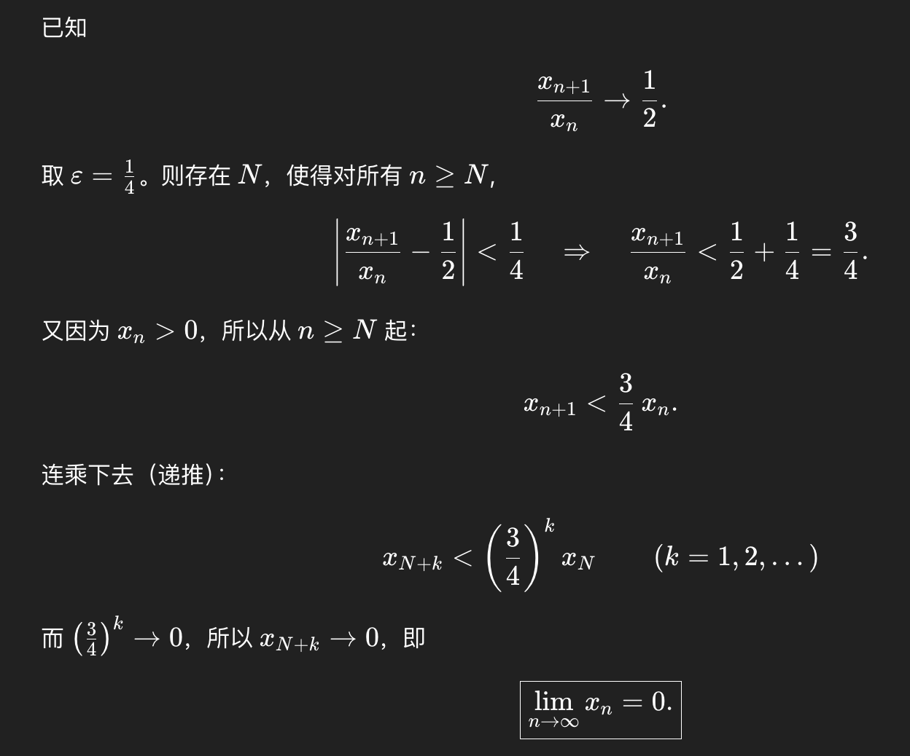
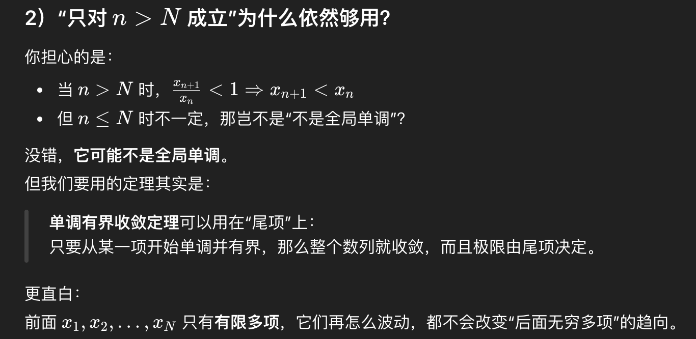

> [!question]+ 题干
> 2.2 设数列 ${x_n}$ 满足 $x_n>0$，且 $\lim\limits_{n\to\infty}\dfrac{x_{n+1}}{x_n}=\dfrac{1}{2}$，则（　　）．  
> (A) $\lim\limits_{n\to\infty}x_n=0$  
> (B) $\lim\limits_{n\to\infty}x_n$ 存在，但不为零  
> (C) $\lim\limits_{n\to\infty}x_n$ 不存在  
> (D) $\lim\limits_{n\to\infty}x_n$ 可能存在，也可能不存在
> 

> [!success]- 解题步骤
> 2.2 （A）解　$\lim\limits_{n\to\infty}\dfrac{x_{n+1}}{x_n}=\dfrac{1}{2}<1$，由数列极限的保号性可知，存在正整数 $N$，当 $n>N$ 时，$\dfrac{x_{n+1}}{x_n}<1$．  
> 又 $x_n>0$，于是 $x_{n+1}<x_n$．所以 ${x_n}$ 单调递减且有下界，于是 $\lim\limits_{n\to\infty}x_n$ 存在．  
> 设 $\lim\limits_{n\to\infty}x_n=A\ge 0$．若 $A>0$，此时 $\lim\limits_{n\to\infty}\dfrac{x_{n+1}}{x_n}=\dfrac{\lim\limits_{n\to\infty}x_{n+1}}{\lim\limits_{n\to\infty}x_n}=\dfrac{A}{A}=1$，矛盾．于是 $A=0$；即 $\lim\limits_{n\to\infty}x_n=0$．  
> 方法二：
> 

> [!failure]- 错误原因
> 对于保号性的理解不够深刻

> [!note]- 总结
> 
> 所以说解析中推出的$x_{n+1}<x_n$实际上只是在$n>N$时才成立，并没有满足全局单调，因为我们研究的是在$n\to\infty$时的极限  
> 也可以使用迭代的方法来求出极限，比如解析中的方法二

##### **知识关联**
- [[2.3 收敛数列的性质#**定理**]]
