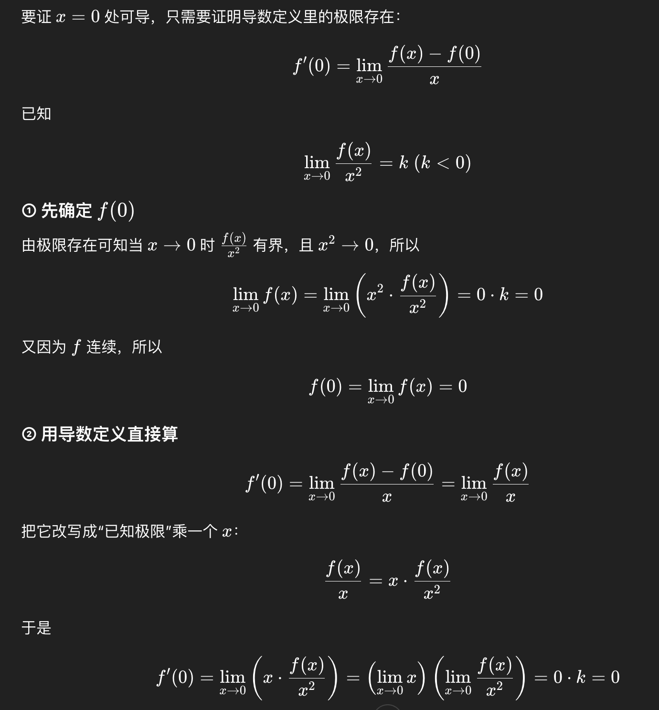

> [!question]+ 题干
> 12. 设 $f(x)$ 连续，且 $\lim_{x\to 0}\frac{f(x)}{x^2}=k(k<0)$，则 $f(x)$ 在点 $x=0$ 处( )。  
>     (A) 导数不存在  
>     (B) 导数存在，且 $f''(0)\ne 0$  
>     (C) 取得极小值  
>     -(D) 取得极大值
>     
> 

> [!success]- 解题步骤
> 12.【答案】(D)  
> 【解析】由题设知 $\lim_{x\to 0} f(x)=0=f(0)$．  
> 由 $\lim_{x\to 0}\frac{f(x)}{x^2}=k(k<0)$，知在点 $x=0$ 的某去心邻域内，有 $\frac{f(x)}{x^2}=k+\alpha$，其中，当 $x\to 0$ 时，$\alpha\to 0$，则 $f(x)=kx^2+\alpha x^2$．  
> 于是在点 $x=0$ 的某去心邻域内，有 $f(x)-f(0)<0$，即 $f(0)$ 为极大值．

> [!failure]- 错误原因
> 这题虽然做对了，但是对于没有判断出部分选项比如是否可导

> [!note]- 总结
> 下面利用了chatgpt给出的回答
> 
> 之后遇到类似的证明时，要想到分子分母同时成一个数，转化成能求出极限的形式

##### **知识关联**
- [[5.1 极值的定义]]
