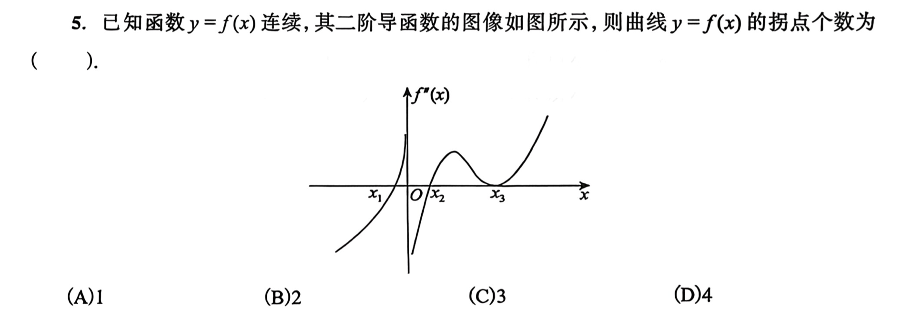

> [!question]+ 题干
> 

> [!success]- 解题步骤
> > 5．【答案】(C)  
> 【解析】由于在点 $x_1,\ x_2$ 左右两侧 $f''(x)$ 变号，知 $(x_1,f(x_1)),(x_2,f(x_2))$ 均为拐点，在点 $x=0$ 处，$f''(x)$ 不存在，但点 $x=0$ 左右两侧 $f''(x)$ 变号，$(0,f(0))$ 亦为拐点，共3个拐点，选(C).

> [!failure]- 错误原因

> [!note]- 总结

##### **知识关联**
- 
