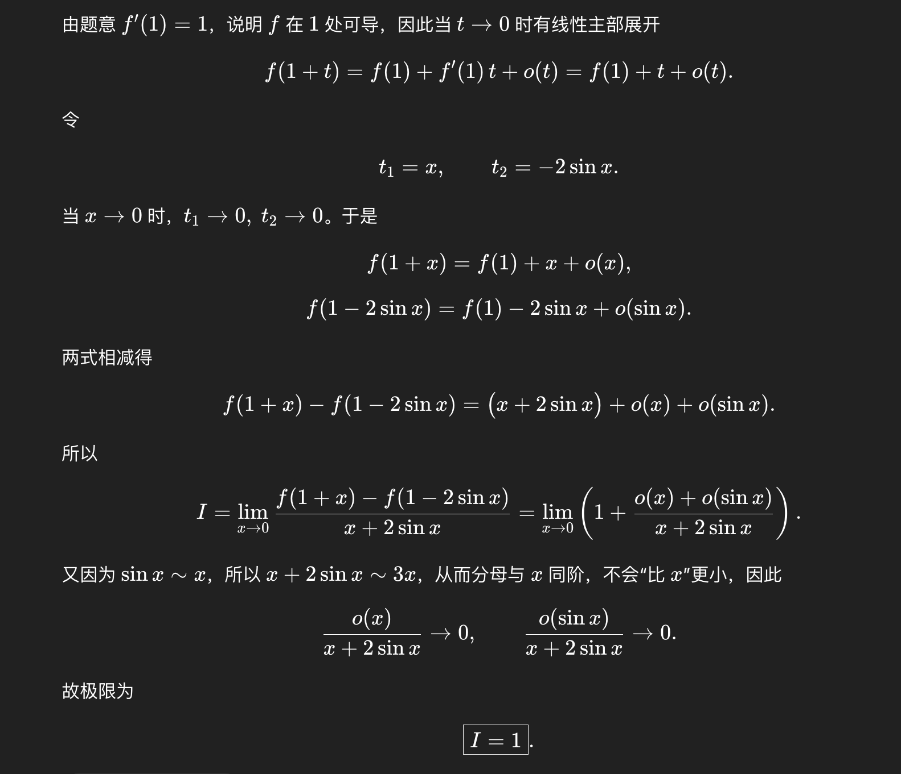
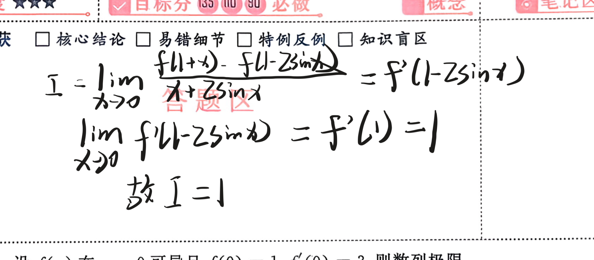
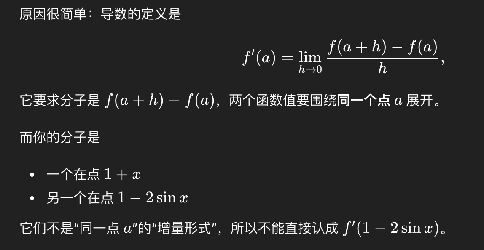

> [!question]+ 题干
> 31 设 $f'(1)=1$，则 $I=\lim_{x\to 0}\dfrac{f(1+x)-f(1-2\sin x)}{x+2\sin x}=$
> 

> [!success]- 解题步骤
> 下面给出两种解析，分别是标准解析和chatgpt解析
> 
> 31 【答案】 1  
> 【分析】方法一： 利用导数定义，转化为求极限  
> $$\lim_{x\to 0}\dfrac{f(1+\varphi(x))-f(1)}{\varphi(x)}=f'(1),$$  
> 其中$\lim_{x\to 0}\varphi(x)=0.$
> 
> $$I=\lim_{x\to 0}\left[\dfrac{f(1+x)-f(1)}{x}\cdot\dfrac{x}{x+2\sin x}-\dfrac{f(1-2\sin x)-f(1)}{-2\sin x}\cdot\dfrac{(-2\sin x)}{x+2\sin x}\right]$$  
> $$=f'(1)\lim_{x\to 0}\dfrac{x}{x+2\sin x}+f'(1)\lim_{x\to 0}\dfrac{2\sin x}{x+2\sin x}$$  
> $$=f'(1)\cdot\dfrac{1}{3}+f'(1)\cdot\dfrac{2}{3}=f'(1)=1.$$
> 方法二：
> 

> [!failure]- 错误原因
> 
> 想当然的直接把这个式子展开成标准的导数定义的形式，但是这种写法是不正确的，因为：

> [!note]- 总结
> 之后遇到这两类题目可以按照解题步骤中的两种思路进行

##### **知识关联**
- [[3.1 导数#导数的定义]]
