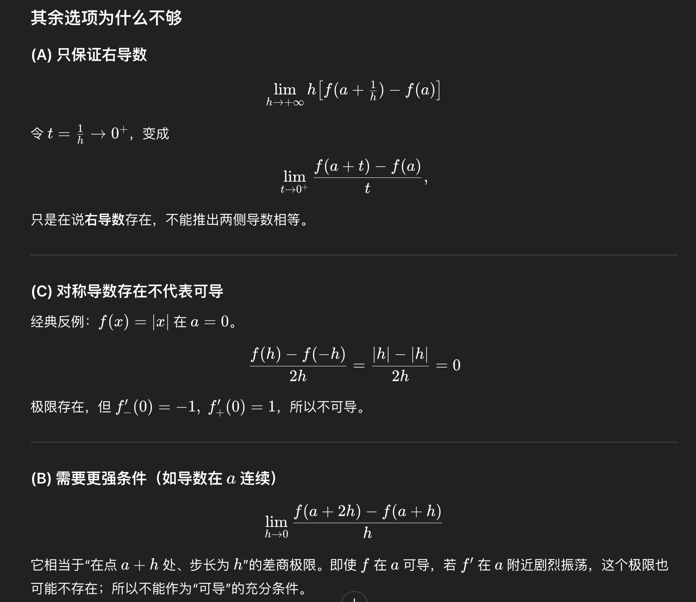

> [!question]+ 题干
> 6 设 $f(x)$ 在 $x=a$ 的某个邻域内有定义，则 $f(x)$ 在 $x=a$ 处可导的一个充分条件是  
> (A) $\lim\limits_{h\to +\infty} h\left[f\left(a+\frac{1}{h}\right)-f(a)\right]$ 存在.  
> (B) $\lim\limits_{h\to 0}\dfrac{f(a+2h)-f(a+h)}{h}$ 存在.  
> (C) $\lim\limits_{h\to 0}\dfrac{f(a+h)-f(a-h)}{2h}$ 存在.  
> (D) $\lim\limits_{h\to 0}\dfrac{f(a)-f(a-h)}{h}$ 存在.
> 

> [!success]- 解题步骤
> 6【答案】(D).  
> 【解析】因 $\lim\limits_{h\to 0}\dfrac{f(a)-f(a-h)}{h}=\lim\limits_{h\to 0}\dfrac{f(a-h)-f(a)}{-h}=f'(a)$,由函数在一点处可导的定义知,应选(D).
> 
> 对于(A)选项: $\lim\limits_{h\to +\infty} h\left[f\left(a+\frac{1}{h}\right)-f(a)\right]$ 存在,即 $\lim\limits_{\frac{1}{h}\to 0^+}\dfrac{f\left(a+\frac{1}{h}\right)-f(a)}{\frac{1}{h}}=f'_+(a)$ 存在;
> 
> 对于(B)(C)选项:可令 $$f(x)=\begin{cases}1,&x\ne a,\0,&x=a,\end{cases}$$ 则 $\lim\limits_{h\to 0}\dfrac{f(a+2h)-f(a+h)}{h}=0,$
> 
> $\lim\limits_{h\to 0}\dfrac{f(a+h)-f(a-h)}{2h}=0$,均存在,但 $f'(a)$ 不存在,故(B)(C)选项错误.
> 

> [!failure]- 错误原因

> [!note]- 总结
> 
> 以上这些错误选项都不能证明$f(x)$可导，只有能简化成导数定义的biao zhun

##### **知识关联**
- 
